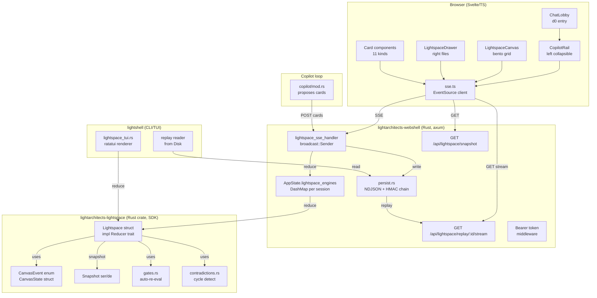

# C2 — Container: Lightspace runtime deployment

**Lock invariant — Wave 2 shape**: `AppState.lightspace_engines` is initially `DashMap<SessionId, Arc<RwLock<Lightspace>>>`. Snapshot endpoint takes **read guard**; reducer apply path takes **write guard**. No nested guards within `reduce()`.

**Wave 2b extension** (Absorbed Plan Decisions — session_registry.rs): The entry is extended to a unified `LightspaceSessionState` struct that holds both the `Lightspace` reducer state AND the `SessionSlot` enum (Running/Paused/Halted). This supports SSE reconnect replay without losing reducer state on browser refresh. The lock invariant remains unchanged — `Arc<RwLock<LightspaceSessionState>>`.
