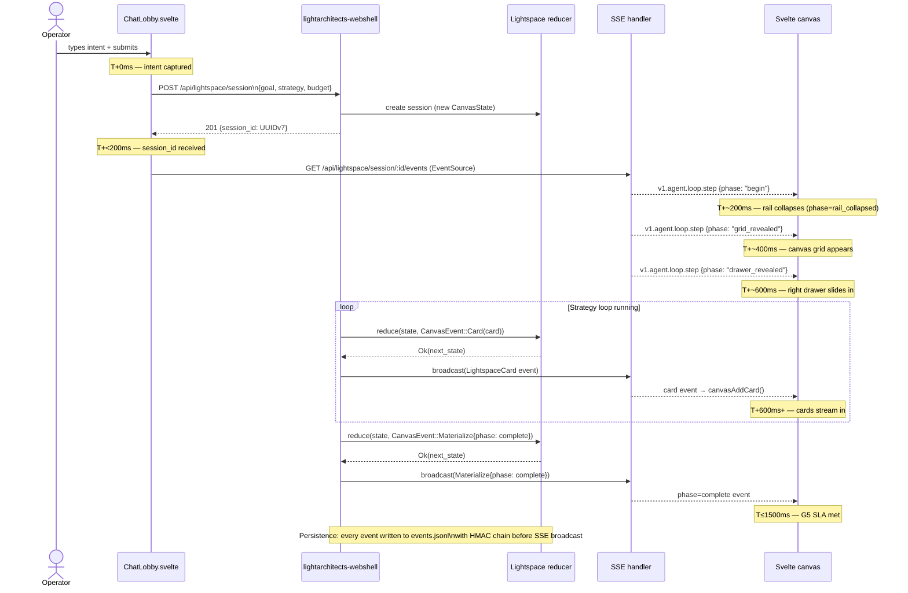
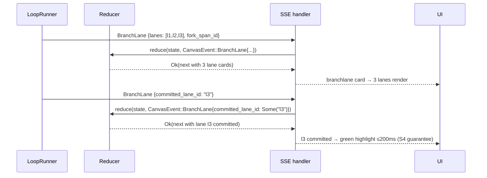

# Sequence — Workspace materialisation choreography

Timeline budget: **≤1500ms** from operator submit to `phase=complete` event (G5 guarantee).



## SSE reconnect / resume protocol

```
Client → GET /api/lightspace/session/:id/events?since_seq=N
  Running slot  → attach to broadcast::Sender; replay buffered events since seq N
  Paused slot   → replay events up to pause; emit v1.agent.loop.hitl
  Halted slot   → replay full event log from Arc<Vec<LightspaceEvent>> at recorded rate
```

## Branch-lane fork sequence (R2 — arXiv:2602.08199)


