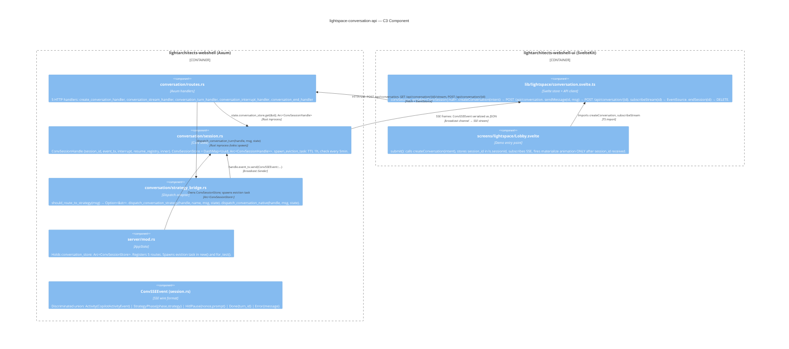

# C3 Component — ConvSessionHandle + Routes + Lobby Wiring

## Component responsibilities (summary)

| Component | Owns | Does NOT own |
|-----------|------|-------------|
| `routes.rs` | HTTP request parsing, 404/401 response, tokio::spawn dispatch | Turn execution logic |
| `session.rs` | Session lifecycle, event broadcast, TTL eviction | HTTP concerns |
| `strategy_bridge.rs` | Message routing (prefix → strategy or native) | Session creation/cleanup |
| `conversation.svelte.ts` | API client state, SSE subscription | UI animation |
| `Lobby.svelte` | Demo UX: loading state, error toast, materialize gate | API client implementation |
