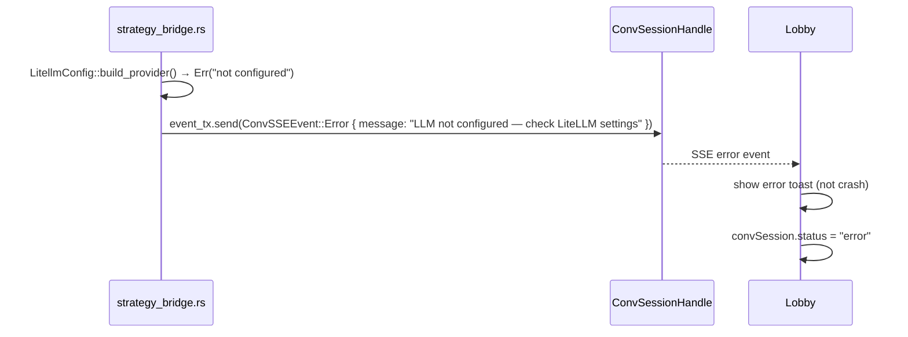

# Sequence — POST /api/conversation → SSE Stream → Lobby Materialize

```mermaid
sequenceDiagram
  autonumber
  actor User as Operator (LightSpace demo)
  participant Lobby as Lobby.svelte
  participant ConvStore as conversation.svelte.ts
  participant Backend as lightarchitects-webshell (Axum)
  participant Session as ConvSessionHandle
  participant Bridge as strategy_bridge.rs
  participant Lib as lightarchitects::ConversationSession

  Note over Lobby: submit() fires (demo action #1)

  Lobby->>ConvStore: createConversation({ intent: "react audit auth" })
  ConvStore->>Backend: POST /api/conversation\n{ intent: "react audit auth" }
  Backend->>Session: ConvSessionHandle::new(session_id=UUID)\nevent_tx = broadcast::channel(256)
  Backend->>Backend: conversation_store.insert(session_id, handle)
  Backend-->>ConvStore: 200 { session_id, stream_url }
  ConvStore->>Lobby: returns { session_id }

  Note over Lobby: ls.setSessionId(session_id) — demo action #2

  Lobby->>ConvStore: subscribeStream(session_id)
  ConvStore->>Backend: GET /api/conversation/{id}/stream\n(SSE connection open)
  Backend->>Session: event_tx.subscribe() → broadcast::Receiver

  Note over Lobby: ls.exitLobby() + materialize animation (fires AFTER session_id)

  Lobby->>ConvStore: sendMessage(session_id, "/react audit auth")
  ConvStore->>Backend: POST /api/conversation/{id}\n{ message: "/react audit auth" }
  Backend->>Bridge: should_route_to_strategy("/react audit auth") → Some("react")
  Backend->>Bridge: tokio::spawn → dispatch_conversation_strategy(handle, "react", msg, state)
  Bridge->>Lib: StrategyRegistry::lookup("react") → ReActStrategy
  Bridge->>Lib: strategy.run(ConversationSession, interrupt) [streaming]
  Lib-->>Session: event_tx.send(ConvSSEEvent::StrategyPhase { phase: "analyze", strategy: "react" })
  Session-->>Backend: SSE frame: { "type": "strategy_phase", "phase": "analyze", "strategy": "react" }
  Backend-->>ConvStore: SSE event (EventSource)
  ConvStore-->>Lobby: convSession store update → canvas card appears

  Note over Lobby: demo money moment — first event visible ≤1s

  Lib-->>Session: event_tx.send(ConvSSEEvent::Activity(CopilotActivityEvent { ... }))
  Session-->>Backend: SSE frame: { "type": "activity", ... }
  Backend-->>ConvStore: SSE event
  ConvStore-->>Lobby: additional canvas cards stream in

  Lib-->>Session: event_tx.send(ConvSSEEvent::Done { turn_id })
  Session-->>Backend: SSE frame: { "type": "done", "turn_id": "..." }
  Backend-->>ConvStore: SSE done event
  ConvStore->>ConvStore: convSession.status = "idle"

  Note over Backend: handle.last_active updated on each POST /{id}
  Note over Backend: TTL eviction runs every 5min; idle >1h → remove from DashMap
```

## Error path (LiteLLM not configured — demo resilience)


