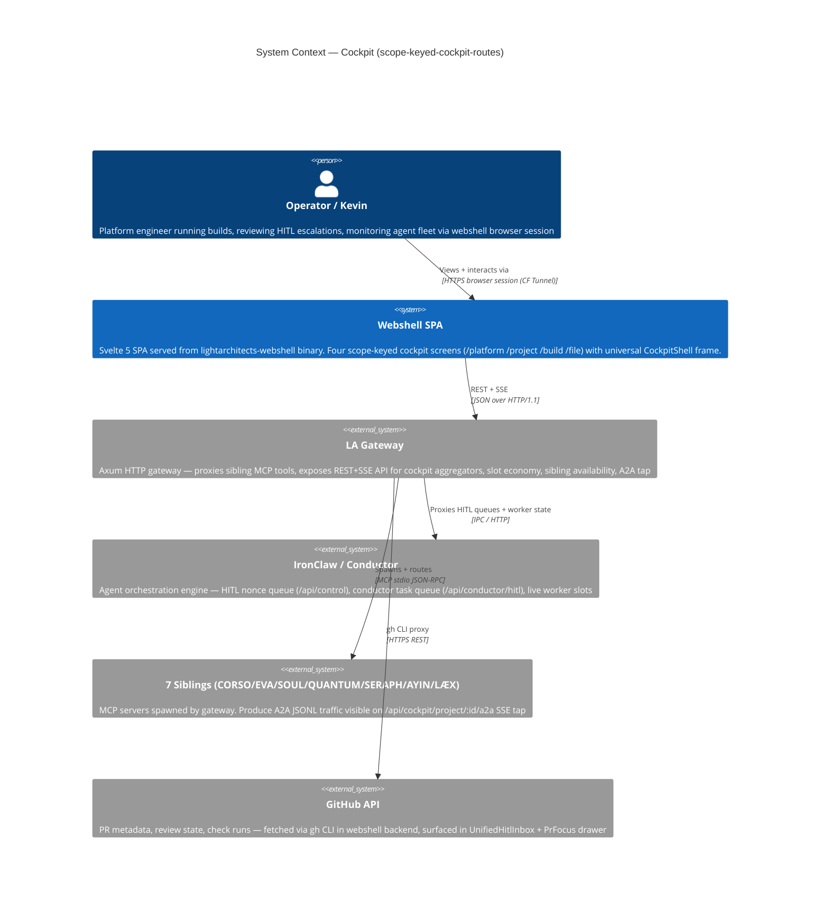

# C1 — System Context: Scope-Keyed Cockpit Routes

Scope: cockpit surface within the lightarchitects platform as seen by the operator.

```mermaid
C4Context
    title System Context — Cockpit (scope-keyed-cockpit-routes)

    Person(operator, "Operator / Kevin", "Platform engineer running builds, reviewing HITL escalations, monitoring agent fleet via webshell browser session")

    System(webshell, "Webshell SPA", "Svelte 5 SPA served from lightarchitects-webshell binary. Four scope-keyed cockpit screens (/platform /project /build /file) with universal CockpitShell frame.")

    System_Ext(gateway, "LA Gateway", "Axum HTTP gateway — proxies sibling MCP tools, exposes REST+SSE API for cockpit aggregators, slot economy, sibling availability, A2A tap")
    System_Ext(ironclaw, "IronClaw / Conductor", "Agent orchestration engine — HITL nonce queue (/api/control), conductor task queue (/api/conductor/hitl), live worker slots")
    System_Ext(siblings, "7 Siblings (CORSO/EVA/SOUL/QUANTUM/SERAPH/AYIN/LÆX)", "MCP servers spawned by gateway. Produce A2A JSONL traffic visible on /api/cockpit/project/:id/a2a SSE tap")
    System_Ext(github, "GitHub API", "PR metadata, review state, check runs — fetched via gh CLI in webshell backend, surfaced in UnifiedHitlInbox + PrFocus drawer")

    Rel(operator, webshell, "Views + interacts via", "HTTPS browser session (CF Tunnel)")
    Rel(webshell, gateway, "REST + SSE", "JSON over HTTP/1.1")
    Rel(gateway, ironclaw, "Proxies HITL queues + worker state", "IPC / HTTP")
    Rel(gateway, siblings, "Spawns + routes", "MCP stdio JSON-RPC")
    Rel(gateway, github, "gh CLI proxy", "HTTPS REST")
```
