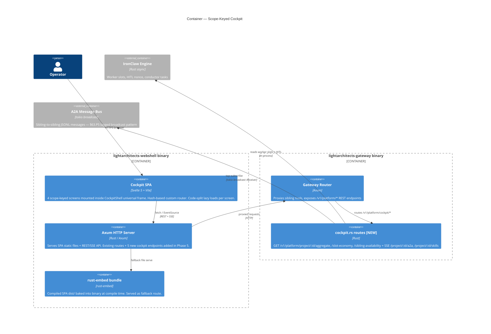

# C2 — Container: Scope-Keyed Cockpit

New containers introduced by this build shown with dashed border.

```mermaid
C4Container
    title Container — Scope-Keyed Cockpit

    Person(operator, "Operator")

    Container_Boundary(webshell_bin, "lightarchitects-webshell binary") {
        Container(spa, "Cockpit SPA", "Svelte 5 + Vite", "4 scope-keyed screens mounted inside CockpitShell universal frame. Hash-based custom router. Code-split lazy loads per screen.")
        Container(axum_server, "Axum HTTP Server", "Rust / Axum", "Serves SPA static files + REST/SSE API. Existing routes + 5 new cockpit endpoints added in Phase 5.")
        Container(static_assets, "rust-embed bundle", "rust-embed", "Compiled SPA dist/ baked into binary at compile time. Served as fallback route.")
    }

    Container_Boundary(gateway_bin, "lightarchitects-gateway binary") {
        Container(gateway_router, "Gateway Router", "Axum", "Proxies sibling tools, exposes /v1/platform/* REST endpoints")
        Container(cockpit_routes, "cockpit.rs routes [NEW]", "Rust", "GET /v1/platform/project/:id/aggregate, /slot-economy, /sibling-availability + SSE /project/:id/a2a, /project/:id/skills")
    }

    Container_Ext(ironclaw, "IronClaw Engine", "Rust async", "Worker slots, HITL nonce, conductor tasks")
    Container_Ext(a2a_bus, "A2A Message Bus", "tokio broadcast", "Sibling-to-sibling JSONL messages — §63.P5 lagged broadcast pattern")

    Rel(operator, spa, "HTTPS browser", "")
    Rel(spa, axum_server, "fetch / EventSource", "REST + SSE")
    Rel(axum_server, static_assets, "fallback file serve", "")
    Rel(axum_server, gateway_router, "proxied requests", "HTTP")
    Rel(gateway_router, cockpit_routes, "routes /v1/platform/cockpit/*", "")
    Rel(cockpit_routes, ironclaw, "reads worker slots + HITL", "in-process")
    Rel(cockpit_routes, a2a_bus, "tap subscribe", "tokio broadcast::Receiver")
```
