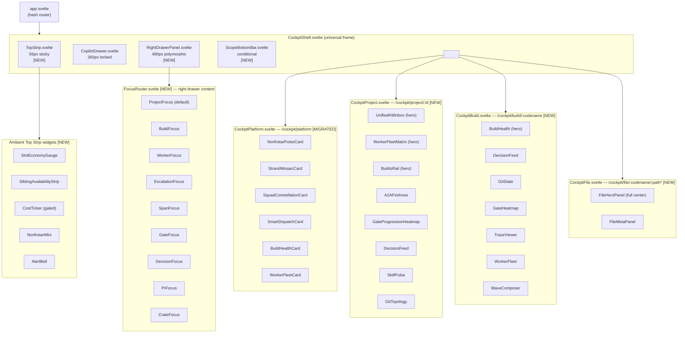

# C3 — Component: Cockpit Screen Tree

```mermaid
graph TD
    AppSvelte["app.svelte\n(hash router)"]

    subgraph CockpitShell["CockpitShell.svelte (universal frame)"]
        TopStrip["TopStrip.svelte\n56px sticky\n[NEW]"]
        LeftDrawer["CopilotDrawer.svelte\n360px locked"]
        RightDrawer["RightDrawerPanel.svelte\n480px polymorphic\n[NEW]"]
        BottomBar["ScopeBottomBar.svelte\nconditional\n[NEW]"]
        MainCenter["<center bento>"]
    end

    subgraph AmbientWidgets["Ambient Top Strip widgets [NEW]"]
        SlotGauge["SlotEconomyGauge"]
        SiblingStrip["SiblingAvailabilityStrip"]
        CostTicker["CostTicker (gated)"]
        NorthstarMini["NorthstarMini"]
        AlertBell["AlertBell"]
    end

    subgraph FocusRouter["FocusRouter.svelte [NEW] — right drawer content"]
        PF["ProjectFocus (default)"]
        BF["BuildFocus"]
        WF["WorkerFocus"]
        EF["EscalationFocus"]
        SF["SpanFocus"]
        GF["GateFocus"]
        DF["DecisionFocus"]
        PRF["PrFocus"]
        CF["CrateFocus"]
    end

    subgraph D0["CockpitPlatform.svelte — /cockpit/platform [MIGRATED]"]
        D0NS["NorthstarPulseCard"]
        D0SM["StrandMosaicCard"]
        D0SC["SquadConstellationCard"]
        D0SD["SmartDispatchCard"]
        D0BH["BuildHealthCard"]
        D0WF2["WorkerFleetCard"]
    end

    subgraph D1["CockpitProject.svelte — /cockpit/project/:id [NEW]"]
        D1HITL["UnifiedHitlInbox (hero)"]
        D1Fleet["WorkerFleetMatrix (hero)"]
        D1Builds["BuildsRail (hero)"]
        D1A2A["A2AFirehose"]
        D1Gate["GateProgressionHeatmap"]
        D1Dec["DecisionFeed"]
        D1Skill["SkillPulse"]
        D1Git["GitTopology"]
    end

    subgraph D2["CockpitBuild.svelte — /cockpit/build/:codename [NEW]"]
        D2BH["BuildHealth (hero)"]
        D2Dec2["DecisionFeed"]
        D2Git2["GitState"]
        D2GH["GateHeatmap"]
        D2Trace["TraceViewer"]
        D2Fleet2["WorkerFleet"]
        D2WC["WaveComposer"]
    end

    subgraph D3["CockpitFile.svelte — /cockpit/file/:codename/:path* [NEW]"]
        D3Hero["FileHeroPanel (full center)"]
        D3Meta["FileMetaPanel"]
    end

    AppSvelte --> CockpitShell
    TopStrip --> AmbientWidgets
    RightDrawer --> FocusRouter
    MainCenter --> D0
    MainCenter --> D1
    MainCenter --> D2
    MainCenter --> D3
```
