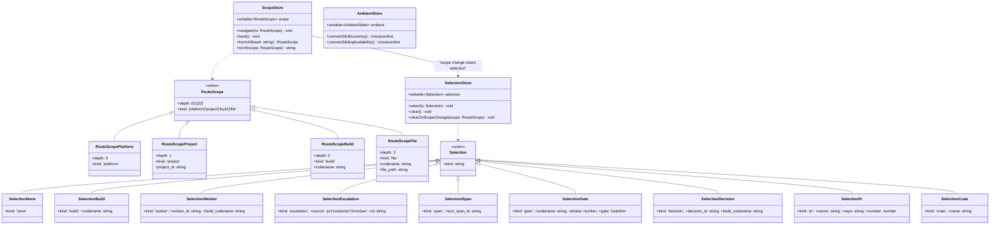

# C4 — Code: RouteScope + Selection Type System

```mermaid
classDiagram
    class RouteScope {
        <<union>>
        +depth: 0|1|2|3
        +kind: 'platform'|'project'|'build'|'file'
    }
    class RouteScopePlatform {
        +depth: 0
        +kind: 'platform'
    }
    class RouteScopeProject {
        +depth: 1
        +kind: 'project'
        +project_id: string
    }
    class RouteScopeBuild {
        +depth: 2
        +kind: 'build'
        +codename: string
    }
    class RouteScopeFile {
        +depth: 3
        +kind: 'file'
        +codename: string
        +file_path: string
    }
    RouteScope <|-- RouteScopePlatform
    RouteScope <|-- RouteScopeProject
    RouteScope <|-- RouteScopeBuild
    RouteScope <|-- RouteScopeFile

    class Selection {
        <<union>>
        +kind: string
    }
    class SelectionNone { +kind: 'none' }
    class SelectionBuild { +kind: 'build'; +codename: string }
    class SelectionWorker { +kind: 'worker'; +worker_id: string; +build_codename: string }
    class SelectionEscalation { +kind: 'escalation'; +source: 'pr'|'conductor'|'ironclaw'; +id: string }
    class SelectionSpan { +kind: 'span'; +turn_span_id: string }
    class SelectionGate { +kind: 'gate'; +codename: string; +phase: number; +gate: GateDim }
    class SelectionDecision { +kind: 'decision'; +decision_id: string; +build_codename: string }
    class SelectionPr { +kind: 'pr'; +owner: string; +repo: string; +number: number }
    class SelectionCrate { +kind: 'crate'; +name: string }

    Selection <|-- SelectionNone
    Selection <|-- SelectionBuild
    Selection <|-- SelectionWorker
    Selection <|-- SelectionEscalation
    Selection <|-- SelectionSpan
    Selection <|-- SelectionGate
    Selection <|-- SelectionDecision
    Selection <|-- SelectionPr
    Selection <|-- SelectionCrate

    class ScopeStore {
        +writable~RouteScope~ scope
        +navigate(to: RouteScope) void
        +back() void
        +fromUrl(hash: string) RouteScope
        +toUrl(scope: RouteScope) string
    }
    class SelectionStore {
        +writable~Selection~ selection
        +select(s: Selection) void
        +clear() void
        +clearOnScopeChange(scope: RouteScope) void
    }
    class AmbientStore {
        +writable~AmbientState~ ambient
        +connectSlotEconomy() Unsubscriber
        +connectSiblingAvailability() Unsubscriber
    }

    ScopeStore ..> RouteScope
    SelectionStore ..> Selection
    ScopeStore --> SelectionStore : "scope change clears selection"
```
