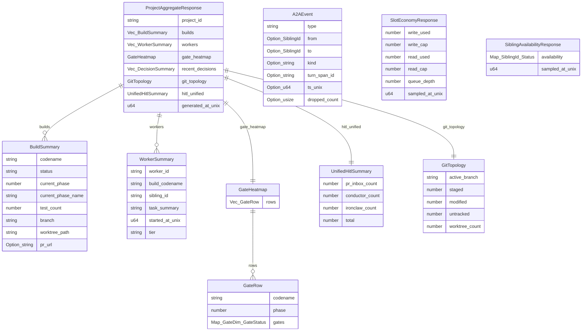

# ERD — Data Models: Cockpit API Contracts

```mermaid
erDiagram
    ProjectAggregateResponse {
        string project_id
        Vec_BuildSummary builds
        Vec_WorkerSummary workers
        GateHeatmap gate_heatmap
        Vec_DecisionSummary recent_decisions
        GitTopology git_topology
        UnifiedHitlSummary hitl_unified
        u64 generated_at_unix
    }
    BuildSummary {
        string codename
        string status
        number current_phase
        string current_phase_name
        number test_count
        string branch
        string worktree_path
        Option_string pr_url
    }
    WorkerSummary {
        string worker_id
        string build_codename
        string sibling_id
        string task_summary
        u64 started_at_unix
        string tier
    }
    GateHeatmap {
        Vec_GateRow rows
    }
    GateRow {
        string codename
        number phase
        Map_GateDim_GateStatus gates
    }
    UnifiedHitlSummary {
        number pr_inbox_count
        number conductor_count
        number ironclaw_count
        number total
    }
    GitTopology {
        string active_branch
        number staged
        number modified
        number untracked
        number worktree_count
    }

    ProjectAggregateResponse ||--o{ BuildSummary : "builds"
    ProjectAggregateResponse ||--o{ WorkerSummary : "workers"
    ProjectAggregateResponse ||--|| GateHeatmap : "gate_heatmap"
    ProjectAggregateResponse ||--|| UnifiedHitlSummary : "hitl_unified"
    ProjectAggregateResponse ||--|| GitTopology : "git_topology"
    GateHeatmap ||--o{ GateRow : "rows"

    A2AEvent {
        string type
        Option_SiblingId from
        Option_SiblingId to
        Option_string kind
        Option_string turn_span_id
        Option_u64 ts_unix
        Option_usize dropped_count
    }

    SlotEconomyResponse {
        number write_used
        number write_cap
        number read_used
        number read_cap
        number queue_depth
        u64 sampled_at_unix
    }

    SiblingAvailabilityResponse {
        Map_SiblingId_Status availability
        u64 sampled_at_unix
    }
```
