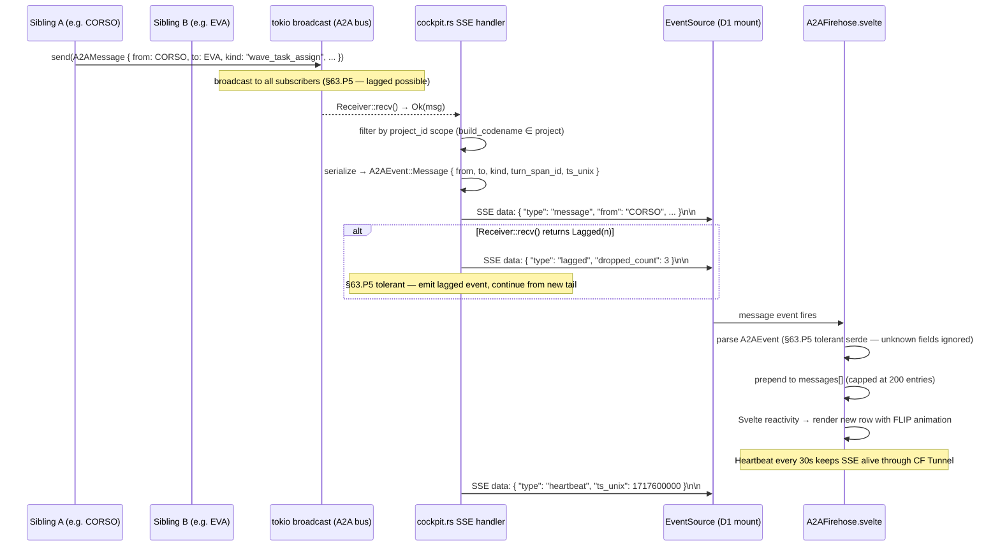

# Sequence — A2A Firehose Tap (d1 A2AFirehose card)

Gateway message-bus tap → SSE → webshell EventSource consumer → bento live append.

```mermaid
sequenceDiagram
    participant SibA as Sibling A (e.g. CORSO)
    participant SibB as Sibling B (e.g. EVA)
    participant Bus as tokio broadcast (A2A bus)
    participant GW as cockpit.rs SSE handler
    participant ES as EventSource (D1 mount)
    participant Card as A2AFirehose.svelte

    SibA->>Bus: send(A2AMessage { from: CORSO, to: EVA, kind: "wave_task_assign", ... })
    Note over Bus: broadcast to all subscribers (§63.P5 — lagged possible)

    Bus-->>GW: Receiver::recv() → Ok(msg)
    GW->>GW: filter by project_id scope (build_codename ∈ project)
    GW->>GW: serialize → A2AEvent::Message { from, to, kind, turn_span_id, ts_unix }
    GW->>ES: SSE data: { "type": "message", "from": "CORSO", ... }\n\n

    alt Receiver::recv() returns Lagged(n)
        GW->>ES: SSE data: { "type": "lagged", "dropped_count": 3 }\n\n
        Note over GW: §63.P5 tolerant — emit lagged event, continue from new tail
    end

    ES->>Card: message event fires
    Card->>Card: parse A2AEvent (§63.P5 tolerant serde — unknown fields ignored)
    Card->>Card: prepend to messages[] (capped at 200 entries)
    Card->>Card: Svelte reactivity → render new row with FLIP animation

    Note over Card: Heartbeat every 30s keeps SSE alive through CF Tunnel
    GW->>ES: SSE data: { "type": "heartbeat", "ts_unix": 1717600000 }\n\n
```
