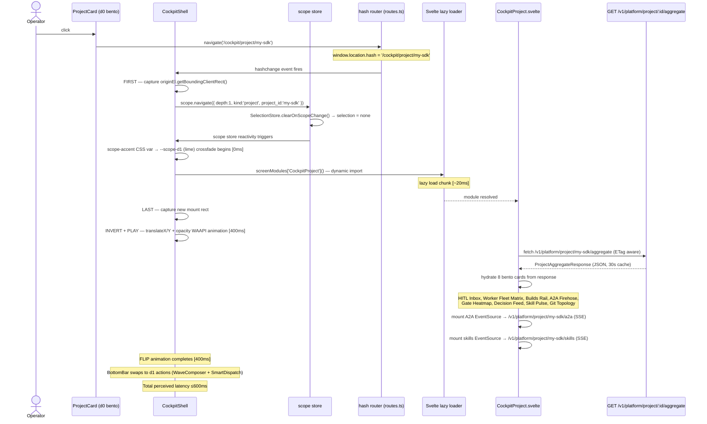

# Sequence — Scope Transition: d0 Platform → d1 Project

600ms total. User clicks a project card on the d0 CockpitPlatform bento.

```mermaid
sequenceDiagram
    actor Op as Operator
    participant Card as ProjectCard (d0 bento)
    participant Shell as CockpitShell
    participant ScopeStore as scope store
    participant Router as hash router (routes.ts)
    participant Svelte as Svelte lazy loader
    participant D1 as CockpitProject.svelte
    participant API as GET /v1/platform/project/:id/aggregate

    Op->>Card: click
    Card->>Router: navigate('/cockpit/project/my-sdk')
    Note over Router: window.location.hash = '/cockpit/project/my-sdk'

    Router->>Shell: hashchange event fires
    Shell->>Shell: FIRST — capture originEl.getBoundingClientRect()
    Shell->>ScopeStore: scope.navigate({ depth:1, kind:'project', project_id:'my-sdk' })
    ScopeStore->>ScopeStore: SelectionStore.clearOnScopeChange() → selection = none
    ScopeStore->>Shell: scope store reactivity triggers

    Shell->>Shell: scope-accent CSS var → --scope-d1 (lime) crossfade begins [0ms]
    Shell->>Svelte: screenModules['CockpitProject']() — dynamic import

    Note over Svelte: lazy load chunk [~20ms]
    Svelte-->>D1: module resolved

    Shell->>Shell: LAST — capture new mount rect
    Shell->>Shell: INVERT + PLAY — translateX/Y + opacity WAAPI animation [400ms]

    D1->>API: fetch /v1/platform/project/my-sdk/aggregate (ETag aware)
    API-->>D1: ProjectAggregateResponse (JSON, 30s cache)

    D1->>D1: hydrate 8 bento cards from response
    Note over D1: HITL Inbox, Worker Fleet Matrix, Builds Rail, A2A Firehose,<br/>Gate Heatmap, Decision Feed, Skill Pulse, Git Topology

    D1->>D1: mount A2A EventSource → /v1/platform/project/my-sdk/a2a (SSE)
    D1->>D1: mount skills EventSource → /v1/platform/project/my-sdk/skills (SSE)

    Note over Shell: FLIP animation completes [400ms]
    Note over Shell: BottomBar swaps to d1 actions (WaveComposer + SmartDispatch)
    Note over Shell: Total perceived latency ≤600ms
```
