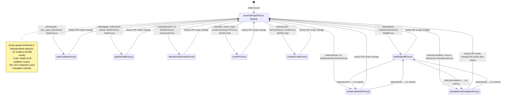

# State Machine — Focus Drawer Selection

Selection store transitions. Cleared on scope navigation. Invalid selections guarded by scope context.

```mermaid
stateDiagram-v2
    [*] --> none : initial mount

    none --> build : select(build, codename)\nshows BuildFocus
    none --> worker : select(worker, id, build)\nshows WorkerFocus
    none --> escalation : select(escalation, source, id)\nshows EscalationFocus
    none --> span : select(span, turn_span_id)\nshows SpanFocus
    none --> gate : select(gate, codename, phase, dim)\nshows GateFocus
    none --> decision : select(decision, id, build)\nshows DecisionFocus
    none --> pr : select(pr, owner, repo, number)\nshows PrFocus [d1/d2 only]
    none --> crate : select(crate, name)\nshows CrateFocus [d2/d3 only]

    build --> none : clear() OR scope change
    worker --> none : clear() OR scope change
    escalation --> none : clear() OR scope change\na/r action also clears
    span --> none : clear() OR scope change
    gate --> none : clear() OR scope change
    decision --> none : clear() OR scope change
    pr --> none : clear() OR scope change
    crate --> none : clear() OR scope change

    build --> worker : select(worker, ...) re-selects
    build --> escalation : select(escalation, ...) re-selects
    worker --> build : select(build, ...) re-selects
    escalation --> build : select(build, ...) re-selects

    note right of none
        Scope guards (enforced in SelectionStore.select()):
        - 'pr' invalid at d3 (file scope)
        - 'crate' invalid at d0 (platform scope)
        - 'file' not in Selection union (navigates instead)
    end note

    state "none\n(ProjectFocus default)" as none
    state "build\n(BuildFocus)" as build
    state "worker\n(WorkerFocus)" as worker
    state "escalation\n(EscalationFocus)" as escalation
    state "span\n(SpanFocus)" as span
    state "gate\n(GateFocus)" as gate
    state "decision\n(DecisionFocus)" as decision
    state "pr\n(PrFocus)" as pr
    state "crate\n(CrateFocus)" as crate
```
