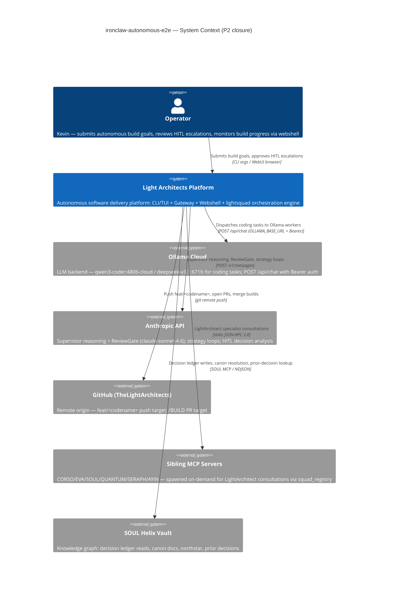

# C1 — System Context: ironclaw-autonomous-e2e

> Canon XLI: Architect-authored design input. Phase 1 deliverable. Implementation follows this diagram.

## Decision: Ollama Cloud as primary coding worker

**ADR-001** — The ironclaw-spine worker pool designed 7 slots (SLOT 1-3 Sonnet, SLOT 4-7 Haiku). This build pivots SLOT 3 to `OllamaCloudCodingProvider` as the primary cost-efficient coding worker. Rationale: operator already uses `qwen3-coder:480b-cloud` via OLLAMA_BASE_URL; proving the loop with real Ollama satisfies P2 mechanical check 7 without Anthropic API cost for every coding task.

**Implications**: OllamaCloudCodingProvider must implement the same `CodingProvider` trait as ClaudeCliProvider; OllamaResponseValidator is mandatory before accepting any diff from the Ollama response (OWASP LLM01 — prompt injection → path traversal).
