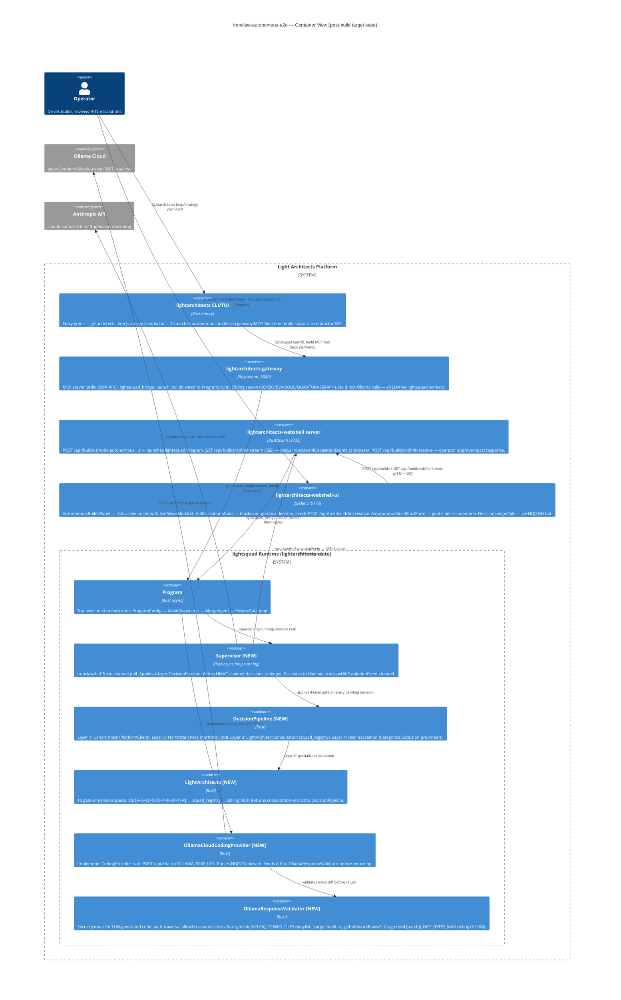

# C2 — Container Diagram: ironclaw-autonomous-e2e

> Canon XLI: Architect-authored design input. Phase 1 deliverable.

```mermaid
C4Container
  title ironclaw-autonomous-e2e — Container View (post-build target state)

  Person(operator, "Operator", "Drives builds; reviews HITL escalations")

  System_Boundary(platform, "Light Architects Platform") {

    Container(cli_tui, "lightarchitects CLI/TUI", "Rust binary", "Entry point: `lightarchitects loop|strategy|conductor`. Dispatches autonomous builds via gateway MCP. Real-time build status via conductor SSE.")

    Container(gateway, "lightarchitects-gateway", "Rust/axum :8080", "MCP server (stdio JSON-RPC). lightsquad_bridge::launch_build() wired to Program::run(). Sibling spawn (CORSO/EVA/SOUL/QUANTUM/SERAPH). No direct Ollama calls — all LLM via lightsquad workers.")

    System_Boundary(lightsquad_runtime, "lightsquad Runtime (lightarchitects crate)") {
      Container(program_ctr, "Program", "Rust async", "Top-level build orchestrator: ProgramConfig → WaveDispatcher → MergeAgent → ReviewGate loop")
      Container(supervisor_ctr, "Supervisor [NEW]", "Rust async long-running", "ironclaw-hitl Tokio channel poll. Applies 4-layer DecisionPipeline. Writes HMAC-chained decisions to ledger. Escalates to User via IronclawHitlEscalationEvent channel.")
      Container(decision_pipeline_ctr, "DecisionPipeline [NEW]", "Rust", "Layer 1: Canon check (PlatformClient). Layer 2: Northstar check (northstar.md). Layer 3: LightArchitect consultation (squad_registry). Layer 4: User escalation (CategoricalExclusion pre-screen).")
      Container(light_architects_ctr, "LightArchitects [NEW]", "Rust", "10 gate-dimension specialists [A+S+Q+C+O+P+K+D+T+R] → squad_registry → sibling MCP. Returns consultation verdict to DecisionPipeline.")
      Container(ollama_worker_ctr, "OllamaCloudCodingProvider [NEW]", "Rust", "Implements CodingProvider trait. POST /api/chat to OLLAMA_BASE_URL. Parses NDJSON stream. Feeds diff to OllamaResponseValidator before returning.")
      Container(response_validator_ctr, "OllamaResponseValidator [NEW]", "Rust", "Security moat for LLM-generated code: path-traversal allowlist (canonicalize after symlink, §63.P4), DENIED_FILES denylist (.cargo, build.rs, .github/workflows/*, Cargo.toml [patch]), DIFF_BYTES_MAX ceiling (512KB).")
    }

    Container(webshell_srv, "lightarchitects-webshell server", "Rust/axum :8733", "POST /api/builds {mode:autonomous,...} — launches lightsquad Program. GET /api/builds/:id/hitl-stream (SSE) — relays IronclawHitlEscalationEvents to browser. POST /api/builds/:id/hitl-resolve — operator approve/reject response.")

    Container(webshell_ui, "lightarchitects-webshell-ui", "Svelte 5 :5173", "AutonomousBuildsPanel — lists active builds with live WaveSlotGrid. HitlEscalationModal — blocks on operator decision, sends POST /api/builds/:id/hitl-resolve. AutonomousBuildStartForm — goal + tier + codename. DecisionLedgerTail — live NDJSON tail.")
  }

  System_Ext(ollama_cloud_ext, "Ollama Cloud", "qwen3-coder:480b-cloud via POST /api/chat")
  System_Ext(anthropic_ext, "Anthropic API", "claude-sonnet-4-6 for Supervisor reasoning")

  Rel(operator, cli_tui, "lightarchitects loop/strategy", "terminal")
  Rel(operator, webshell_ui, "AutonomousBuildsPanel + HitlEscalationModal", "browser")
  Rel(cli_tui, gateway, "lightsquad.launch_build MCP tool", "stdio JSON-RPC")
  Rel(webshell_ui, webshell_srv, "POST /api/builds + GET /api/builds/:id/hitl-stream", "HTTP + SSE")
  Rel(webshell_srv, program_ctr, "lightsquad_bridge::launch_build()", "Rust async")
  Rel(gateway, program_ctr, "lightsquad_bridge::launch_build()", "Rust async")
  Rel(program_ctr, supervisor_ctr, "spawns long-running monitor task")
  Rel(supervisor_ctr, decision_pipeline_ctr, "applies 4-layer gate on every pending decision")
  Rel(decision_pipeline_ctr, light_architects_ctr, "Layer 3: specialist consultation")
  Rel(supervisor_ctr, webshell_srv, "IronclawHitlEscalationEvent → SSE channel", "Tokio channel")
  Rel(program_ctr, ollama_worker_ctr, "dispatches coding tasks (SLOT 3)")
  Rel(ollama_worker_ctr, response_validator_ctr, "validates every diff before return")
  Rel(ollama_worker_ctr, ollama_cloud_ext, "POST /api/chat NDJSON stream")
  Rel(supervisor_ctr, anthropic_ext, "canon resolution + decision analysis")
```
