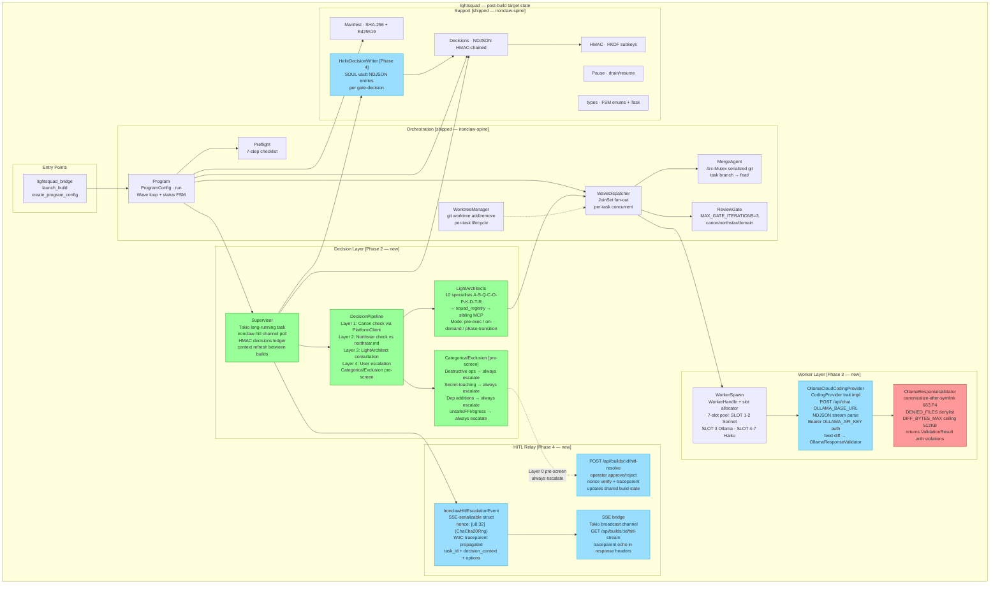

# C3 — Component Diagram: lightsquad module

> Canon XLI: Architect-authored design input. Phase 1 deliverable.

**Legend**: Green = Phase 2 · Blue = Phase 3 or 4 · Red = Security-critical (Phase 3) · No fill = Shipped (ironclaw-spine)
