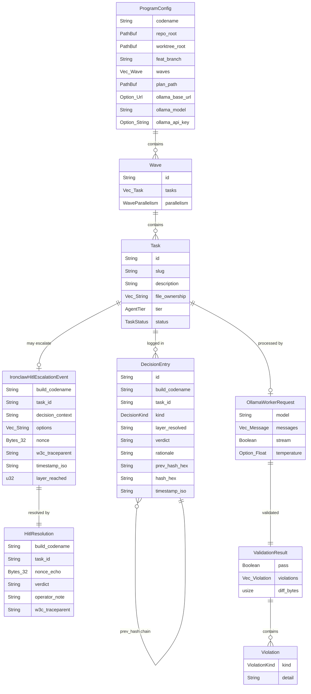

# ERD — Data Schemas: ironclaw-autonomous-e2e

> Canon XLI: Architect-authored design input. Phase 1 deliverable.

## Key schema invariants

- `DecisionEntry.prev_hash_hex` — SHA-256 of the raw previous NDJSON line (genesis = 64 zeros). HMAC via HKDF wave subkey. Tamper-evident chain identical to container-hitl-audit pattern.
- `IronclawHitlEscalationEvent.nonce` — 32 random bytes from ChaCha20Rng; echoed in `HitlResolution.nonce_echo` to prevent replay attacks.
- `IronclawHitlEscalationEvent.w3c_traceparent` — propagated from supervisor's AYIN span context through SSE payload and echoed back in POST response headers for continuous trace.
- `ValidationResult.diff_bytes` — must be ≤ `DIFF_BYTES_MAX = 524_288` (512KB). Oversized diffs → `Violation::DiffCeiling`.
