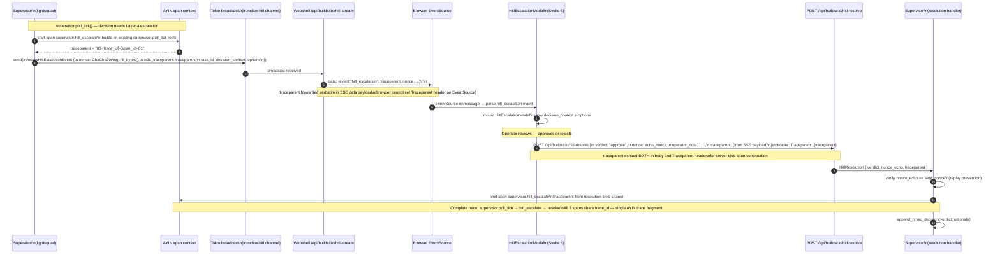

# SEQ-2 — HITL Escalation Round-Trip: W3C traceparent through full loop

> Canon XLI: Architect-authored design input. Phase 1 deliverable.
> AYIN requirement: single continuous trace from supervisor.escalate → POST /hitl-resolve.

