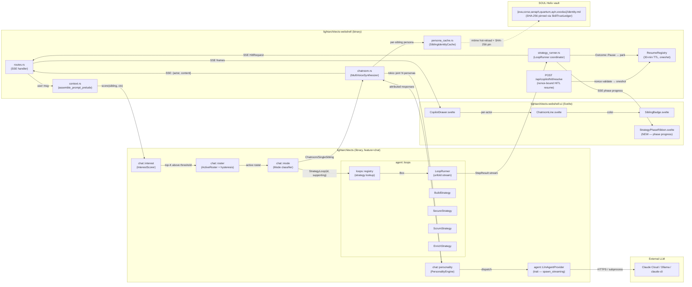

# C2 Container Diagram — copilot-chatroom-core

> Phase 1 architecture artifact (Canon XLI — Diagram-First Doctrine).
> Authors: Phase 1 architecture pass. Implementation follows this diagram.

```mermaid
graph LR
  subgraph Webshell["lightarchitects-webshell (binary)"]
    Routes["routes.rs\n(SSE handler)"]
    Context["context.rs\n(assemble_prompt_prelude)"]
    Chatroom["chatroom.rs\n(MultiVoiceSynthesizer)"]
    Cache["persona_cache.rs\n(SiblingIdentityCache)"]
    StrategyRunner["strategy_runner.rs\n(LoopRunner coordinator)"]
    HitlRoute["POST /api/copilot/hitl/resolve\n(nonce-bound HITL resume)"]
    ResumeReg["ResumeRegistry\n(30-min TTL, oneshot)"]
  end

  subgraph SDK["lightarchitects (library, feature=chat)"]
    Interest["chat::interest\n(InterestScorer)"]
    Roster["chat::roster\n(ActiveRoster + hysteresis)"]
    Mode["chat::mode\n(Mode classifier)"]
    Personality["chat::personality\n(PersonalityEngine)"]
    Provider["agent::LlmAgentProvider\n(trait — spawn_streaming)"]

    subgraph Loops["agent::loops"]
      Registry["loops::registry\n(strategy lookup)"]
      Runner["LoopRunner\n(unfold stream)"]
      BuildS["BuildStrategy"]
      SecureS["SecureStrategy"]
      ScrumS["ScrumStrategy"]
      EnrichS["EnrichStrategy"]
    end
  end

  subgraph UI["lightarchitects-webshell-ui (Svelte)"]
    Drawer["CopilotDrawer.svelte"]
    Line["ChatroomLine.svelte"]
    Badge["SiblingBadge.svelte"]
    Ribbon["StrategyPhaseRibbon.svelte\n(NEW — phase progress)"]
  end

  subgraph Helix["SOUL Helix vault"]
    Identities["{eva,corso,seraph,quantum,ayin,exodus}/identity.md\n(SHA-256 pinned via SkillTrustLedger)"]
  end

  subgraph LLM["External LLM"]
    Claude["Claude Cloud / Ollama / claude-cli"]
  end

  Routes -->|"user msg"| Context
  Context -->|"score(sibling, ctx)"| Interest
  Interest -->|"top-K above threshold"| Roster
  Roster -->|"active roster"| Mode
  Mode -->|"Chatroom/SingleSibling"| Chatroom
  Mode -->|"StrategyLoop(id, supporting)"| Registry
  Registry -->|"Box<dyn Strategy>"| Runner
  Runner -->|"StepResult stream"| StrategyRunner
  StrategyRunner -->|"Outcome::Pause → park"| ResumeReg
  StrategyRunner -->|"SSE HitlRequest"| Routes
  HitlRoute -->|"nonce validate → oneshot"| ResumeReg
  Chatroom -->|"per-sibling persona"| Cache
  Cache -.->|"mtime hot-reload + SHA-256 pin"| Identities
  Chatroom -->|"tokio::join! N personas"| Personality
  Personality -->|"dispatch"| Provider
  Provider -->|"HTTPS / subprocess"| Claude
  Personality -->|"attributed responses"| Chatroom
  Chatroom -->|"SSE: {actor, content}"| Routes
  Routes -->|"SSE frames"| Drawer
  Drawer -->|"per-actor"| Line
  Line -->|"color"| Badge
  StrategyRunner -->|"SSE phase progress"| Ribbon
```
