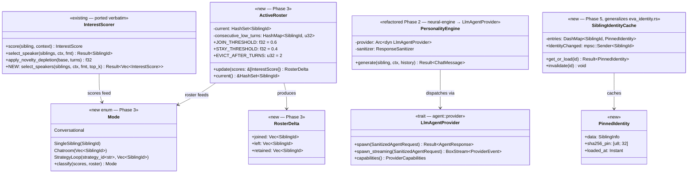
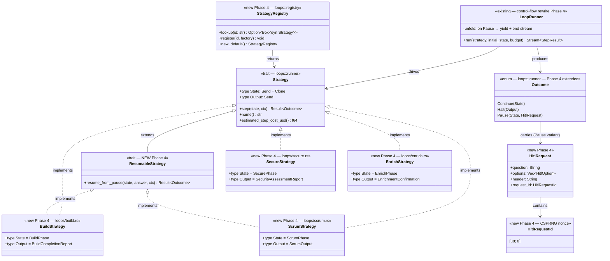

# C3 Component Diagram — copilot-chatroom-core

> Phase 1 architecture artifact (Canon XLI — Diagram-First Doctrine).

## chat module component design

```mermaid
classDiagram
  class InterestScorer {
    <<existing — ported verbatim>>
    +score(sibling, context) InterestScore
    +select_speaker(siblings, ctx, fmt) Result~SiblingId~
    +apply_novelty_depletion(base, turns) f32
    +NEW: select_speakers(siblings, ctx, fmt, top_k) Result~Vec~InterestScore~~
  }
  class ActiveRoster {
    <<new — Phase 3>>
    -current: HashSet~SiblingId~
    -consecutive_low_turns: HashMap~SiblingId, u32~
    +JOIN_THRESHOLD: f32 = 0.6
    +STAY_THRESHOLD: f32 = 0.4
    +EVICT_AFTER_TURNS: u32 = 2
    +update(scores: &[InterestScore]) RosterDelta
    +current() &HashSet~SiblingId~
  }
  class RosterDelta {
    <<new — Phase 3>>
    +joined: Vec~SiblingId~
    +left: Vec~SiblingId~
    +retained: Vec~SiblingId~
  }
  class Mode {
    <<new enum — Phase 3>>
    Conversational
    SingleSibling(SiblingId)
    Chatroom(Vec~SiblingId~)
    StrategyLoop(strategy_id~str~, Vec~SiblingId~)
    +classify(scores, roster) Mode
  }
  class PersonalityEngine {
    <<refactored Phase 2 — neural-engine → LlmAgentProvider>>
    -provider: Arc~dyn LlmAgentProvider~
    -sanitizer: ResponseSanitizer
    +generate(sibling, ctx, history) Result~ChatMessage~
  }
  class LlmAgentProvider {
    <<trait — agent::provider>>
    +spawn(SanitizedAgentRequest) Result~AgentResponse~
    +spawn_streaming(SanitizedAgentRequest) BoxStream~ProviderEvent~
    +capabilities() ProviderCapabilities
  }
  class SiblingIdentityCache {
    <<new — Phase 5, generalizes eva_identity.rs>>
    -entries: DashMap~SiblingId, PinnedIdentity~
    +get_or_load(id) Result~PinnedIdentity~
    +invalidate(id) void
    +IdentityChanged: mpsc::Sender~SiblingId~
  }
  class PinnedIdentity {
    <<new>>
    +data: SiblingInfo
    +sha256_pin: [u8; 32]
    +loaded_at: Instant
  }

  InterestScorer --> Mode : scores feed
  ActiveRoster --> Mode : roster feeds
  ActiveRoster --> RosterDelta : produces
  PersonalityEngine --> LlmAgentProvider : dispatches via
  SiblingIdentityCache --> PinnedIdentity : caches
```

## Strategy Loop L1 component design

```mermaid
classDiagram
  class Strategy {
    <<trait — loops::runner>>
    +type State: Send + Clone
    +type Output: Send
    +step(state, ctx) Result~Outcome~
    +name() str
    +estimated_step_cost_usd() f64
  }
  class ResumableStrategy {
    <<trait — NEW Phase 4>>
    +resume_from_pause(state, answer, ctx) Result~Outcome~
  }
  class Outcome {
    <<enum — loops::runner — Phase 4 extended>>
    Continue(State)
    Halt(Output)
    Pause(State, HitlRequest)
  }
  class HitlRequest {
    <<new Phase 4>>
    +question: String
    +options: Vec~HitlOption~
    +header: String
    +request_id: HitlRequestId
  }
  class HitlRequestId {
    <<new Phase 4 — CSPRNG nonce>>
    [u8; 8]
  }
  class LoopRunner {
    <<existing — control-flow rewrite Phase 4>>
    +run(strategy, initial_state, budget) Stream~StepResult~
    -unfold: on Pause → yield + end stream
  }
  class StrategyRegistry {
    <<new Phase 4 — loops::registry>>
    +lookup(id: str) Option~Box~dyn Strategy~~
    +register(id, factory) void
    +new_default() StrategyRegistry
  }
  class BuildStrategy {
    <<new Phase 4 — loops/build.rs>>
    +type State = BuildPhase
    +type Output = BuildCompletionReport
  }
  class SecureStrategy {
    <<new Phase 4 — loops/secure.rs>>
    +type State = SecurePhase
    +type Output = SecurityAssessmentReport
  }
  class ScrumStrategy {
    <<new Phase 4 — loops/scrum.rs>>
    +type State = ScrumPhase
    +type Output = ScrumOutput
  }
  class EnrichStrategy {
    <<new Phase 4 — loops/enrich.rs>>
    +type State = EnrichPhase
    +type Output = EnrichmentConfirmation
  }

  Strategy <|-- ResumableStrategy : extends
  Strategy <|.. BuildStrategy : implements
  Strategy <|.. SecureStrategy : implements
  Strategy <|.. ScrumStrategy : implements
  Strategy <|.. EnrichStrategy : implements
  ResumableStrategy <|.. BuildStrategy : implements
  ResumableStrategy <|.. ScrumStrategy : implements
  LoopRunner --> Strategy : drives
  LoopRunner --> Outcome : produces
  Outcome --> HitlRequest : carries (Pause variant)
  HitlRequest --> HitlRequestId : contains
  StrategyRegistry --> Strategy : returns
```
