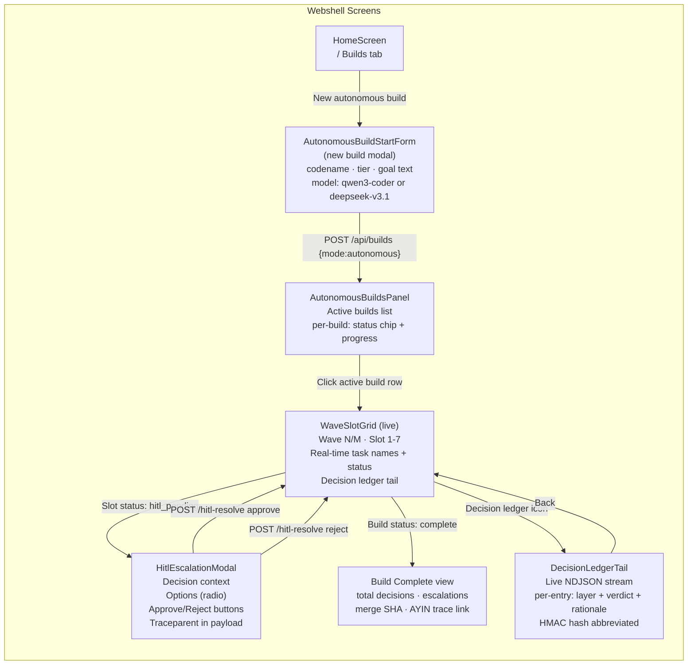
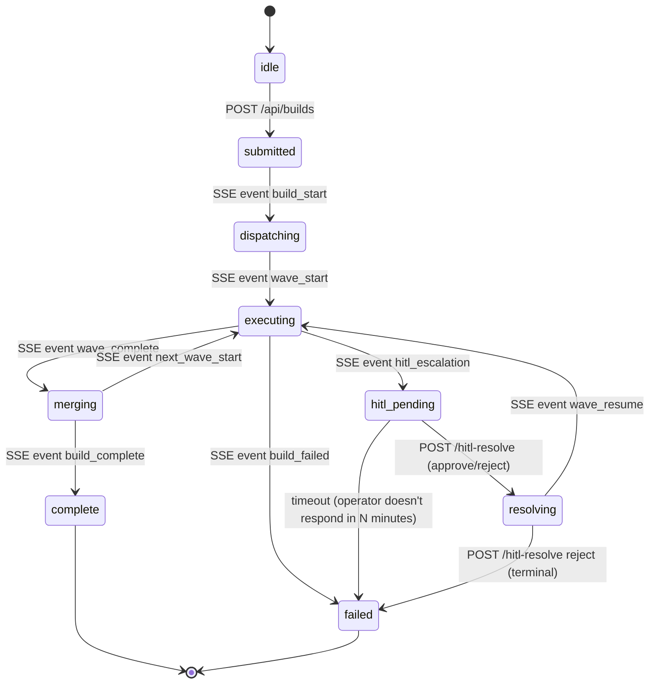

# Screen Flow — Webshell UI: Autonomous Build session

> Canon XLI: Architect-authored design input. Phase 1 deliverable.

## State machine: AutonomousBuild client-side

## Component list (Svelte 5, Phase 5 deliverables)

| Component | File | Description |
|-----------|------|-------------|
| `AutonomousBuildsPanel` | `screens/AutonomousBuildsPanel.svelte` | Root panel — build list + drill-down |
| `AutonomousBuildStartForm` | `components/AutonomousBuildStartForm.svelte` | New build modal |
| `WaveSlotGrid` | `components/WaveSlotGrid.svelte` | Live wave/slot progress grid |
| `HitlEscalationModal` | `components/HitlEscalationModal.svelte` | HITL escalation decision UI |
| `DecisionLedgerTail` | `components/DecisionLedgerTail.svelte` | Live NDJSON decision stream |

## SSE events consumed by UI

| Event type | Payload | UI action |
|-----------|---------|-----------|
| `build_start` | `{build_id, codename, wave_count}` | `submitted → dispatching` |
| `wave_start` | `{wave_n, task_ids}` | Update WaveSlotGrid |
| `task_progress` | `{task_id, slot, status}` | Update slot chip |
| `hitl_escalation` | `IronclawHitlEscalationEvent` | Mount HitlEscalationModal |
| `wave_resume` | `{wave_n}` | `hitl_pending → executing` |
| `wave_complete` | `{wave_n, merged_tasks}` | `executing → merging` |
| `decision_entry` | `DecisionEntry` (NDJSON) | Append to DecisionLedgerTail |
| `build_complete` | `{build_id, merge_sha}` | `merging → complete` |
| `build_failed` | `{build_id, reason}` | `* → failed` |
