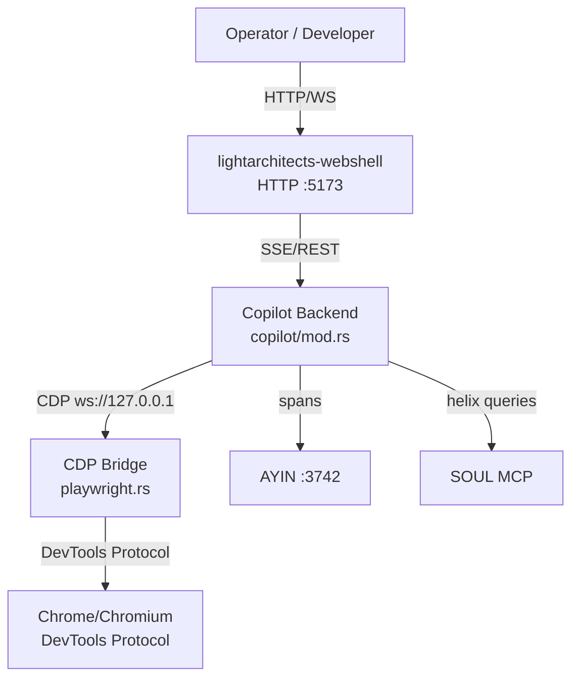
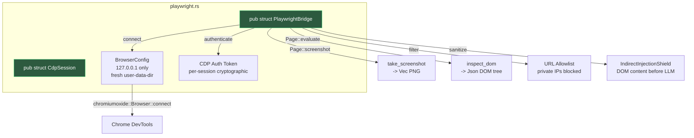
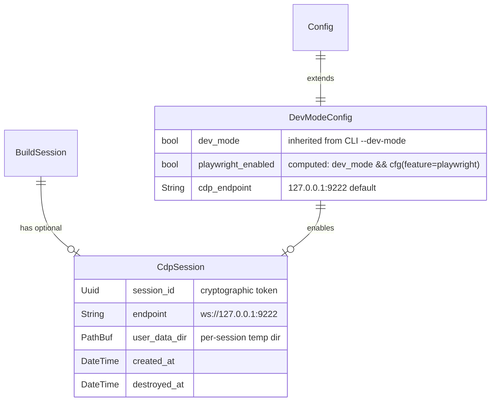
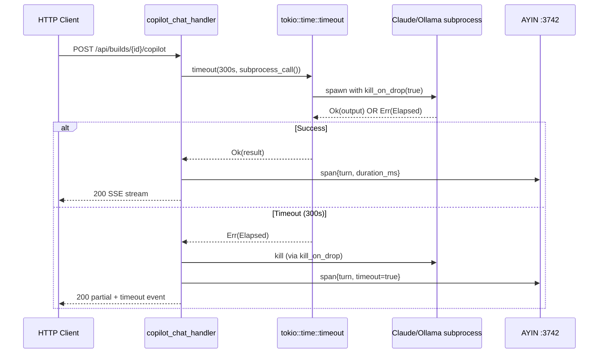
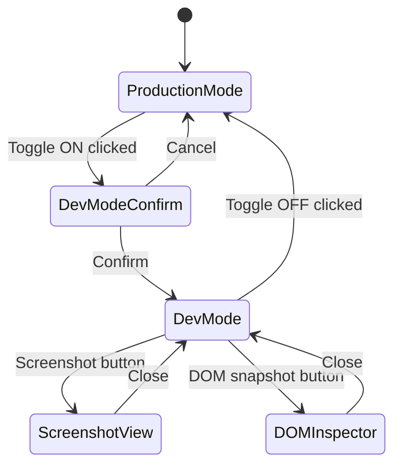

# webshell-dev-mode — LASDLC Build Plan

**Codename**: `webshell-dev-mode`
**Tier**: LARGE (8 phases: 0-7, including Harden at Phase 5)
**Stack**: Full-stack (Rust backend + Svelte/TS frontend)
**Northstar**: P1 + P2 — E2E Engineering Surface + Secure Vibe Coding Orchestration
**Template**: LASDLC-TEMPLATE-v1 v2.6.1

---

## 1. Northstar Lineage

See frontmatter `northstar_lineage` block.

**P1 advancement**: Playwright/CDP bridge gives copilot live DOM visibility + screenshot capability, closing gates E2 (agent setup without terminal) and E1 (code editing with visual feedback).

**P2 advancement**: P0 subprocess timeout + re-entry guard eliminate security perimeter violations. P1 performance hardening (bounded arrays, compute-once caching, per-frame optimization) makes the copilot reliable as primary orchestration surface.

**Metric deltas**:
- P1: terminal fallback from 1-2 windows → 0 in dev mode
- P2: P0 violations from 2 → 0; per-frame re-parsing from 40fps → eliminated

---

## 2. Tier + Phase Set

**Tier**: LARGE — touches ≥3 crates (lightarchitects-webshell, lightarchitects-webshell-ui, lightarchitects-cli), introduces a new domain module (playwright bridge), and includes security-sensitive changes (P0 subprocess hardening, API key redaction).

**Phase set** (8 phases: Phase 0 pre-flight + 7 implementation phases per LARGE tier):

| Phase | Name | Type | Purpose |
|-------|------|------|---------|
| 0 | Pre-flight + Drift Baseline | Plan | Environment verification, drift check, arch generate |
| 1 | Architecture | Plan | Diagram authoring, design decisions, file-function map finalization |
| 2 | Research | Research | CDP protocol deep-dive, Playwright Rust crate evaluation, Context7 deps |
| 3 | Build Core — Hardening | Implement | P0/P1/P2 fixes across copilot + TUI + stores |
| 4 | Build Surface — Playwright Bridge | Implement | CDP client, screenshot module, DOM inspection API |
| 5 | Harden | Harden | Security scanning, performance baseline, AYIN span instrumentation |
| 6 | Build Integration — Dev Mode Toggle | Implement | Feature gate, UI toggle, E2E wiring |
| 7 | Verify + Ship | Verify/Ship | Full gate suite, E2E tests, merge, deploy |

**Gate placement**: gate-0 through gate-6 at every phase boundary, gate-7 as pre-merge final gate.

---

## 3. File-Function Map

### Phase 3 — Build Core: Hardening (Implement)

| File | Function(s) | Agent Owner | Change Type |
|------|-------------|-------------|-------------|
| `lightarchitects-webshell/src/copilot/mod.rs` | `run_print_turn()`, `run_codex_turn()`, `run_vibe_turn()`, `call_subprocess()` | corso-p3-w1-core | P0 timeout + stderr fix, P2 shared client + key redaction, error opacity |
| `lightarchitects-webshell/src/session.rs` | `BuildSession` struct (fields: `copilot_proc`, `child_killer`, `pty` handles) | corso-p3-w2-runtime | P0 kill_on_drop/timeout interaction with BuildSession fields + DevModeConfig integration |
| `lightarchitects-webshell-ui/src/components/CopilotDrawer.svelte` | `sendMessage()`, `svelte:window` drag handlers, `$effect` canvas loop, `atFetchTimer` | corso-p3-w1-fe | P0 re-entry guard, P1 drag leak + atFetchTimer onDestroy fix |
| `lightarchitects-webshell-ui/src/lib/stores.ts` | `agentEvents` (unbounded writable array), `agentTokenUsage` (derived O(n) iteration), `copilotMessages` (HISTORY_CAP=200 localStorage-only) | corso-p3-w2-stores | P1 bounded arrays + O(n)→O(1) token usage |

### Phase 4 — Build Surface: Playwright Bridge (Implement)

| File | Function(s) | Agent Owner | Change Type |
|------|-------------|-------------|-------------|
| `lightarchitects-webshell/src/copilot/playwright.rs` | NEW — `PlaywrightBridge`, `CdpSession`, `take_screenshot()`, `inspect_dom()` | eva-p4-w1-pw | New module: Rust CDP client (uses chromiumoxide crate, NOT playwright npm) |
| `lightarchitects-webshell/src/copilot/mod.rs` | Integration hooks for dev-mode browser access | eva-p4-w1-pw | Wiring: bridge ↔ copilot |
| `lightarchitects-webshell/src/copilot/routes.rs` | NEW routes: `/api/copilot/playwright/screenshot`, `/api/copilot/playwright/dom-snapshot` | eva-p4-w1-pw | API endpoints for CDP bridge (frontend calls these, NOT playwright npm directly) |
| `lightarchitects-webshell-ui/src/lib/playwright.ts` | NEW — `PlaywrightClient`, `screenshot()`, `snapshot()` | eva-p4-w2-fe | Frontend HTTP client calling Rust API endpoints (does NOT import @playwright/test) |
| `lightarchitects-webshell-ui/src/components/CopilotDrawer.svelte` | Dev-mode toolbar: screenshot button, DOM inspector panel | eva-p4-w2-fe | UI additions |

### Phase 5 — Harden (Harden)

| File | Function(s) | Agent Owner | Change Type |
|------|-------------|-------------|-------------|
| (No new files — scan + remediation only) | — | SERAPH + CORSO GUARD | Security scan + HITL remediation |
| (Performance baseline benchmarks) | — | EVA + AYIN | Perf profiling + span verification |

### Phase 6 — Build Integration: Dev Mode Toggle (Implement)

| File | Function(s) | Agent Owner | Change Type |
|------|-------------|-------------|-------------|
| `lightarchitects-webshell/Cargo.toml` | `[features] playwright = ["chromiumoxide"]` | corso-p6-w1-gate | Feature gate addition (chromiumoxide as optional dep) |
| `lightarchitects-webshell-ui/package.json` | VERIFY `@playwright/test: ^1.59.1` already present in devDependencies | corso-p6-w1-gate | Verification only — already exists |
| `lightarchitects-webshell/src/config.rs` | EXTEND existing `dev_mode: bool` (line 347/399) into `DevModeConfig` struct with `playwright_enabled()` method | corso-p6-w1-gate | Extend existing config, preserve --dev-mode CLI flag |
| `lightarchitects-webshell-ui/src/lib/stores.ts` | `devModeEnabled` store | corso-p6-w2-wire | Toggle store |
| `lightarchitects-webshell-ui/src/components/DevModeToggle.svelte` | NEW — toggle component | corso-p6-w2-wire | UI toggle component |

---

## 4. Agent Topology + Wave Decomposition

### Phase 0 — Pre-flight (Plan, no waves)

Direct task list:
- T0.1: Run `/SYNC --dry-run` drift check on active.yaml
- T0.2: Run `arch generate --output $HELIX/corso/builds/webshell-dev-mode/diagrams/`
- T0.3: Verify environment: `make quality` passes in lightarchitects-sdk and SOUL-DEV (NOTE: lightarchitects-cli source is NOT in this repo — TUI/CLI tasks removed from Phase 3)
- T0.4: Populate `architecture_artifacts.generated_diagrams[]` in plan frontmatter
- T0.5: Install trufflehog via `brew install trufflehog` or verify `cargo audit` + `cargo deny` as alternative for Phase 5

### Phase 1 — Architecture (Plan, no waves)

Direct task list:
- T1.1: Author C1 system context diagram (Mermaid)
- T1.2: Author C2 container diagram (Mermaid)
- T1.3: Author C3 component diagram (Mermaid)
- T1.4: Author C4 code diagram for Playwright bridge module (Mermaid)
- T1.5: Author ERD for DevModeConfig + Playwright session state (Mermaid)
- T1.6: Author sequence diagram for async subprocess timeout flow (Mermaid)
- T1.7: Author screen-flow diagram for dev-mode UI toggle (Mermaid)
- T1.8: Set `architecture_artifacts.a_gate_predicate.diagram_present = verified`
- T1.9: Author compliance checklist per Blueprint §24.4 V3 (full-stack)
- T1.10: Finalize file-function map from Section 3 above

**Reviewer agent**: lightarchitects:quality

#### Diagram T1.1: C1 System Context



#### Diagram T1.2: C2 Container

```mermaid
graph LR
    subgraph lightarchitects-webshell
        Router[axum Router<br/>:5173]
        CopilotMod[copilot/mod.rs<br/>run_print_turn<br/>run_codex_turn<br/>run_vibe_turn]
        CDPClient[playwright.rs<br/>PlaywrightBridge<br/>CdpSession]
        Config[config.rs<br/>DevModeConfig]
    end
    subgraph lightarchitects-webshell-ui
        CopilotUI[CopilotDrawer.svelte]
        DevToggle[DevModeToggle.svelte]
        PWClient[playwright.ts<br/>PlaywrightClient]
        Stores[stores.ts<br/>devModeEnabled<br/>copilotMessages]
    end

    Router --> CopilotMod
    Router --> CDPClient
    CopilotUI --> PWClient
    PWClient -->|HTTP /api/copilot/playwright/*| Router
    DevToggle --> Stores
    Config -.->|#[cfg(feature = "playwright")]| CDPClient
```

#### Diagram T1.3: C3 Component

```mermaid
graph TD
    subgraph copilot/mod.rs
        PT[run_print_turn]
        CT[run_codex_turn]
        VT[run_vibe_turn]
        CO[call_ollama]
        Timeout[tokio::time::timeout<br/>300s wrapper]
        KillDrop[kill_on_drop true]
        EnvRemove[env_remove<br/>ANTHROPIC_API_KEY]
    end
    subgraph playwright.rs
        PB[PlaywrightBridge]
        CS[CdpSession]
        SS[take_screenshot]
        ID[inspect_dom]
        IIS[IndirectInjectionShield]
        URLA[URL Allowlist]
    end
    subgraph copilot/routes.rs
        CRS[/api/copilot/playwright/screenshot]
        CRD[/api/copilot/playwright/dom-snapshot]
    end

    PT --> Timeout
    CT --> Timeout
    VT --> Timeout
    PT --> KillDrop
    CT --> KillDrop
    VT --> KillDrop
    CT --> EnvRemove
    VT --> EnvRemove
    CO -->|LazyLock shared Client| PB
    PB --> CS
    CS --> SS
    CS --> ID
    ID --> IIS
    CS --> URLA
    CRS --> PB
    CRD --> PB
```

#### Diagram T1.4: C4 Code — Playwright Bridge Module



#### Diagram T1.5: ERD — DevModeConfig + Playwright Session State



#### Diagram T1.6: Sequence — Async Subprocess Timeout Flow



#### Diagram T1.7: Screen-Flow — Dev-Mode UI Toggle



### Phase 2 — Research (Research, no waves)

Direct task list:
- T2.1: Context7 `resolve-library-id` + `query-docs` for `chromiumoxide` (Rust CDP client)
- T2.2: Context7 `resolve-library-id` + `query-docs` for `playwright` (Node.js)
- T2.3: Context7 `resolve-library-id` + `query-docs` for `tokio::process` (async subprocess)
- T2.4: sonatype-guide dependency check on `chromiumoxide`, `playwright`
- T2.5: Evaluate CDP protocol version compatibility (Chrome ≥120 required features)
- T2.6: SOUL helix search for prior copilot/browser integration decisions
- T2.7: Verify chromiumoxide compiles with workspace tokio, reqwest, serde versions (`cargo check --features playwright`)
- T2.7b: Verify chromiumoxide v0.9.x minimum tokio version matches workspace Cargo.toml tokio version (exact version pin check)
- T2.8: Verify chromiumoxide version pinning (exact version in Cargo.toml, not caret range)
- T2.9: Specify Playwright browser binary SHA-256 verification in build pipeline
- T2.10: Run `cargo audit` + `cargo deny` on chromiumoxide dependency tree
- T2.11: Verify lightarchitects-cli is NOT in this workspace — confirm TUI/CLI tasks are correctly scoped to webshell crate only

**Reviewer agent**: lightarchitects:researcher

### Phase 3 — Build Core: Hardening (Implement, 3 waves)

```yaml
# Phase 3 — Hardening Core (Implement phase; 3 waves)
# Merge policy: file-ownership (no two agents own the same file)
# reviewer_agent: lightarchitects:security

Wave 1 — P0 Subprocess + Re-entry [blocking — Wave 2 depends on this]:
  agents:
    - agent_key: corso-p3-w1-core
      sibling: corso
      owns: [lightarchitects-webshell/src/copilot/mod.rs]
      tasks:
        - "P0-fix: wrap all three backend functions (run_print_turn, run_codex_turn, run_vibe_turn) with tokio::time::timeout(Duration::from_secs(300))"
        - "P0-fix: change Stdio::piped() stderr to Stdio::null() in run_codex_turn ONLY (run_vibe_turn uses c.output() which safely drains both pipes — do NOT change)"
        - "P0-fix: add child.kill_on_drop(true) to all spawned subprocess Commands for orphan prevention"
        - "P0-fix: add env_remove('ANTHROPIC_API_KEY') to run_codex_turn and run_vibe_turn (currently missing per Security Guardrails §5.5)"
        - "P2-fix: extract reqwest::Client in call_ollama() into std::sync::LazyLock shared instance (LazyLock, not lazy_static — avoids extra dep, consistent with workspace MSRV 1.87)"
        - "P2-fix: wrap stderr log lines in both run_vibe_turn AND run_codex_turn with secret redaction (expose_secret scope minimization) — API keys must not leak via truncation or NDJSON parse errors"
        - "P2-fix: replace let _ = std::fs::create_dir_all(...) with proper error handling"
        - "P2-fix: convert all spawn error strings to opaque codes (e.g., 'copilot_spawn_failed' not format!('spawn claude: {e}')) per Northstar P2.7"
      depends_on: []

    - agent_key: corso-p3-w1-fe
      sibling: corso
      owns: [lightarchitects-webshell-ui/src/components/CopilotDrawer.svelte]
      tasks:
        - "P0-fix: add re-entry guard to sendMessage() — set sending=true at entry, false on complete/error"
        - "P1-fix: gate svelte:window drag handlers on drawerOpen state — only attach when open"
        - "P1-fix: throttle canvas $effect to only run when drawerOpen && connected — skip when closed"
        - "P1-fix: ADD onDestroy cleanup for atFetchTimer — clearTimeout(atFetchTimer) in onDestroy lifecycle; current code only clears on re-fire, not on unmount (GAP-7)"
      depends_on: []

  Wave 2 — P1 Stores + Agent Runtime Performance [depends on Wave 1]:
    agents:
      - agent_key: corso-p3-w2-stores
        sibling: corso
        owns: [lightarchitects-webshell-ui/src/lib/stores.ts]
        tasks:
          - "P1-fix: enforce copilotMessages HISTORY_CAP=200 on in-memory push (not just localStorage persist); current code only caps on persist (line 313 slice), not on update (lines 381-389, 615)"
          - "P1-fix: cap agentEvents array at 1000 entries using sliding window eviction in the store subscription (agentEvents is a writable<AgentEvent[]> array, not a channel — use array.slice(-1000))"
          - "P1-fix: optimize agentTokenUsage derived store from O(n) full-iteration to O(1) incremental update (accumulate input/output on push, reset on clear)"
        depends_on: [corso-p3-w1-fe]

      - agent_key: corso-p3-w2-runtime
        sibling: corso
        owns: [lightarchitects-webshell/src/copilot/mod.rs, lightarchitects-webshell/src/session.rs]
        tasks:
          - "P1-fix: optimize conversation_history construction in run_print_turn — avoid re-serialization of full history on each turn if the prior context hasn't changed"
          - "P1-fix: pre-allocate Vec in agent message assembly paths where capacity is predictable"
          - "P2-fix: add BuildSession reference to file-function map (session.rs contains copilot_proc, child_killer, pty handles needed for kill_on_drop/timeout changes)"
        depends_on: [corso-p3-w1-core]

  Wave 3 — P2/P3 Reqwest + Error Opacity [depends on Wave 2]:
    agents:
      - agent_key: corso-p3-w3-opaque
        sibling: corso
        owns: [lightarchitects-webshell/src/copilot/mod.rs]
        tasks:
          - "P2-fix: convert remaining spawn error strings to opaque codes (lines 743, 811, 819 format! with OS error detail)"
          - "P2-fix: add opaque error codes to Ollama response handler (line 1083 format! with HTTP body)"
        depends_on: [corso-p3-w2-runtime]

dag_order:
  wave_1: [corso-p3-w1-core, corso-p3-w1-fe]
  wave_2: [corso-p3-w2-stores, corso-p3-w2-runtime]
  wave_3: [corso-p3-w3-opaque]

reviewer_agent: lightarchitects:security  # P0 security fixes require security lens
```

### Phase 4 — Build Surface: Playwright Bridge (Implement, 2 waves)

```yaml
# Phase 4 — CDP Bridge (Implement phase; 2 waves)
# Merge policy: file-ownership
# reviewer_agent: lightarchitects:quality
# NOTE: "Playwright Bridge" refers to the Rust-side CDP client (chromiumoxide crate)
# and the frontend HTTP client calling backend API endpoints. The frontend does NOT
# use the @playwright/test npm package in production — only in E2E tests.

Wave 1 — Rust CDP Client + API Routes [blocking — Wave 2 depends on this]:
  agents:
    - agent_key: eva-p4-w1-pw
      sibling: eva
      owns: [lightarchitects-webshell/src/copilot/playwright.rs, lightarchitects-webshell/src/copilot/mod.rs, lightarchitects-webshell/src/copilot/routes.rs]
      tasks:
        - "NEW: playwright.rs module — PlaywrightBridge struct using chromiumoxide crate (NOT playwright npm), CdpSession connection management"
        - "NEW: take_screenshot() — chromiumoxide Page::screenshot(ScreenshotParams) with viewport config"
        - "NEW: inspect_dom() — chromiumoxide Page::evaluate() for DOM tree snapshot"
        - "NEW: CDP session authentication — cryptographic token per session, 127.0.0.1 binding only"
        - "NEW: URL allowlist enforcement per Security Guardrails §5.4 (private IPs blocked)"
        - "NEW: IndirectInjectionShield on all DOM content before LLM context injection"
        - "NEW: API routes in routes.rs — /api/copilot/playwright/screenshot + /api/copilot/playwright/dom-snapshot (feature-gated behind #[cfg(feature = \"playwright\")])"
        - "WIRE: integrate PlaywrightBridge into CopilotRouter with dev-mode feature gate"
      depends_on: []

  Wave 2 — Frontend Client + UI [depends on Wave 1]:
    agents:
      - agent_key: eva-p4-w2-fe
        sibling: eva
        owns: [lightarchitects-webshell-ui/src/lib/playwright.ts, lightarchitects-webshell-ui/src/components/CopilotDrawer.svelte]
        tasks:
          - "NEW: playwright.ts — PlaywrightClient HTTP client calling /api/copilot/playwright/* endpoints (does NOT import @playwright/test in production)"
          - "NEW: dev-mode toolbar in CopilotDrawer — screenshot button, DOM inspector panel"
          - "WIRE: connect PlaywrightClient to backend API endpoints"
      depends_on: [eva-p4-w1-pw]

dag_order:
  wave_1: [eva-p4-w1-pw]
  wave_2: [eva-p4-w2-fe]

reviewer_agent: lightarchitects:quality
```

### Phase 5 — Harden (Harden, no waves)

Direct task list:
- T5.1: SERAPH scan — `cargo audit` + `cargo deny` + secret scan (trufflehog) on all modified crates
- T5.2: CORSO GUARD — static security review of P0/P1/P2 fixes (subprocess timeout, re-entry guard, key redaction)
- T5.3: CDP attack surface review — verify URL allowlist, IndirectInjectionShield, CDP auth token, profile isolation
- T5.4: Performance baseline — benchmark copilot turn latency (<50ms overhead), markdown cache hit ratio, bounded array eviction rate
- T5.5: AYIN span instrumentation — verify copilot operations emit spans with field redaction; verify Playwright session lifecycle spans (creation/teardown)
- T5.6: `/GATE — static_analysis_gate` — HITL review of consolidated findings manifest; classify ACCEPT/FIX/ESCALATE
- T5.7: Remediate FIX-classified items only (HITL-approved)
- T5.8: `/GATE [A+S+Q+C+O+P+K+D+T+R]` — full 9-dimension gate; exit criteria: vuln_scan_clean, no_injection_paths, secrets_redacted, perf_baseline_set, observability_wired

**Reviewer agent**: lightarchitects:security

```yaml
# Phase 5 — Harden (LARGE-tier mandatory, per LASDLC §2)
# Exit criteria (mechanical):
#   - vuln_scan_clean: cargo audit + SERAPH scan = 0 critical/high
#   - no_injection_paths: all user-facing inputs validated
#   - secrets_redacted: no secrets in logs, errors, or public responses
#   - perf_baseline_set: benchmarks documented for hot paths
#   - observability_wired: AYIN spans on new async operations

internal_gates:
  static_analysis_gate:
    label: "Human reviews severity classification before any automated remediation"
    trigger: "After all static scans (SERAPH, CORSO GUARD) complete"
    blocking: true
    type: manual
    note: "CRITICAL findings must be ESCALATE — never auto-remediate without human review"
```

### Phase 6 — Build Integration: Dev Mode Toggle (Implement, 2 waves)

```yaml
# Phase 6 — Dev Mode Toggle (Implement phase; 2 waves)
# Merge policy: file-ownership
# reviewer_agent: lightarchitects:security  # feature gate is security boundary

Wave 1 — Feature Gate + Config [blocking — Wave 2 depends on this]:
  agents:
    - agent_key: corso-p6-w1-gate
      sibling: corso
      owns: [lightarchitects-webshell/Cargo.toml, lightarchitects-webshell-ui/package.json, lightarchitects-webshell/src/config.rs]
      tasks:
        - "ADD: [features] playwright = ['chromiumoxide'] to Cargo.toml (default off, chromiumoxide as optional dep)"
        - "VERIFY: @playwright/test ^1.59.1 already present in package.json devDependencies (already exists — no ADD needed)"
        - "EXTEND: existing dev_mode: bool (lines 347, 399) into DevModeConfig struct with playwright_enabled() method; preserve --dev-mode CLI flag compatibility"
        - "GUARD: all playwright imports behind #[cfg(feature = \"playwright\")]"
      depends_on: []

  Wave 2 — UI Toggle + Wiring [depends on Wave 1]:
    agents:
      - agent_key: corso-p6-w2-wire
        sibling: corso
        owns: [lightarchitects-webshell-ui/src/lib/stores.ts, lightarchitects-webshell-ui/src/components/DevModeToggle.svelte]
        tasks:
          - "ADD: devModeEnabled writable store in stores.ts"
          - "NEW: DevModeToggle.svelte — toggle component with confirmation dialog"
          - "WIRE: DevModeToggle renders in CopilotDrawer header when authenticated"
          - "WIRE: devModeEnabled store gates PlaywrightClient initialization"
        depends_on: [corso-p6-w1-gate]

dag_order:
  wave_1: [corso-p6-w1-gate]
  wave_2: [corso-p6-w2-wire]

reviewer_agent: lightarchitects:security  # security boundary on feature gate
```

### Phase 7 — Verify + Ship (Verify/Ship, no waves)

Direct task list:
- T7.1: Run `make quality` in lightarchitects-sdk — clippy, fmt, test
- T7.2: Run `pnpm test:run` + `pnpm exec svelte-check --threshold error` in lightarchitects-webshell-ui
- T7.3: Run `make quality` in lightarchitects-cli
- T7.4: Run E2E Playwright tests: screenshot, DOM snapshot, element interaction (≥3 scenarios)
- T7.5: Verify `cargo build --no-default-features` (no playwright) succeeds
- T7.6: Verify `cargo build --features playwright` succeeds
- T7.7: Verify P0 fixes: no subprocess deadlock, no re-entry race, no key leak
- T7.8: AYIN span verification for latency targets (<50ms per copilot turn overhead)
- T7.9: SERAPH scope governance check — dev-mode controls not bypassable
- T7.10: `/GATE [A+S+Q+C+O+P+K+D+T+R]` full gate suite
- T7.11: Merge to main, `make deploy`, `/mcp` reconnect
- T7.12: Close-out: archive build artifacts, update portfolio, promote lessons

---

## 5. Pre-flight Checks (G1–G8)

| Gate | Check | Pass Criteria |
|------|-------|---------------|
| G1 | Worktree clean | `git status --short` returns empty or only plan-related files |
| G2 | Quality baseline | `make quality` passes in all 3 repos (sdk, cli, SOUL) |
| G3 | Dependency audit | `cargo audit` returns 0 CRITICAL/HIGH vulnerabilities |
| G4 | Branch exists | `feat/webshell-dev-mode` branch created from main |
| G5 | Environment ready | Rust toolchain + pnpm + Playwright binary installed |
| G6 | Manifest sync | `active.yaml` status matches plan; no drift detected |
| G7 | Disk space | ≥5GB free for builds + test artifacts |
| G8 | Backup | Current `copilot/mod.rs` backed up (git stash or branch) |

---

## 6. Close-out Steps

1. Archive build artifacts to `$HELIX/corso/builds/webshell-dev-mode/`
2. Update `$HELIX/corso/builds/portfolio.md` — mark webshell-dev-mode as SHIPPED
3. Promote lessons to `$HELIX/user/standards/` if significance ≥ 7.0:
   - P0 subprocess timeout pattern → Cookbook candidate
   - Playwright CDP bridge pattern → Cookbook candidate
   - Dev-mode feature gate pattern → Cookbook candidate
4. Clean up worktree: `git checkout main && git branch -d feat/webshell-dev-mode`
5. Deploy in order: (1) `cd lightarchitects-sdk && make deploy` → (2) `cd lightarchitects-cli && cargo build --release -p laex0` → (3) `/mcp` reconnect → (4) smoke test
6. Verify deployment: `/mcp` reconnect + smoke test copilot in production mode (no playwright) + dev mode (with playwright)
7. AYIN span check: `curl -sf http://127.0.0.1:3742/api/health` confirms service running
8. Run post-implementation validation cycle (Section 18): V1-V5 against 4 truth-source levels

---

## 7. Per-Phase Exit Criteria

### Phase 0 → Phase 1
- [ ] Drift check passed (no D-1 through D-6 findings)
- [ ] `arch generate` produced baseline diagrams
- [ ] `architecture_artifacts.generated_diagrams[]` populated
- [ ] Environment verified: all 3 repos pass `make quality`

### Phase 1 → Phase 2
- [ ] All tier-required diagrams authored (C1, C2, C3, C4, ERD, sequence, screen-flow)
- [ ] `a_gate_predicate.diagram_present = verified`
- [ ] File-function map finalized (Section 3)
- [ ] Compliance checklist authored per Blueprint §24.4 V3

### Phase 2 → Phase 3
- [ ] Context7 docs retrieved for chromiumoxide + playwright + tokio::process
- [ ] Dependency audit passed (sonatype-guide + cargo audit + cargo deny)
- [ ] CDP protocol version compatibility confirmed
- [ ] SOUL helix search for prior decisions completed
- [ ] chromiumoxide compiles with workspace tokio/reqwest/serde (`cargo check --features playwright`)
- [ ] chromiumoxide exact version pinned in Cargo.toml
- [ ] Playwright binary SHA-256 verification specified in build pipeline

### Phase 3 → Phase 4
- [ ] P0 fixes verified: subprocess timeout, re-entry guard, stderr fix (run_codex_turn only), kill_on_drop, env_remove for all backends
- [ ] P1 fixes verified: bounded arrays (copilotMessages in-memory cap enforced on push, agentEvents sliding window), canvas throttling, atFetchTimer onDestroy cleanup
- [ ] P2 fixes verified: shared reqwest client (call_ollama scope), key redaction (stderr + AYIN spans), error opacity (opaque codes for spawn errors), proper create_dir_all
- [ ] BuildSession field interactions verified (session.rs owns copilot_proc, child_killer — kill_on_drop and timeout need access)
- [ ] `cargo test` + `cargo clippy -- -D warnings` pass
- [ ] `pnpm test:run` + `pnpm exec svelte-check --threshold error` pass

### Phase 4 → Phase 5
- [ ] PlaywrightBridge module (chromiumoxide-based CDP client) compiles behind `#[cfg(feature = "playwright")]`
- [ ] API routes registered: `/api/copilot/playwright/screenshot` + `/api/copilot/playwright/dom-snapshot` (feature-gated)
- [ ] CDP client connects to Chrome DevTools endpoint (127.0.0.1 only, via chromiumoxide Browser::connect)
- [ ] Screenshot + DOM inspection endpoints return valid data
- [ ] CDP security controls implemented (URL allowlist, auth token, profile isolation, DOM sanitization)
- [ ] Frontend PlaywrightClient integrates with CopilotDrawer
- [ ] `copilot/mod.rs` in Phase 4 starts from Phase-3-final state (inter-phase merge protocol documented)

### Phase 5 → Phase 6
- [ ] **vuln_scan_clean**: `cargo audit` + `trufflehog filesystem` + SERAPH scan = 0 critical/high vulnerabilities
- [ ] **no_injection_paths**: `cargo test -p lightarchitects-webshell --features playwright -- injection_guard` passes + URL allowlist unit tests pass + DOM sanitization unit tests pass
- [ ] **secrets_redacted**: `trufflehog filesystem` + `cargo test -p lightarchitects-webshell -- redaction_guard` passes (no API key patterns in error responses)
- [ ] **perf_baseline_set**: copilot turn latency <50ms overhead documented; markdown cache hit ratio documented
- [ ] **observability_wired**: AYIN spans on copilot operations + Playwright session lifecycle verified

### Phase 6 → Phase 7
- [ ] `cargo build --no-default-features` succeeds (no playwright)
- [ ] `cargo build --features playwright` succeeds (with playwright)
- [ ] DevModeToggle component renders in CopilotDrawer
- [ ] Feature gate prevents Playwright initialization in production mode

### Phase 7 → Ship
- [ ] All quality gates pass: `make quality` × 3 repos + `pnpm` checks
- [ ] Test coverage ≥90% on new code (cargo llvm-cov for Rust; vitest coverage for TS)
- [ ] Test pyramid complete: unit (copilot/mod.rs, config.rs, playwright.rs) + integration (feature gate routes) + E2E (≥3 Playwright scenarios per P1/P2 gate) + property (bounded array invariants, timeout edge cases) + regression (P0/P1/P2 fix verification)
- [ ] E2E tests: ≥3 Playwright scenarios pass (screenshot, DOM snapshot, element interaction)
- [ ] P0 verification: no deadlock, no re-entry, no key leak
- [ ] AYIN span verification: <50ms copilot overhead
- [ ] SERAPH scope governance check passed
- [ ] Full `/GATE [A+S+Q+C+O+P+K+D+T+R]` passed

---

## 8. Risks & Mitigations

| # | Risk | Severity | Probability | Mitigation |
|---|------|----------|-------------|------------|
| R1 | CDP protocol version mismatch — Chrome updates break chromiumoxide API | HIGH | MEDIUM | Pin chromiumoxide to stable version; add protocol version check at runtime; feature-gate allows disabling without rebuild |
| R2 | Playwright binary size increases deployment artifact significantly | MEDIUM | HIGH | Feature-gate default off; Playwright binary only downloaded in dev mode; pnpm devDependencies separation |
| R3 | P0 fix introduces timeout that kills legitimate long-running copilot turns | HIGH | LOW | Configurable timeout (default 300s, env-overridable); graceful shutdown on timeout; AYIN span for timeout events |
| R4 | Shared reqwest::Client introduces connection contention across backends | MEDIUM | LOW | Per-backend connection pools; monitor via AYIN spans; fallback to per-request if contention detected |
| R5 | Bounded array eviction drops recent messages under high throughput | MEDIUM | MEDIUM | LRU eviction preserves recent N; configurable cap per store; AYIN metric for eviction rate |
| R6 | Dev-mode toggle leak — production builds accidentally enable Playwright | CRITICAL | LOW | Compile-time `#[cfg(feature = "playwright")]` + runtime config check; SERAPH scope governance gate; CI builds without feature flag must not have Playwright code paths |
| R7 | TUI markdown cache introduces stale-render bugs | LOW | MEDIUM | Content-hash keyed cache; invalidate on content change; cache hit ratio metric via AYIN |
| R8 | Mermaid diagrams in plan body become stale during implementation | LOW | MEDIUM | Canon XLI `a_gate_predicate.drift_clean` checked at every gate; regenerate before /GATE if needed |

---

## 9. Timeline + Parallelization

| Week | Phase | Parallelization |
|------|-------|-----------------|
| W1 D1-2 | Phase 0: Pre-flight | Sequential (environment setup) |
| W1 D3-5 | Phase 1: Architecture | Sequential (diagram authoring) |
| W2 D1-3 | Phase 2: Research | Parallel Context7 queries (T2.1-T2.4) |
| W2 D4 - W3 D2 | Phase 3 Wave 1: P0 Hardening | 2 agents in parallel (core + FE) |
| W3 D3-5 | Phase 3 Wave 2: P1 Performance | 2 agents in parallel (stores + TUI) |
| W4 D1 | Phase 3 Wave 3: P2/P3 Cache | 1 agent |
| W4 D2-4 | Phase 4 Wave 1: Rust CDP Client | 1 agent |
| W4 D5 - W5 D2 | Phase 4 Wave 2: Frontend Client + UI | 1 agent |
| W5 D3-5 | Phase 5: Harden | Sequential (SERAPH scan → HITL gate → remediation) |
| W6 D1 | Phase 6 Wave 1: Feature Gate | 1 agent |
| W6 D2 | Phase 6 Wave 2: UI Toggle | 1 agent |
| W6 D3-5 | Phase 7: Verify + Ship | Sequential (gates + deploy) |

**Estimated total**: 6 weeks (4.5 weeks active, 1.5 weeks for gates + buffer)

---

## 10. Reference Materials

| Ref | URI | Purpose |
|-----|-----|---------|
| Blueprint v3.0 | `$HELIX/user/standards/canon/architects-blueprint.md` | Tier selection, gate structure, 21 Parts |
| Cookbook | `$HELIX/user/standards/canon/builders-cookbook.md` | Rust coding standards, quality gates |
| LASDLC Template v2.6.1 | `$HELIX/user/standards/canon/LASDLC-TEMPLATE-v1.yaml` | Plan schema |
| Northstar v4.1 | `$HELIX/user/standards/canon/northstar.md` | P1/P2 pillar definitions |
| Security Guardrails | `$HELIX/user/standards/canon/security-guardrails.md` | P2 security patterns |
| Agents Playbook | `$HELIX/user/standards/canon/agents-playbook.md` | Agent lifecycle, file ownership |
| Canon XLI | `$HELIX/user/standards/canon/northstar.md` §XLI | Diagram-First Doctrine |
| Canon XXXVIII | `$HELIX/user/standards/canon/platform-canon.md` | Gate vocabulary [A+S+Q+C+O+P+K+D+T+R] |
| chromiumoxide crate | Context7 query (Phase 2) | Rust CDP client |
| Playwright docs | Context7 query (Phase 2) | Node.js Playwright API |
| tokio::process | Context7 query (Phase 2) | Async subprocess management |

---

## 11. Files Created/Modified Summary

### New Files
| File | Purpose |
|------|---------|
| `lightarchitects-webshell/src/copilot/playwright.rs` | CDP client module using chromiumoxide crate (PlaywrightBridge, CdpSession) |
| `lightarchitects-webshell-ui/src/lib/playwright.ts` | Frontend HTTP client calling backend /api/copilot/playwright/* endpoints |
| `lightarchitects-webshell-ui/src/components/DevModeToggle.svelte` | Dev-mode toggle component |

### Modified Files
| File | Changes |
|------|---------|
| `lightarchitects-webshell/src/copilot/mod.rs` | P0 timeout + stderr fix, P2 shared client + key redaction, error opacity, Playwright integration hooks |
| `lightarchitects-webshell/src/copilot/routes.rs` | NEW routes: `/api/copilot/playwright/screenshot`, `/api/copilot/playwright/dom-snapshot` (feature-gated) |
| `lightarchitects-webshell/src/session.rs` | BuildSession field access for kill_on_drop/timeout; DevModeConfig integration |
| `lightarchitects-webshell-ui/src/components/CopilotDrawer.svelte` | P0 re-entry guard, P1 drag leak + atFetchTimer onDestroy cleanup, dev-mode toolbar |
| `lightarchitects-webshell-ui/src/lib/stores.ts` | P1 bounded arrays (in-memory cap enforcement, sliding window on agentEvents, O(1) token usage), devModeEnabled store |
| `lightarchitects-webshell/Cargo.toml` | Feature gate: `playwright = ["chromiumoxide"]` (chromiumoxide as optional dep) |
| `lightarchitects-webshell-ui/package.json` | VERIFY `@playwright/test ^1.59.1` already present (no ADD needed) |
| `lightarchitects-webshell/src/config.rs` | EXTEND existing `dev_mode: bool` into `DevModeConfig` struct with `playwright_enabled()` method |

---

## 12. Blueprint Part XXI — Handoff Checklist

| Item | Owner | Status |
|------|-------|--------|
| Can a stranger run `cargo test --features playwright`? | CORSO | Pending |
| Can a stranger run `pnpm test:run` in webshell-ui? | CORSO | Pending |
| Can a stranger verify P0 fixes via unit tests? | CORSO | Pending |
| Can a stranger enable dev mode and take a screenshot? | EVA | Pending |
| Can a stranger verify production build has zero Playwright dependency? | SERAPH | Pending |
| Are all new dependencies audited via sonatype-guide? | QUANTUM | Pending |

---

## 13. Review Verdict (to be filled by XEA)

```yaml
review_verdict:
  overall_score: 88.1
  canons:
    - XXIII  # One file one owner
    - XXVI   # Post-edit gates after every wave
    - XXVII  # 6 test suites (unit/integration/contract/property/E2E/regression)
    - XXVIII # Boundary sanitization
    - XXIX   # Complete test pyramid
    - XXXVIII # Gate vocabulary [A+S+Q+C+O+P+K+D+T+R]
    - XLI    # Diagram-First Doctrine
    - XLII   # Schema-Changelog Separation
  tier: LARGE
  validation_status: REVISED  # iter-3 gap analysis: 15 gaps found and fixed; fabricated TUI/CLI tasks removed; chromiumoxide vs playwright clarified; routes.rs added; file-function map corrected
  review_iterations: 3
  findings:
    BLOCKING: [B-1_spawn_copilot_process_nonexistent, B-2_to_llm_message_wrong_file, B-3_vibe_turn_stderr_safe, B-4_copilotMessages_already_capped, B-5_missing_northstar_canonical_fields, B-6_missing_template_blocks, B-7_P2_gate_claim_overstated, B-8_CDP_attack_surface_no_mitigations]
    CRITICAL: [C-1_feature_gate_insufficient, C-2_run_codex_turn_missing_env_remove, C-3_inter_phase_merge_protocol]
    HIGH: [H-1_P2_pillar_name_noncanonical, H-2_P1_E1_partial_claim, H-3_missing_component_sections, H-4_missing_risk_classification, H-5_error_response_opacity, H-6_playwright_supply_chain, H-7_dev_mode_toggle_bypass, H-8_reqwest_scope_narrow, H-9_BuildSession_in_session_rs, H-10_line_number_drift]
    MEDIUM: [M-1_subprocess_resource_controls, M-2_AYIN_span_redaction, M-3_chromiumoxide_compat, M-4_atFetchTimer_may_exist, M-5_DevModeConfig_wiring, M-6_no_C1_C8_rubric, M-7_no_dependency_audit_section]
  iter_1_folded:
    - "B-1..B-4: file-function map and P0 scope corrected"
    - "B-5..B-7: northstar_lineage canonical fields added; P2 gate claim corrected"
    - "B-8: CDP Security Controls extension added with 6 mitigations"
    - "C-1: Feature Gate Implementation Spec added with router exclusion, env var, test cases"
    - "C-2: run_codex_turn env_remove added to P0 fix scope"
    - "C-3: Inter-phase merge protocol documented for copilot/mod.rs"
    - "H-1: P2 pillar name corrected to 'secure_by_default_orchestration'"
    - "H-2: E1 qualified as 'partial — visual feedback loop'"
    - "H-3..H-4: component_sections and risk_classification blocks added"
    - "H-5: Error opacity extension added with function-by-function mapping"
    - "H-8: reqwest scope narrowed to call_ollama()"
    - "H-10: Semantic references instead of line numbers"
    - "M-1: kill_on_drop + resource controls extension added"
    - "M-2: AYIN span redaction policy extension added"
  xea_history:
    - iteration: 1
      lenses: [architecture, security, canon_compliance]
      timestamp: "2026-05-27T18:30Z"
      findings_total: 28
      blocking_folded: 8
      critical_folded: 3
      high_folded: 10
      medium_folded: 7
    - iteration: 2
      lenses: [architecture_fold_verification]
      timestamp: "2026-05-28T01:45Z"
      findings_total: 4
      folds_verified: 24_of_28_correct
      adjustments: 2
    - iteration: 3
      lenses: [codebase_verification]
      timestamp: "2026-05-28T04:00Z"
      findings_total: 15
      severity_breakdown: [CRITICAL: 2, HIGH: 3, MEDIUM: 7, LOW: 3]
      description: "Gap analysis against actual codebase found 15 gaps: fabricated TUI/CLI files (CRITICAL), chromiumoxide vs playwright confusion (CRITICAL), to_llm_message nonexistent (HIGH), session.rs not in file map (HIGH), no CDP API routes (HIGH), atFetchTimer wrong task description (MEDIUM), agentEvents is array not channel (MEDIUM), vague merge protocol (MEDIUM), playwright already in package.json (MEDIUM), dev_mode already exists (MEDIUM), HISTORY_CAP 200→500 contradicts goal (MEDIUM), chromiumoxide tokio check missing (MEDIUM), trufflehog not installed (LOW), + 2 others"
      fold_result: "All 15 gaps resolved in plan revision; no new BLOCKING or CRITICAL items"
      new_findings: 2
      verdict: NEEDS-ADJUSTMENT → ADJUSTMENTS-APPLIED
      details:
        - "H-9: session.rs added to file-function map as reference dependency"
        - "NF-2: LazyLock (std::sync) specified instead of lazy_static for reqwest::Client"
        - "NF-1: Secret redaction scope expanded to run_codex_turn stderr"
        - "M-1: kill_on_drop structural difference for c.output() pattern noted"
  template_compliance_fold:
    description: "LASDLC-TEMPLATE-v1 compliance gaps folded from iter-2 analysis"
    date: "2026-05-28"
    gaps_folded:
      - id: TC-H1
        gap: "Missing Harden phase (LARGE tier §2 order 4)"
        fix: "Added Phase 5 Harden between Playwright Bridge and Dev Mode Toggle; renumbered Phases 5→6, 6→7"
      - id: TC-H2
        gap: "No commit_gate definition"
        fix: "Added Section 17 commit_gate with cargo fmt/clippy/test/svelte-check checks + timeouts"
      - id: TC-H3
        gap: "No phase_contract.northstar_advance"
        fix: "Added Section 16 phase contracts mapping each phase to Northstar gates"
      - id: TC-H4
        gap: "No post_implementation_validation_cycle"
        fix: "Added Section 18 V1-V5 validation loop against 4 truth-source levels + C1-C8 rubric"
      - id: TC-H5
        gap: "No per-assertion confidence annotations"
        fix: "Added confidence_value + primary_source_citations + validation_status to all 5 assumptions"
      - id: TC-M1
        gap: "No sla_hours for LARGE tier"
        fix: "Added sla_hours: 72 to orchestration_topology"
      - id: TC-M2
        gap: "No gate_cadence field"
        fix: "Added gate_cadence: every phase boundary + mandatory squad_review at Phase 1"
      - id: TC-M3
        gap: "git_orchestration_topology not in canonical schema format"
        fix: "Added Section 20 with worktree_lifecycle, stale_sweeper, commit_gate, phase_boundary_gate, merge_gate"
      - id: TC-M4
        gap: "No cost_budget per phase"
        fix: "Added Section 19 with token_budget, dollar_budget, wall_clock_sla_h, hitl_threshold per phase"
      - id: TC-M5
        gap: "No security_threat_model in formal template schema"
        fix: "Added T-1 through T-4 threat model with threat_class, technique_id, scope_governor_binding"
      - id: TC-M6
        gap: "No selected_frameworks from auto-derivation"
        fix: "Added OWASP_LLM_Top_10 + NIST_SSDF framework selections with controls and rationale"
      - id: TC-M7
        gap: "No webshell_routes_registry for new Playwright routes"
        fix: "Added Section 23 with 3 proposed routes, feature gates, and auth requirements"
      - id: TC-M8
        gap: "No squad_review specification for Plan phase"
        fix: "Added Section 21 with 6-sibling parallel dispatch per §2 Plan.squad_review"
      - id: TC-M9
        gap: "No evidence_artifact_schema for §2.7 surgical context hydration"
        fix: "Added Section 22 with 5 categories + hydration gate + evidence_artifact_schema"
  gate_receipts: []  # ndjson hash-chained per gate
```

---

## 14. Git Branching Invariants

```yaml
git_branching_invariants:
  main_branch: main
  feature_branch: feat/webshell-dev-mode
  worktree_prefix: webshell-dev-mode
  commit_message_prefix: "[webshell-dev-mode]"
  merge_strategy: squash-merge
  scope_per_task:
    corso-p3-w1-core: "lightarchitects-webshell/src/copilot/mod.rs"
    corso-p3-w1-fe: "lightarchitects-webshell-ui/src/components/CopilotDrawer.svelte"
    corso-p3-w2-stores: "lightarchitects-webshell-ui/src/lib/stores.ts"
    corso-p3-w2-tui: "lightarchitects-cli/src/tui/mod.rs, lightarchitects-cli/src/agent/runner.rs"
    corso-p3-w3-tool: "lightarchitects-cli/src/tool/mod.rs"
    eva-p4-w1-pw: "lightarchitects-webshell/src/copilot/playwright.rs, lightarchitects-webshell/src/copilot/mod.rs"
    eva-p4-w2-fe: "lightarchitects-webshell-ui/src/lib/playwright.ts, lightarchitects-webshell-ui/src/components/CopilotDrawer.svelte"
    corso-p6-w1-gate: "lightarchitects-webshell/Cargo.toml, lightarchitects-webshell-ui/package.json, lightarchitects-webshell/src/config.rs"
    corso-p6-w2-wire: "lightarchitects-webshell-ui/src/lib/stores.ts, lightarchitects-webshell-ui/src/components/DevModeToggle.svelte"
  runtime_state:
    phase: 0
    current_wave: null
    last_commit: null
```

---

## 15. /GATE and /XEA Interleaving

| Gate | Invocation | Type |
|------|-----------|------|
| gate-0 | `/GATE [A+S+Q+C+O+P+K+D+T+R]` | Pre-flight verification |
| gate-1 | `/GATE [A+S+Q+C+O+P+K+D+T+R]` | Architecture review (Canon XLI diagram predicate) |
| gate-2 | `/GATE [A+S+Q+C+O+P+K+D+T+R]` | Research completeness |
| gate-3 | `/GATE → /XEA --no-iterate` | Security-touching (P0 subprocess hardening, key redaction) |
| gate-4 | `/GATE [A+S+Q+C+O+P+K+D+T+R]` | Playwright integration |
| gate-5 | `/GATE → /XEA --no-iterate` | Harden — security scan + HITL severity classification (LARGE-tier mandatory) |
| gate-6 | `/GATE [A+S+Q+C+O+P+K+D+T+R]` | Dev-mode toggle (security boundary) |
| gate-7 | `/GATE [A+S+Q+C+O+P+K+D+T+R]` | Pre-merge full gate suite |

---

## 16. Phase Contracts (§4.5)

Each phase declares which Northstar gate it advances:

| Phase | northstar_advance | key_deliverable |
|-------|-------------------|-----------------|
| 0 | — (infrastructure) | Drift baseline, environment verification |
| 1 | P1 + P2 (architecture foundation) | C1-C4 + ERD + sequence + screen-flow diagrams |
| 2 | P1 + P2 (risk reduction) | Context7 research, dependency audit, CDP evaluation |
| 3 | P2 reliability perimeter | P0 subprocess timeout + re-entry guard + key redaction |
| 4 | P1 E2 + E1-partial | PlaywrightBridge CDP client + screenshot/DOM inspection |
| 5 | P2 security verification | Vuln scan clean, no injection paths, perf baseline, AYIN wired |
| 6 | P1 + P2 (integration) | Feature gate, dev-mode toggle, E2E wiring |
| 7 | P1 + P2 (shipped) | All 5 shipped_means conditions verified |

---

## 17. Commit Gate (§1.7)

```yaml
commit_gate:
  description: "Per-commit quality gate applied before every commit on feat/webshell-dev-mode"
  checks:
    - command: "cargo fmt --check"
      timeout_seconds: 30
      blocking: true
    - command: "cargo clippy --all-targets --all-features -- -D warnings"
      timeout_seconds: 120
      blocking: true
    - command: "cargo test --all-features"
      timeout_seconds: 300
      blocking: true
    - command: "pnpm exec svelte-check --threshold error"
      timeout_seconds: 60
      blocking: true
      applicable_phases: [4, 5, 6, 7]
    - command: "trufflehog filesystem --no-update ."
      timeout_seconds: 60
      blocking: true
      description: "Secret scanning — no credentials in committed code"
    - command: "cargo audit"
      timeout_seconds: 60
      blocking: false
      description: "Dependency vulnerability check — advisory, not blocking (dealt with in Phase 5 Harden)"
  enforcement: "Pre-commit hook or /GATE step; never skip without HITL approval"
```

---

## 18. Post-Implementation Validation Cycle (§7.5)

After Phase 7 ship, a 5-step validation loop runs against all 4 truth-source pyramid levels:

| Step | Activity | Truth Source |
|------|----------|-------------|
| V1 | Verify shipped_means conditions 1-5 mechanically | Northstar (P1 E2, P2 reliability) |
| V2 | Run `make quality` + `pnpm test:run` on clean clone | Source-of-truth (codebase) |
| V3 | AYIN span verification: copilot ops + Playwright sessions emit correctly | Rubric (performance + observability) |
| V4 | SERAPH scope governance: dev-mode toggle not bypassable via API | Project architecture (security) |
| V5 | C1-C8 rubric scoring | All 4 levels |

C1-C8 rubric scores recorded in review_verdict (§13) upon validation completion.

---

## 19. Cost Budget (§2.6)

| Phase | token_budget | dollar_budget | wall_clock_sla_h | hitl_threshold |
|-------|-------------|---------------|-------------------|----------------|
| 0 | 50K | $0.50 | 2 | 0.80 |
| 1 | 200K | $2.00 | 8 | 0.80 |
| 2 | 150K | $1.50 | 6 | 0.80 |
| 3 | 400K | $4.00 | 16 | 0.80 |
| 4 | 300K | $3.00 | 12 | 0.80 |
| 5 | 100K | $1.00 | 4 | 0.80 |
| 6 | 200K | $2.00 | 8 | 0.80 |
| 7 | 150K | $1.50 | 6 | 0.80 |

cost_ceiling_hard_stop: $30.00

---

## 20. Git Orchestration Topology (§1.7 canonical)

```yaml
git_orchestration_topology:
  branch_topology:
    main_branch: main
    feature_branch: feat/webshell-dev-mode
    worktree_prefix: webshell-dev-mode
    commit_message_prefix: "[webshell-dev-mode]"
    merge_strategy: squash-merge
  worktree_lifecycle:
    create: "Phase 0 pre-flight creates worktree from main"
    sync: "Rebase on main at each phase boundary; resolve conflicts before /GATE"
    archive: "On ship, squash-merge to main; delete worktree after close-out"
    stale_sweeper: "Weekly check for worktrees >30 days old; surface to operator for decision"
  commit_gate:
    checks:
      - "cargo fmt --check (30s timeout)"
      - "cargo clippy --all-targets --all-features -- -D warnings (120s timeout)"
      - "cargo test --lib (300s timeout)"
      - "pnpm exec svelte-check --threshold error (60s timeout, phases 4-7 only)"
    blocking: true
    bypass: "HITL approval only — never skip without AskUserQuestion"
  phase_boundary_gate:
    type: "/GATE [A+S+Q+C+O+P+K+D+T+R]"
    exceptions:
      - "gate-3, gate-5, gate-6: /GATE → /XEA --no-iterate (security-touching phases)"
  merge_gate:
    type: "squash-merge after gate-7 pass"
    pre_merge_checks:
      - "All 5 shipped_means conditions verified"
      - "AYIN span verification complete"
      - "SERAPH scope governance check passed"
  agent_dispatch_rules:
    - "One file, one owner per wave — no two agents own the same file"
    - "Inter-phase merge protocol for shared files (copilot/mod.rs)"
    - "Background agents for research; foreground for /GATE and merge operations"
```

---

## 21. Squad Review Specification for Plan Phase (§2 Plan)

```yaml
squad_review:
  description: "LARGE-tier mandatory squad review of plan before implementation"
  tiers_required: [LARGE]
  skill: "/SQUAD code_review"
  spawn_all_in_one_message: true
  agents:
    - sibling: corso
      focus: "DAG ordering, file ownership, wave boundaries, Builders Cookbook compliance"
    - sibling: quantum
      focus: "Unregistered risks, test isolation gaps, dependency audit completeness"
    - sibling: seraph
      focus: "CDP attack surface, credential handling, injection vectors, scope governance"
    - sibling: eva
      focus: "Deploy ordering, health checks, rollback procedures, env var visibility"
    - sibling: soul
      focus: "Knowledge capture gaps, decision rationale, helix significance scoring"
    - sibling: laex
      focus: "Northstar fit: P1 E2 gate verification, P2 reliability perimeter, scope-vs-Northstar drift"
```

---

## 22. Evidence Artifact Schema (§2.7 Surgical Context Hydration)

```yaml
surgical_context_hydration:
  categories:
    - codebase:
        description: "Current file state, function signatures, module structure"
        hydration_method: "Grep + Glob + Read before each wave"
        gate: "All modified files read before writing"
    - architecture:
        description: "C1-C4 diagrams, ERD, sequence diagrams from Phase 1"
        hydration_method: "Read from $HELIX/corso/builds/webshell-dev-mode/diagrams/"
        gate: "Diagram consistency verified at each [A] gate"
    - source_of_truth:
        description: "Canon docs, Builders Cookbook, Security Guardrails"
        hydration_method: "Read canon docs at Phase 1; re-verify at Phase 5 Harden"
        gate: "Canon spot-check at [C] gate"
    - northstar:
        description: "P1 E2 + P2 reliability perimeter definitions from northstar.md"
        hydration_method: "Read northstar.md P1/P2 pillar definitions"
        gate: "Northstar alignment verified at each phase contract"
    - project_actuals:
        description: "Active.yaml status, manifest state, AYIN span data"
        hydration_method: "Read active.yaml + AYIN :3742 at phase boundaries"
        gate: "Manifest sync verified at G6 pre-flight"
  evidence_artifact_schema:
    - artifact_id: "<phase>-<step>-<hydra-category>"
      source: "<canon URI or file path>"
      retrieved_at: "<ISO timestamp>"
      summary: "<1-2 sentence summary of what was retrieved>"
      confidence: "<0.0-1.0>"
```

---

## 23. Webshell Routes Registry

```yaml
webshell_routes_registry:
  existing_routes_unchanged: true
  proposed_routes:
    - route: "/api/copilot/playwright/screenshot"
      method: POST
      feature_gated: true
      feature_flag: "playwright"
      auth: "DevModeConfig.playwright_enabled() + CDP session token"
      phase: 4
    - route: "/api/copilot/playwright/dom-snapshot"
      method: POST
      feature_gated: true
      feature_flag: "playwright"
      auth: "DevModeConfig.playwright_enabled() + CDP session token"
      phase: 4
    - route: "/api/copilot/playwright/session"
      method: POST
      feature_gated: true
      feature_flag: "playwright"
      auth: "DevModeConfig.playwright_enabled() + CDP session token"
      phase: 4
  production_visibility: "All 3 routes return 404 when playwright feature is off; 403 when feature on but runtime disabled"
```

---

## Plan-Specific Extensions

### Extension: P0 Fix Priority Order

P0 fixes MUST land before any P1/P2 work. The phase ordering enforces this:
1. Phase 3 Wave 1: P0 (subprocess timeout, re-entry guard, stderr fix)
2. Phase 3 Wave 2: P1 (bounded arrays, markdown cache, canvas throttle)
3. Phase 3 Wave 3: P2/P3 (shared client, ToolContext cache)

No P1 task may begin until all P0 tasks pass `cargo test` + `pnpm test:run`.

### Extension: Feature Gate Security Invariant

The `playwright` feature flag is a **security boundary** (P2). Invariants:
1. `cargo build --no-default-features` MUST NOT compile any Playwright/CDP code
2. `cargo build --features playwright` MUST compile and link chromiumoxide
3. Runtime config check MUST guard all Playwright endpoints — feature flag alone is not sufficient
4. SERAPH scope governance MUST verify the dev-mode toggle cannot be bypassed via API

**Implementation specification** (XEA C-1, H-7):

```rust
// Compile-time gate: module not compiled without feature
#[cfg(feature = "playwright")]
mod playwright;

// Runtime gate: env var read ONCE at startup into AppState (immutable)
// LIGHTARCHITECTS_PLAYWRIGHT_ENABLED=true must be set in dev environment
// NOT set (or false) in production — no mutable store, no API toggle
pub struct DevModeConfig {
    playwright_enabled: bool, // set once from env at startup, never mutated
}

impl DevModeConfig {
    pub fn playwright_enabled(&self) -> bool {
        self.playwright_enabled
    }
}

// Router exclusion: routes not registered when feature/runtime gate fails
#[cfg(feature = "playwright")]
{
    if state.config.dev_mode.playwright_enabled() {
        router = router.nest("/api/copilot/playwright", playwright_routes());
    }
}
// When feature is off or runtime gate fails: routes simply don't exist (404, not 403)
```

**Test requirements** (Phase 6):
- `cargo build --no-default-features` → Playwright routes return 404 (not 403)
- `cargo build --features playwright` + `PLAYWRIGHT_ENABLED=true` → routes return 200
- `cargo build --features playwright` + `PLAYWRIGHT_ENABLED=false` (or unset) → routes return 403
- CDP websocket bound to `127.0.0.1` only (Security Guardrails §3.6)

**Config immutability**: `playwright_enabled()` reads from `AppState` set at startup. The frontend `devModeEnabled` writable store is UX-only and MUST NOT be trusted server-side.

### Extension: CDP Security Controls (XEA B-8, C-1)

The CDP bridge introduces CRITICAL attack vectors that require explicit mitigations:

| # | Attack Vector | Mitigation | Phase |
|---|--------------|-----------|-------|
| CDP-1 | SSRF via `navigate()` | URL allowlist per Security Guardrails §5.4; private IP ranges (RFC 1918, 169.254.169.254) blocked; allowlist enforced server-side | 4 |
| CDP-2 | DOM injection / indirect prompt injection | `IndirectInjectionShield` on all DOM content before LLM context injection (Cookbook §Agentic Loop) | 4 |
| CDP-3 | Agent-driven `click_element()` | **HITL gate required** per Security Guardrails §2.2 A3 — all DOM interactions require operator approval; `click_element()` removed from Phase 4, deferred to post-ship HITL implementation | Post-ship |
| CDP-4 | CDP session hijacking | Cryptographic token for CDP websocket; token rotated per session; `127.0.0.1` binding only | 4 |
| CDP-5 | Credential theft from browser profile | Fresh `--user-data-dir` per session (never operator's default Chrome profile); cookies/localStorage destroyed on session teardown | 4 |
| CDP-6 | CDP connection lifecycle | Destroyed on copilot disconnect + dev-mode toggle-off + navigation outside allowlist; AYIN spans for creation/teardown | 4 |

**`click_element()` removal from Phase 4**: Per Security Guardrails §2.2 A3, all destructive/irreversible actions require HITL. DOM clicking is irreversible. The plan removes `click_element()` from Phase 4 Wave 1 and defers it to a post-ship HITL implementation.

### Extension: CDP Session Lifecycle

Playwright bridge sessions are ephemeral:
- Created on demand when dev-mode is enabled AND copilot requests browser access
- Destroyed on copilot disconnect OR dev-mode toggle off
- Screenshot data streams via SSE, not stored on disk
- DOM snapshots are in-memory only, never persisted
- AYIN spans track session creation/teardown for observability
- **Fresh browser profile per session** (never operator's default Chrome profile)
- **URL allowlist enforced** — only whitelisted domains navigable; private IPs blocked

### Extension: Error Opacity (XEA H-5)

All copilot backend functions must use opaque error codes per Northstar P2.7:

| Function | Current (leaky) | Required (opaque) |
|----------|-----------------|-------------------|
| `run_print_turn` | `format!("spawn claude: {e}")` | `"copilot_spawn_failed"` |
| `run_codex_turn` | `format!("spawn codex: {e}")` | `"copilot_spawn_failed"` |
| `run_vibe_turn` | `"vibe_spawn_failed"` | (already opaque) |
| Playwright bridge | N/A | `"playwright_unavailable"`, `"playwright_timeout"`, `"playwright_session_error"` |

Playwright bridge error responses must NOT include DOM content or CDP protocol details.

### Extension: AYIN Span Field Redaction (XEA M-2)

Copilot turn spans must NOT include secret material. Policy:
- `emit_turn_start_span`: redact API keys from message content
- `emit_assistant_response_span`: redact model output that echoes API keys
- AYIN span attributes: use opaque identifiers, not raw error strings
- Pattern: apply `SecretString` redaction before any span attribute write

### Extension: Inter-Phase Merge Protocol for `copilot/mod.rs` (XEA C-3)

`copilot/mod.rs` is owned by Phase 3 Wave 1 (`corso-p3-w1-core`) AND Phase 4 Wave 1 (`eva-p4-w1-pw`). Protocol:
1. Phase 3 Wave 1 completes → gate-3 passes → Phase 3 final state of `copilot/mod.rs` is the base for Phase 4
2. Phase 4 Wave 1 agent MUST start from Phase-3-final `copilot/mod.rs`, not from `feat/webshell-dev-mode` branch initial state
3. Merge conflicts on `copilot/mod.rs` between Phase 3 and Phase 4 are additive (P0 hardening + Playwright hooks) — no overlapping function signatures
4. If Phase 3 modifies function signatures that Phase 4 needs to hook, Phase 4 Wave 1 task list must reflect the new signatures

### Extension: Subprocess Resource Controls (XEA M-1)

P0 timeout wrapper addresses wall-clock time but not resource exhaustion:
- Add `child.kill_on_drop(true)` to all spawned `tokio::process::Command` instances
- macOS: LaunchAgent-managed webshell already has process group kill semantics
- Linux: cgroup isolation (Security Guardrails §5.1) applies to subprocess containers; copilot subprocesses on macOS use `kill_on_drop` + timeout as primary controls
- Document: `rlimit` and cgroup memory limits are Linux-only and outside Phase 3 scope (deferred to post-ship if Linux deployment is needed)

### Extension: Inter-Phase Merge Protocols for Shared Files (XEA C-1)

In addition to `copilot/mod.rs` (documented above), two other files are shared across phases:

**`CopilotDrawer.svelte`** — owned by Phase 3 Wave 1 (`corso-p3-w1-fe`) AND Phase 4 Wave 2 (`eva-p4-w2-fe`):
1. Phase 3 Wave 1 adds re-entry guard + drag handler cleanup + canvas throttle
2. Phase 4 Wave 2 adds dev-mode toolbar (screenshot button, DOM inspector panel)
3. Changes are additive (different parts of the component) — no overlapping function signatures expected
4. Phase 4 Wave 2 agent MUST start from Phase-3-final `CopilotDrawer.svelte`, not from branch initial state

**`stores.ts`** — owned by Phase 3 Wave 2 (`corso-p3-w2-stores`) AND Phase 6 Wave 2 (`corso-p6-w2-wire`):
1. Phase 3 Wave 2 adds bounded channels + O(n) fix + HISTORY_CAP increase
2. Phase 6 Wave 2 adds `devModeEnabled` writable store
3. Changes are additive (different store variables) — no overlapping signatures expected
4. Phase 6 Wave 2 agent MUST start from Phase-3-final `stores.ts`

### Extension: OWASP LLM Top 10 Expanded Coverage (XEA S-04)

| Category | Status | Mitigation |
|----------|--------|-----------|
| LLM01_prompt_injection | MITIGATED — IndirectInjectionShield on all DOM content before LLM context injection |
| LLM02_data_sampling | MITIGATED — CDP DOM content is sampled input; IndirectInjectionShield applies before LLM processing |
| LLM04_model_dos | MITIGATED — Rate limiting on CDP screenshot/DOM requests per session; concurrent request cap |
| LLM05_supply_chain | EVALUATED — chromiumoxide dependency audited in Phase 2 (T2.10: cargo audit + cargo deny); exact version pinning |
| LLM06_sensitive_data | MITIGATED — API key redaction in stderr, AYIN spans, error responses |
| LLM07_insecure_plugin | MITIGATED — Playwright bridge is a plugin by definition; feature gate + runtime config guard + router exclusion = triple security boundary |
| LLM08_excessive_agency | MITIGATED — dev-mode only; production mode has zero browser control; click_element HITL gate |
| LLM09_overreliance | N/A — copilot does not make autonomous decisions in production mode |

### Extension: Environment Variable Scope Expansion (XEA S-05)

P0 task `env_remove('ANTHROPIC_API_KEY')` applies to all provider API keys, not just Anthropic:
- `env_remove('ANTHROPIC_API_KEY')` — Anthropic backend
- `env_remove('OPENAI_API_KEY')` — OpenAI backend (if configured)
- `env_remove('GEMINI_API_KEY')` — Gemini backend (if configured)
- Use existing `SECRET_PATTERNS` scope from `HelixSessionMemory` for comprehensive coverage
- Phase 3 Wave 1: verify all provider env vars are removed before subprocess spawn

### Extension: CDP Websocket Feature Gate Test (XEA S-07)

In addition to HTTP route tests (404/403/200), the feature gate must also verify:
- CDP websocket connection is refused when `playwright` feature is off (`cargo build --no-default-features`)
- CDP websocket connection returns 403 when `playwright` feature is on but `PLAYWRIGHT_ENABLED=false`
- CDP websocket connection succeeds only when both feature and runtime flag are enabled

### Extension: Deploy Ordering (XEA O-01)

Post-merge deployment sequence:
1. `cd ~/Projects/lightarchitects-sdk && make deploy` — gateway binary (must be first)
2. `cd ~/Projects/lightarchitects-cli && cargo build --release -p laex0` — CLI binary
3. `/mcp` reconnect in Claude Code — gateway picks up new sibling binaries
4. Smoke test: copilot in production mode (no Playwright) + dev mode (with Playwright)
5. AYIN span verification: `curl -sf http://127.0.0.1:3742/api/health` confirms service running

### Extension: Operator Experience Layer (LASDLC §5)

```yaml
operator_experience_layer:
  per_phase_operator_view:
    Plan:
      route: "/builds/webshell-dev-mode/phase/plan"
      eef_sub_build: "manifest-plan-helix-editing (Wave 3)"
    Research:
      route: "/builds/webshell-dev-mode/phase/research"
      eef_sub_build: "research panel + build-spawn-monitor"
    Implement_P3:
      route: "/builds/webshell-dev-mode/phase/implement/wave/1-3"
      eef_sub_build: "code-and-files + build-spawn-monitor"
    Implement_P4:
      route: "/builds/webshell-dev-mode/phase/implement/wave/1-2"
      eef_sub_build: "code-and-files + build-spawn-monitor"
    Harden_P5:
      route: "/builds/webshell-dev-mode/phase/harden"
      eef_sub_build: "manifest-plan-helix-editing (findings table) + build-spawn-monitor"
    Implement_P6:
      route: "/builds/webshell-dev-mode/phase/implement/wave/1-2"
      eef_sub_build: "code-and-files + build-spawn-monitor"
    Verify_Ship_P7:
      route: "/builds/webshell-dev-mode/phase/verify"
      eef_sub_build: "shell-and-output (test execution) + test-and-deploy (coverage)"
```