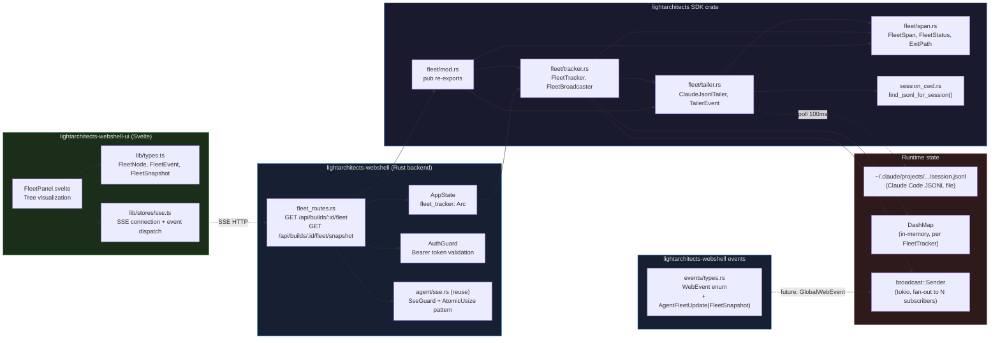

# Fleet Component Dependency Graph

> Canon XLI: Diagram-First. This diagram is a design input, not an output.
> Component boundaries and dependency directions MUST be preserved in implementation.



## Dependency direction invariants

| Rule | Rationale |
|------|----------|
| SDK fleet module has NO dependency on webshell | SDK is consumed by webshell, not the reverse. Fleet types must be publishable standalone. |
| `fleet_routes.rs` depends on SDK via `lightarchitects` crate path dep | Follows existing workspace pattern (CORSO/EVA path dep to soul). |
| `WebEvent::AgentFleetUpdate` is additive | Does not break existing WebEvent consumers. Serde tag-based dispatch. |
| `find_jsonl_for_session` lives in `session_cwd.rs` | Centralizes JSONL path derivation logic; reuses existing HOME-prefix validation pattern. |
| `FleetTracker` is `Arc<FleetTracker>` in `AppState` | Shared across route handlers without locking the full AppState. |
| UI `FleetPanel` never reads JSONL directly | All data flows through the SSE endpoint. UI is display-only. |

## Crate boundary summary

```
lightarchitects (SDK)
  └── fleet/       [NEW — Phase 2]
       ├── mod.rs
       ├── span.rs     FleetSpan, FleetStatus, ExitPath
       ├── tracker.rs  FleetTracker (Arc-safe), FleetBroadcaster
       └── tailer.rs   ClaudeJsonlTailer (tokio task)

lightarchitects-webshell (backend)
  └── src/
       ├── session_cwd.rs    [MODIFY — add find_jsonl_for_session]
       ├── events/types.rs   [MODIFY — add AgentFleetUpdate variant]
       └── fleet_routes.rs   [NEW — Phase 3]

lightarchitects-webshell-ui (frontend)
  └── src/
       ├── lib/types.ts         [MODIFY — add FleetNode, FleetEvent, FleetSnapshot]
       ├── lib/stores/sse.ts    [MODIFY — handle AgentFleetUpdate]
       └── lib/components/
            └── FleetPanel.svelte  [NEW — Phase 4]
```
