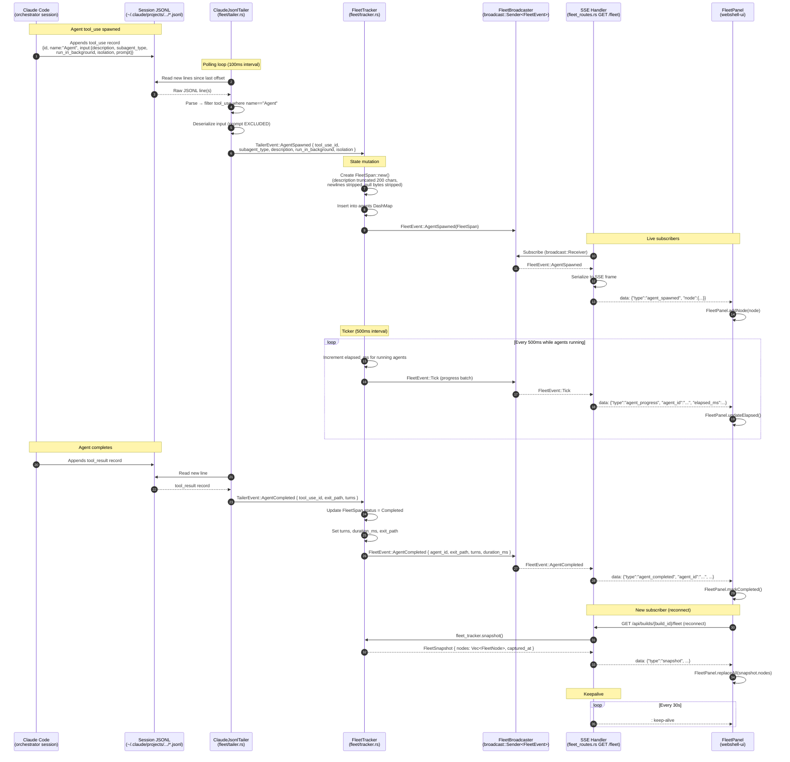

# Fleet Data Flow — Sequence Diagram

> Canon XLI: Diagram-First. This diagram is a design input, not an output.
> The implementation in Phase 2 MUST conform to this flow.

## Key design invariants this diagram encodes

1. **`prompt` is never in the flow** — Tailer reads it but immediately discards it during deserialization. FleetSpan constructor never receives it.
2. **FleetSpan::new() is the single sanitization point** — description normalization happens exactly here, before any storage or broadcast.
3. **Snapshot-on-reconnect** — the first event on any new SSE connection is always a full `FleetSnapshot`, preventing state divergence.
4. **Ticker is tracker-driven** — elapsed_ms is updated by the Tracker's internal ticker, not by the SSE handler. SSE handler is purely a subscriber.
5. **Broadcast fan-out** — multiple SSE connections receive the same events without per-subscriber state.
