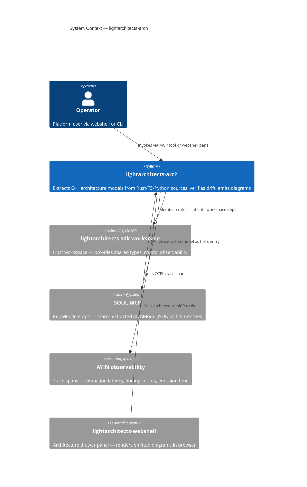

# L0 — System Context Diagram

Architecture intelligence crate within the Light Architects platform.
This diagram is the **architect-drawn ground truth** — the drift verifier (Phase 4) compares
extracted facts against it.  Edit here first; never let the generator author this file.

