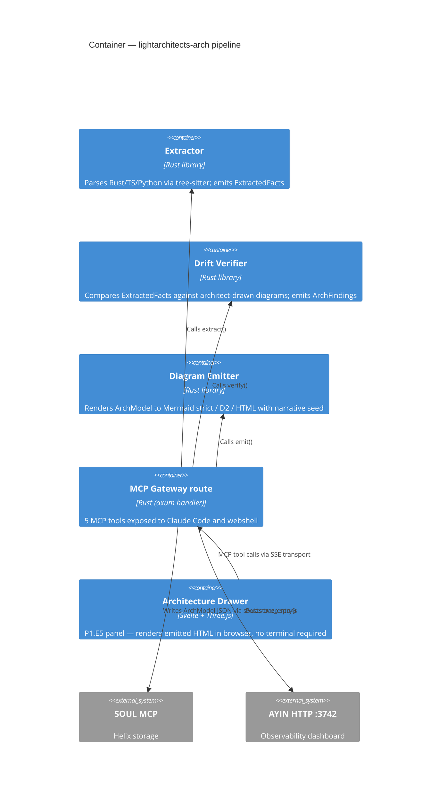

# L1 — Container Diagram

Process and binary boundaries for the architecture intelligence subsystem.

```mermaid
%%{init: {"theme": "default"}}%%
C4Container
    title Container — lightarchitects-arch pipeline

    Container(extractor, "Extractor", "Rust library", "Parses Rust/TS/Python via tree-sitter; emits ExtractedFacts")
    Container(verifier, "Drift Verifier", "Rust library", "Compares ExtractedFacts against architect-drawn diagrams; emits ArchFindings")
    Container(emitter, "Diagram Emitter", "Rust library", "Renders ArchModel to Mermaid strict / D2 / HTML with narrative seed")
    Container(gateway, "MCP Gateway route", "Rust (axum handler)", "5 MCP tools exposed to Claude Code and webshell")
    Container(webshell_panel, "Architecture Drawer", "Svelte + Three.js", "P1.E5 panel — renders emitted HTML in browser, no terminal required")

    System_Ext(soul_mcp, "SOUL MCP", "Helix storage")
    System_Ext(ayin_http, "AYIN HTTP :3742", "Observability dashboard")

    Rel(gateway, extractor, "Calls extract()")
    Rel(gateway, verifier, "Calls verify()")
    Rel(gateway, emitter, "Calls emit()")
    Rel(gateway, soul_mcp, "Writes ArchModel JSON via soul::store_entry()")
    Rel(gateway, ayin_http, "Posts trace spans")
    Rel(webshell_panel, gateway, "MCP tool calls via SSE transport")
```
