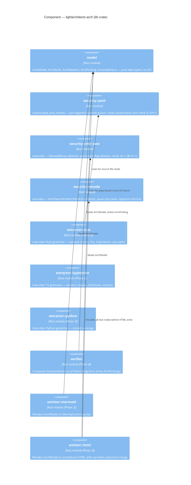

# L2 — Component Diagram

Module-level breakdown of `lightarchitects-arch`.

```mermaid
%%{init: {"theme": "default"}}%%
C4Component
    title Component — lightarchitects-arch (lib crate)

    Component(model, "model", "Rust module", "ArchModel, ArchNode, ArchRelation, ArchFinding, ExtractedFacts — pure data types, no I/O")

    Component(security_path, "security::path", "Rust module", "canonicalize_and_check() — per-segment symlink guard + post-canonicalize root check (S-3/H1)")
    Component(security_cmd, "security::cmd_exec", "Rust module", "execute() — AllowedBinary allowlist, per-binary flag allowlist, never sh -c (B1/S-1)")
    Component(security_enc, "security::encode", "Rust module", "encode() — HtmlText/HtmlAttr/HtmlUrl contexts, javascript:/data: rejection (H2/S-4)")

    Component(extractor_rust, "extractor::rust", "Rust module [Phase 2]", "tree-sitter Rust grammar — extracts structs, fns, impl blocks, use paths")
    Component(extractor_ts, "extractor::typescript", "Rust module [Phase 2]", "tree-sitter TS grammar — extracts classes, interfaces, imports")
    Component(extractor_py, "extractor::python", "Rust module [Phase 2]", "tree-sitter Python grammar — smoke coverage")

    Component(verifier, "verifier", "Rust module [Phase 4]", "Compares ExtractedFacts vs architect diagrams; emits ArchFindings")
    Component(emitter_mermaid, "emitter::mermaid", "Rust module [Phase 3]", "Renders ArchModel to Mermaid strict syntax")
    Component(emitter_html, "emitter::html", "Rust module [Phase 3]", "Renders ArchModel to standalone HTML with narrative-seed.toml merge")

    Rel(extractor_rust, security_path, "Uses for source file reads")
    Rel(extractor_rust, security_cmd, "Uses for grep-based cross-ref search")
    Rel(emitter_html, security_enc, "Encodes all text nodes before HTML write")
    Rel(verifier, model, "Reads ArchModel, writes ArchFinding")
    Rel(emitter_mermaid, model, "Reads ArchModel")
    Rel(emitter_html, model, "Reads ArchModel")
```
