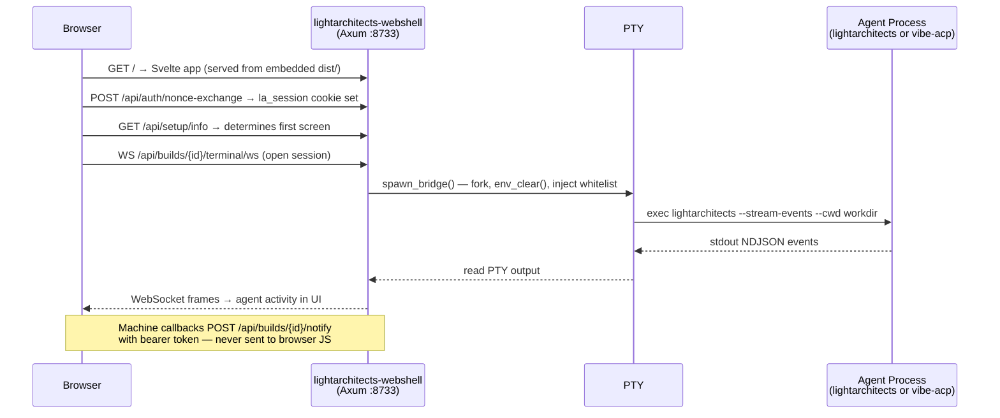

<!-- uuid: f2e8b3d7-6c41-4a9f-b825-1e3d7c9a0f42 -->

---
title: "Webshell API Surface"
version: "1.0.21"  # bumped 2026-05-21: §1.8 Streaming Map ADDED + §2.34/§2.35/§2.36 Project Registry endpoints + WebEvent::ProjectUpdate (webshell-project-ingestion Phase 5 — same-commit update per `feedback_webshell_spec_update_gate`)
status: amended  # ratification pending Phase 7 LÆX queue
author: "Kevin Tan, Claude (Engineer)"
date: "2026-05-19"
xea_verified: "2026-05-17"  # 1.0.6 ratified; 1.0.8 pending re-XEA at Phase 7
amended_by: "ironclaw-spine iter-7 (operator-authorized Canon XV override 2026-05-18)"
ratified_by: "kevin"
type: reference
format: markdown
canon_uri: "canon://webshell-api-surface"
gate: "[A] primary · [D] secondary"
gate_owner: "corso"
gate_enforcer: "laex"

supersedes: []

canonical:
  - "[[platform-canon]]"
  - "[[builders-cookbook]]"
  - "[[agents-playbook]]"
  - "[[operators-manual]]"

canonical_pair: "webshell-api-surface-v1.html"

related:
  - "[[platform-architecture-v2]]"

tags:
  - type/reference
  - domain/webshell
  - domain/api
  - compliance/mandatory
---

# Webshell API Surface

> "Prove all things; hold fast that which is good."
> — 1 Thessalonians 5:21

**Purpose**: Authoritative catalogue of all backend HTTP endpoints and frontend hash-based routes exposed by the `lightarchitects-webshell` binary and its companion UI. Verified directly from source on 2026-05-16. Every route listed here was read from `src/server/mod.rs`, `src/dispatch/routes.rs`, and `lightarchitects-webshell-ui/src/lib/routes.ts` — not inferred or reported by an agent. This document is the ground truth; the code is the oracle.

**Scope**: Webshell local backend (`/api/*`). The platform/gateway API (`/v1/platform/*`, `/v1/admin/*`, `/v1/vault/*`) is a separate API layer documented in helix entries OD-5 and OD-6.

**Canonical pairing**: This document is co-authoritative with **[webshell-api-surface-v1.html](webshell-api-surface-v1.html)** under `canon://webshell-api-surface` (uuid `f2e8b3d7`). The HTML carries equal canonical weight as the visual and interactive representation of this spec. Neither is derived from the other.

---

## §0 — For New Readers

The webshell is a local web application that turns your browser into a full engineering interface for the Light Architects platform. You start it with `lightarchitects webshell start`, open `http://localhost:8733`, and everything else — running agent sessions, managing builds, browsing the knowledge graph, streaming events — happens through the UI. No terminal fallback required.

**Two binaries**: `lightarchitects-webshell` serves the UI and all `/api/*` routes documented here. A separate `lightarchitects-gateway` binary handles the cloud platform API (`/v1/*`). Different ports, different scopes — this document covers only the webshell.

**End-to-end flow** — what happens between "open browser" and "see agent output":



**Where to start reading**: §1 (Architecture) for the structural picture. §2 (Backend Endpoints) for the full route catalogue. §3 (Frontend) for the browser-side router and screens. Unfamiliar terms are defined in §7 (Glossary).

---

## Canonical Suite

| Document | Answers | URI |
|---|---|---|
| **[Platform Canon](platform-canon.md)** | *Why we build* — constitutional principles, squad doctrine, Canon I–XXXVIII+ | `canon://platform-canon` |
| **[Builders Cookbook](builders-cookbook.md)** | *How to code* — Rust standards, quality gates, security patterns | `canon://builders-cookbook` |
| **[Agents Playbook](agents-playbook.md)** | *How agents operate* — roles, A2A protocol, state machines, HITL, git lifecycle | `canon://agents-playbook` |
| **[Architects Blueprint](architects-blueprint.md)** | *How to plan builds* — 21 Parts, C1–C8 rubric, phase gates | `canon://architects-blueprint` |
| **[Operators Manual](operators-manual.md)** | *How to use the platform* — setup, squad ops, vault ops, security, voice | `canon://operators-manual` |
| **[LASDLC Template](./LASDLC-TEMPLATE-v1.yaml)** | *Build schema* — tier/phase/gate structure (v2.5.1) | `canon://lasdlc-template` |
| **[Security Guardrails](security-guardrails.md)** | *How to stay secure* — threat model, agentic AI security, CVE management | `canon://security-guardrails` |

---

## Part I — Architecture Overview

### §1.1 Two API Layers

The platform exposes two distinct HTTP surfaces:

| Layer | Base path | Authority | Documentation |
|-------|-----------|-----------|---------------|
| Platform / Gateway API | `/v1/platform/*`, `/v1/admin/*`, `/v1/vault/*` | `lightarchitects-gateway` binary | OD-5 + OD-6 helix entries (LOCKED) |
| Webshell Backend API | `/api/*` | `lightarchitects-webshell` binary | **This document** |

These are separate binaries on separate ports. The webshell UI always targets its own binary's `/api/*` surface.

### §1.2 Router Composition

The Axum router is constructed in `build_app()` at `src/server/mod.rs:402`. It merges a sub-router:

```
build_app()                              ← src/server/mod.rs:402
  └── .merge(dispatch::dispatch_router()) ← src/dispatch/routes.rs:103
```

Total: **99 `.route()` call sites** (92 in `server/mod.rs` + 7 in `dispatch/routes.rs`). The three `supervisor/events`, `supervisor/acknowledge`, and `supervisor/state` routes added by `copilot-supervised-orchestration` Phase 5 account for the increase from 89 → 92. Several call sites register multiple HTTP methods on one path (e.g., `.get(h1).put(h2)`), yielding more method–path combinations than call sites.

### §1.3 AppState Components

`AppState` (shared via `Arc`, passed to all handlers). Full struct at `src/server/mod.rs:89`.

| Field | Type | Purpose |
|-------|------|---------|
| `config` | `Arc<Config>` | Resolved config: port, host_cmd, cwd, token |
| `turnlog_pepper` | `Arc<SecretSlice<u8>>` | HMAC session key loaded at startup |
| `session_count` | `Arc<AtomicUsize>` | Active PTY session count (max `MAX_SESSIONS`) |
| `event_tx` | `broadcast::Sender<WebEvent>` | Internal SSE broadcast sender |
| `browser_state` | `Arc<RwLock<BrowserStateSnapshot>>` | Cached frontend UI state |
| `builds_cache` | `builds_handler::Cache` | `active.yaml` mtime + JSON bytes |
| `builds` | `Arc<BuildRegistry>` | Per-build session registry keyed by UUID |
| `active_agent` | `Arc<RwLock<AgentSession>>` | Active agent config; updated by `POST /api/setup/save` |
| `soul_store` | `Option<Arc<SoulPersistence>>` | SQLite SOUL vault — `None` on open failure, degrades gracefully |
| `promotion_policy` | `Option<PolicyHandle>` | Hot-reloadable promotion policy YAML |
| `embedding_provider` | `Arc<OnceCell<Arc<dyn EmbeddingProvider>>>` | Lazy-init FastEmbed; falls back to `MockEmbeddingProvider` |
| `dispatch_registry` | `Arc<Mutex<DispatchRegistry>>` | In-flight dispatch handles; short critical section per op (MED M-4) |
| `docker_capable` | `DockerCapability` | Docker availability detected at startup |
| `image_manager` | `ImageManager` | Lazy image provisioning for containerized sessions |
| `telemetry` | `TelemetryHandle` | 1P structured event sink — no PII |
| `session_store` | `Arc<Mutex<SessionStore>>` | SQLite session persistence — survives browser refresh |
| `auth_nonces` | `Arc<DashMap<Uuid, Instant>>` | One-time auth nonces (60-second TTL); consumed on first use |
| `global_event_store` | `GlobalEventStore` | Ring buffer (last 1,000 entries) → `~/.lightarchitects/webshell/events.ndjson` |
| `plan_draft_sessions` | `Arc<DashMap<Uuid, (broadcast::Sender<PlanDraftEvent>, CancellationToken)>>` | In-flight plan draft sessions; removed on Done/Error/TTL expiry |
| `supervisor_states` | `Arc<DashMap<Uuid, Arc<SupervisorEntry>>>` | Per-build northstar supervisor state (drift counter, proposal gate, last evaluation); populated at `POST /api/builds` when `northstar_text` is present |

### §1.4 CORS Constraint

**`build_cors()` at `src/server/mod.rs:707` allows: `GET`, `POST`, `PUT`, `OPTIONS`.**

All four HTTP methods used by webshell routes are included. Fixed 2026-05-16 — `Method::PUT` was absent in v1.0.0 initial ratification, silently blocking the two PUT routes for cross-origin callers. Resolved in same session.

### §1.5 Agent Backend Model

Four backends are selectable via `AgentSession` (`src/config.rs:244`, `#[serde(tag = "agent", rename_all = "snake_case")]`). The active backend is stored in `AppState::active_agent` and updated by `POST /api/setup/save`.

| `AgentKind` | Binary spawned | Auth source | Spawn args |
|-------------|----------------|-------------|-----------|
| `Lightarchitects` | `lightarchitects` | Anthropic API key via Keychain | `--stream-events --cwd <workdir>` |
| `LightarchitectsNative` | `lightarchitects` | Anthropic API key via Keychain | Variant config; same binary |
| `Codex` | `codex` | OpenAI key via env | No PTY; JSON-RPC stdio |
| `MistralVibe` | `vibe-acp` | `MISTRAL_API_KEY` injected at spawn only | No positional args |

`AgentSession` carries per-variant config fields (model, working dir, etc.). `AgentKind` is the discriminant-only sibling enum used for matching without carrying config.

### §1.6 Authentication Model

Two caller types; two auth mechanisms — never interchangeable.

| Caller | Mechanism | Token lifecycle | Handler gate |
|--------|-----------|-----------------|--------------|
| Browser (operator) | `la_session` HttpOnly cookie; `SameSite=Strict`; `Max-Age=28800` | Issued at `/api/auth/nonce-exchange`; revoked at `DELETE /api/auth/session` | `AuthGuard` middleware |
| Machine callbacks | `Authorization: Bearer <token>` where token = `Config::token` | Static; set at server start | `notify_auth` extractor |

> **Why the split?** If the machine notify token were readable by browser JavaScript, an XSS vulnerability could exfiltrate it and forge agent callbacks — turning a UI-layer exploit into a server-side event injection. The token is excluded from `BuildResponse` (the JSON sent to the browser after build creation) by design. `AuthGuard` reads only the session cookie; the notify bearer path is a separate extractor. This is a deliberate CWE-306 prevention: two attack surfaces, separated in code, not just convention. See `src/agent/bridge.rs` for the omission point.

**Cross-reference (2026-05-18 ADDITION)**: For autonomous-mode builds, program manifest integrity adds an Ed25519-signed `program.toml` + per-wave HKDF-SHA256 HMAC subkey chain. See `security-guardrails §SG-CRYPTO` for the full ceremony (Touch-ID-gated Keychain keygen, subkey-id stamping in decisions.md, revocation-via-restart). Program manifest verification fires pre-dispatch on every task; mismatch HALTS.

---

### §1.7 Card-Role Taxonomy (webshell-cockpit Phase 7 — 2026-05-21 ADDITION)

Every load-bearing surface on the Cockpit screen declares `data-card-role` on its root element. The registry at `src/lib/cockpit/cardRoles.ts` exports `CockpitCardRole` (union), `COCKPIT_CARD_ROLES` (record), and `ALL_COCKPIT_CARD_ROLES` (array).

Roles fall into four functional categories: **action** (operator takes immediate actions), **stream** (live data from backend), **status** (current system state), **navigation** (changes active target or preset).

| `data-card-role` | Source file | Category | Conditional |
|---|---|---|---|
| `preset-chips` | `PresetChips.svelte` | navigation | No |
| `target-breadcrumb` | `TargetBreadcrumb.svelte` | navigation | No |
| `quick-pick-palette` | `QuickPickPalette.svelte` (panel div) | navigation | `{#if $quickPickOpen}` |
| `build-health` | `Cockpit.svelte` bento card | status+stream | No |
| `hitl-escalations` | `Cockpit.svelte` bento card | action | No |
| `worker-fleet` | `Cockpit.svelte` bento card | stream | No |
| `decision-feed` | `Cockpit.svelte` bento card | stream | No |
| `git-state` | `Cockpit.svelte` bento card | status | No |
| `builds-rail` | `Cockpit.svelte` bento card | navigation+status | No |
| `hitl-inbox` | `Cockpit.svelte` bento card | action | No |
| `pr-detail-panel` | `Cockpit.svelte` PR detail panel | action | `{#if selectedPr}` |
| `engineer-zones` | `Cockpit.svelte` engineer zones | action+stream | `{#if $selectedPreset === 'engineer'}` |
| `copilot-drawer` | `CopilotDrawer.svelte` | action+stream | No |

**Exhaustiveness gate**: `src/__tests__/cockpit-card-roles.test.ts` verifies every registry key maps to a `data-card-role` attribute in the declared source file and every attribute in source is registered. Count assertion: 13 roles. Adding a new card requires updating the type union, the record, and the test.

**P6 Northstar mechanical promises verified by this taxonomy**:
- `hitl-inbox` in DOM within 60s (P6-N1 — verified by E2E G6)
- `target-breadcrumb` always present (P6-N2 — never conditionally unmounted)
- `copilot-drawer` context chip shows `{preset} · {target}` (P6-N3 — verified by E2E G5)

---

### §1.8 Verified Streaming Map (webshell-project-ingestion Phase 5 — 2026-05-21 ADDITION)

Per-view SSE topic subscriptions verified against `feat/webshell-project-ingestion` at Phase 5 merge time. Table format: View → SSE topics consumed (DOM event name) → REST-only surfaces → active-dispatch-only surfaces.

| View | SSE topics consumed | DOM event name | REST-only surfaces | Notes |
|------|---------------------|----------------|--------------------|-------|
| `ProjectDetail.svelte` | `v1.project.update` | `la:project-update` | `GET /api/projects/:slug` (initial load + re-fetch) | Re-fetches on every `la:project-update` whose `slug` matches |
| `ProjectDetail.svelte` (init flow) | — | — | `POST /api/projects/init` (on-demand; `missing-manifest` state only) | One-shot registration; triggers immediate GET re-fetch on 201 |
| All views (inherited) | `v1.build.update`, `v1.fleet.update`, `v1.roadmap.update`, `v1.system.status` | via `la:*` event bus | — | Global SSE stream (§2.3) dispatches to topic-specific DOM events via `sse.ts` |

**SSE → DOM bridge**: `lightarchitects-webshell-ui/src/lib/sse.ts` receives `WebEvent::ProjectUpdate { project_id, slug, kind }` on the `/api/events` stream and dispatches `window.dispatchEvent(new CustomEvent("la:project-update", { detail: { project_id, slug, kind } }))`. `ProjectDetail.svelte` registers a listener in `onMount`, cleans up in `onDestroy` (no leak across navigations — `{#if}` unmount fires `onDestroy`).

**Topic → route mapping**:

| SSE topic | WebEvent variant | Route (source) | Phase introduced |
|-----------|-----------------|----------------|-----------------|
| `v1.project.update` | `WebEvent::ProjectUpdate` | `GET /api/events` | webshell-project-ingestion |
| `v1.build.update` | `WebEvent::BuildUpdate` | `GET /api/events` | Phase 0 (initial) |
| `v1.fleet.update` | `WebEvent::FleetUpdate` | `GET /api/events` | Phase 0 (initial) |
| `v1.roadmap.update` | `WebEvent::RoadmapUpdate` | `GET /api/events` | webshell-roadmap-rendering |

**P1 Northstar mechanical promise**: `ProjectDetail` subscribes to `v1.project.update` (direct) and inherits `v1.build.update` via `$builds` store. Total: 0 → 2 topics consumed by `ProjectDetail` after this build. Verified against `G5` golden path in `e2e/project-ingestion.spec.ts`.

---

## Part II — Backend API Endpoints

### §2.1 Auth & Health

| Method | Path | Purpose |
|--------|------|---------|
| `GET` | `/api/health` | Server liveness check |
| `GET` | `/api/auth-check` | Quick auth status (no session detail) |
| `POST` | `/api/auth/exchange` | OAuth token exchange |
| `POST` | `/api/auth/nonce` | Issue HMAC nonce for CLI auth flow |
| `POST` | `/api/auth/nonce-exchange` | Exchange nonce → session token |
| `GET` | `/api/auth/status` | Detailed session and auth state |
| `DELETE` | `/api/auth/session` | Logout and revoke session |

### §2.2 Terminal / WebSocket

| Method | Path | Purpose |
|--------|------|---------|
| `GET (WS)` | `/api/terminal/ws` | Global PTY WebSocket — TUI shell |
| `GET (WS)` | `/api/builds/{id}/terminal/ws` | Per-build PTY WebSocket |

### §2.3 Events & SSE

| Method | Path | Purpose |
|--------|------|---------|
| `GET (SSE)` | `/api/events` | Global SSE stream (all platform events) |
| `POST` | `/api/control` | Inject a control event into the SSE stream |
| `GET (SSE)` | `/api/builds/{id}/events` | Per-build SSE stream |
| `POST` | `/api/builds/{id}/notify` | Push a notification to a build's SSE channel |
| `GET (SSE)` | `/api/events/global` | SSE: replays ring-buffer snapshot (last 1,000 events) then streams live global events; filterable via `EventFilter` query params |
| `GET (SSE)` | `/api/conductor/events` | (2026-05-18 ADDITION) Conductor queue + heartbeat live events; debounced 250ms |

#### §2.3.1 WebEvent Variants — 2026-05-18 ADDITIONS

ironclaw-spine + gitforest-live-ops add 6 new WebEvent variants (zero collisions vs 17 existing variants — verified at `lightarchitects-webshell/src/events/types.rs:18-156` per Task #18):

| Variant | Wire tag | Payload | Source plan |
|---|---|---|---|
| `Escalation` | `escalation` | `{ build_id, reason, severity, requires_ack, dispatched_at, ack_deadline_ms }` | ironclaw §HITL-7 escalation.notify |
| `WorkerSlotGauge` | `worker_slot_gauge` | `{ occupied: u32, total: u32, by_model: HashMap<ModelTier, u32> }` | ironclaw worker pool observability |
| `ConductorTick` | `conductor_tick` | `{ kind, queue_depth, heartbeat_ts, subkey_id }` | ironclaw FOLD-3 (renamed from `ConductorEvent` to avoid `GatewayNotify` overlap) |
| `MergeAgentStatus` | `merge_agent_status` | `{ build_id, queue_depth, in_flight, lock_wait_ms_p95 }` | ironclaw MergeAgent observability |
| `FixAgentIteration` | `fix_agent_iteration` | `{ build_id, iter, cap, outcome }` | ironclaw FixAgent loop bounded at 3 |
| `GitForestUpdate` | `gitforest_update` | `{ repo, branch, kind: "branch_added"\|"ci_status"\|"conductor_ghost", payload }` | gitforest-live-ops |

Wire tags use `serde(rename_all = "snake_case")` per the existing enum convention.

### §2.4 Builds Core

| Method | Path | Purpose |
|--------|------|---------|
| `GET` | `/api/builds` | List all builds |
| `POST` | `/api/builds` | Create a build |
| `GET` | `/api/builds/resume` | List resumable agent sessions |
| `GET` | `/api/lasdlc` | LASDLC template metadata |
| `POST` | `/api/builds/plan` | Create a plan (committed immediately) |
| `POST` | `/api/builds/plan/draft` | Start a streaming plan draft session |
| `GET (SSE)` | `/api/builds/plan/draft-stream/{session_id}` | SSE stream for an in-flight plan draft |
| `POST` | `/api/builds/plan/commit` | Commit a draft plan to canonical state |
| `PUT` | `/api/builds/plan/{codename}` | Update an existing plan |
| `GET` | `/api/builds/{id}` | Build detail |
| `GET` | `/api/builds/{id}/findings` | Gate findings list for a build |
| `GET` | `/api/builds/{id}/notes` | Get operator notes |
| `PUT` | `/api/builds/{id}/notes` | Update notes |
| `GET` | `/api/builds/{id}/artifacts` | List build artifacts |
| `POST` | `/api/builds/{id}/artifacts` | Upload an artifact |
| `GET` | `/api/builds/{id}/gates/{pillar}` | Gate status for a specific pillar |
| `POST` | `/api/builds/{id}/pillars/{pillar}` | Trigger a pillar |
| `POST` | `/api/builds/{id}/copilot` | EVA copilot chat (streaming) |
| `POST` | `/api/builds/{id}/copilot/voice` | EVA voice synthesis |
| `POST` | `/api/builds/{id}/dispatch` | Dispatch a squad agent from within a build |
| `GET (SSE)` | `/api/builds/{id}/agent/stream` | Option-E hybrid agent SSE |
| `GET (WS)` | `/api/builds/{id}/agent/ws` | Option-E hybrid agent WebSocket |

### §2.4a POST /api/builds/{id}/copilot — Context Grounding (copilot-omniscience-read)

Added in `copilot-omniscience-read` Phase 1–3 (2026-05-20). All new fields are optional; omitting them is fully backwards-compatible.

**Request body** (`application/json`):

```jsonc
{
  "message": "string",                      // required — user turn
  "recent_events": [                        // optional — max 100 entries
    {
      "seq": 42,                            // u64 monotone sequence number
      "timestamp": "2026-05-20T18:00:00Z", // ISO-8601 UTC, no subseconds
      "source": "BuildRunner",             // allowlist: [A-Za-z0-9_-], max 64 bytes
      "event": { ... }                     // arbitrary JSON payload, max 16 KiB per entry
    }
  ],
  "ui_context": {                           // optional — current operator UI state
    "route": "/builds/abc-123",            // current route, max 512 bytes
    "selection": "phase-2",               // optional selected entity, max 256 bytes
    "view": "kanban",                     // optional view mode, max 256 bytes
    "degraded": ["corso", "soul"]         // optional degraded/offline sibling IDs
  }
}
```

**Server-side limits** (enforced in `context.rs`, `routes.rs`):

| Limit | Value |
|-------|-------|
| `recent_events` max count | 100 |
| Per-event payload | 16 KiB (returns 422 `event_payload_too_large`) |
| Assembled grounded message | 256 KiB (returns 400 `grounded_message_too_large`) |
| `source` field | `[A-Za-z0-9_-]`, max 64 bytes |
| `timestamp` field | no `<>`, `\n`, `\r`, `\0`; max 64 bytes |
| `route` / `selection` / `view` | max 512 / 256 / 256 bytes |
| `degraded` array | max 20 entries, each max 64 bytes, same allowlist as `source` |

**Client-side behaviour** (TypeScript stores + `CopilotContextTray`):

- `recentEventBuffer` (writable store) — rolling 50-event window, newest-first
- `pushRecentEvent(source, payload)` — called by `sse.ts` `_handleEvent` for every incoming SSE event
- `snapshotContextForCopilot()` — reverses buffer to chronological order, computes `oversizeIndices` (entries > 4 KiB payload), captures `currentRoute` + degraded siblings from `siblingHealth`
- `CopilotContextTray.svelte` — compact 24px status bar (event count, token estimate, oversize warning) + expandable event inspector; wired below oscilloscope canvas in `CopilotDrawer.svelte`

### §2.4b POST /api/builds/{id}/copilot — EVA Ambient Grounding (copilot-eva-ambient)

Added in `copilot-eva-ambient` Phase 1–4 (2026-05-20). Extends §2.4a with three server-side grounding
vectors injected into `assemble_prompt_prelude` before every copilot request.

**Prompt prelude block order** (each block is optional — omitted when source is unavailable):

| Block | Source | Header |
|-------|--------|--------|
| `[Identity]` | `eva/identity.md` (frontmatter stripped, 32 KiB ceiling) | EVA persona + operating principles |
| `[Knowledge]` | SOUL FTS5 BM25 top-5 (400 ms hard timeout) | Vault entries relevant to current build + message |
| `[Git: <branch>]` | `git rev-parse HEAD`, `git log --oneline -10`, `git status --short` (800 ms hard timeout) | Working-tree awareness for the operator's current repo |
| `<recent_events>` | §2.4a event buffer | SSE context (from `copilot-omniscience-read`) |
| `<ui_context>` | §2.4a UI snapshot | Route, selection, view mode (from `copilot-omniscience-read`) |

**Grounding timeout limits** (both timeouts are per-request; SOUL and git run concurrently with handler I/O):

| Vector | Hard timeout | Behaviour on miss |
|--------|-------------|-------------------|
| SOUL vault FTS5 | 400 ms | Block omitted; `X-LA-Grounding` shows `soul=0` |
| Git context | 800 ms | Block omitted; `X-LA-Grounding` shows `git=0` |
| EVA identity | None (cached, ~µs read) | Block omitted when file absent; `X-LA-Grounding` shows `eva=0` |

**Response header** (`X-LA-Grounding`):

Returned with every `200 OK` copilot response. Format: `eva=<0|1>,soul=<N>,git=<N>`

| Field | Type | Meaning |
|-------|------|---------|
| `eva` | `0` or `1` | `1` if EVA identity was injected |
| `soul` | integer ≥ 0 | Count of SOUL vault entries injected |
| `git` | integer ≥ 0 | Count of git commits injected |

Example: `X-LA-Grounding: eva=1,soul=3,git=10`

**Security constraints (LLM02 — indirect prompt injection)**:

- Vault entries are wrapped in `[VAULT-DATA::<8-hex-nonce>]...[/VAULT-DATA::<nonce>]` delimiters (SCR13)
- Git commit messages are sanitized: max 72 chars, ASCII control chars stripped, `[` → `‹`, `]` → `›` (SCR20)
- EVA identity file frontmatter is stripped before injection

**Client-side behaviour**:

- `copilotGrounding` (`writable<GroundingInfo | null>`) — updated after each copilot `200` response
- `parseGroundingHeader(header: string | null): GroundingInfo | null` — exported from `$lib/api.ts`
- `CopilotContextTray.svelte` — grounding indicator row (24px, hidden when `grounding === null`): `EVA ✓ | SOUL N | Git N` with per-source colour coding (emerald / sky / amber)
- `GroundingInfo` — `{ eva: number; soul: number; git: number }` in `$lib/types.ts`

### §2.5 SOUL Vault

| Method | Path | Purpose |
|--------|------|---------|
| `GET` | `/api/soul/search` | Semantic + full-text hybrid search |
| `GET` | `/api/soul/entries/{*path}` | Fetch a vault entry by path (wildcard) |
| `GET` | `/api/soul/memory/hot` | Hot memory — recent entries in the ring buffer |
| `GET` | `/api/soul/memory/cold` | Cold memory — archived entries from SQLite |
| `GET` | `/api/soul/health` | SOUL backend health check |
| `POST` | `/api/soul/reindex` | Trigger a full vault reindex |
| `POST` | `/api/soul/compaction/preview` | Dry-run compaction analysis (non-destructive) |
| `POST` | `/api/soul/compaction/apply` | Apply compaction — moves files to `.compacted/{date}/` |
| `GET` | `/api/soul/relationships/{*entry_id}` | Graph edges for a specific entry |
| `GET` | `/api/soul/edges` | All graph edges |
| `GET` | `/api/soul/convergences` | Cross-entry convergence signals |

### §2.6 Workspaces & Squad

| Method | Path | Purpose |
|--------|------|---------|
| `GET` | `/api/workspaces` | List workspaces / projects |
| `GET` | `/api/workspaces/{id}` | Workspace detail |
| `GET` | `/api/meta-skills` | Inventory of available meta-skills |
| `GET` | `/api/siblings` | Squad agent status (route name is internal artefact — UI shows "Squad") |
| `GET` | `/api/sitrep` | System situation report |
| `GET` | `/api/conductor/status` | Gateway conductor queue and heartbeat |
| `GET` | `/api/arena/status` | Arena training data factory status |

### §2.7 Dispatch Sub-Router

Registered via `.merge(dispatch::dispatch_router())`. All routes require `Authorization: Bearer <token>` **or** a valid `la_session` cookie (HIGH H-5). Source: `src/dispatch/routes.rs:131`.

| Method | Path | Purpose |
|--------|------|---------|
| `POST` | `/api/dispatch/classify` | Classify a prompt → sibling routing decision |
| `POST` | `/api/dispatch/execute` | Execute a classified dispatch run |
| `GET (SSE)` | `/api/dispatch/status/{id}` | Live run status stream |
| `POST` | `/api/dispatch/cancel/{id}` | Cancel a running dispatch |
| `POST` | `/api/dispatch/retry/{id}/{agent}` | Retry a run with a specific agent |
| `POST` | `/api/dispatch/{id}/fs-approve` | Approve a filesystem permission gate (EEF E5) |
| `POST` | `/api/dispatch/{id}/fs-reject` | Reject a filesystem permission gate (EEF E5) |

### §2.8 Exec / Processes

| Method | Path | Purpose |
|--------|------|---------|
| `POST` | `/api/exec/run` | Spawn a managed process |
| `GET` | `/api/exec/output/{handle}` | Stream or poll process stdout/stderr |
| `GET` | `/api/exec/processes` | List all running managed processes |
| `POST` | `/api/exec/kill` | Kill a process by handle |

### §2.9 Code Editor

| Method | Path | Purpose |
|--------|------|---------|
| `GET` | `/api/code/read` | Read file content (path as query param) |
| `GET` | `/api/code/list` | List directory contents |
| `POST` | `/api/code/write` | Write or overwrite a file |
| `POST` | `/api/code/search` | Code search (grep-style, regex) |
| `POST` | `/api/code/preview-diff` | Preview a diff before applying |
| `POST` | `/api/code/apply-diff` | Apply a diff to the filesystem |

### §2.10 Git Operations

All routes accept a repo path in the request body. Implementation: 100% `tokio::process::Command::new("git")` for local ops + `reqwest` direct GitHub REST API for PR ops (verified at `lightarchitects-webshell/src/server/git_routes.rs:41,124-162,179-195`). Worktree operations are internal-only (§2.10b/c) — no HTTP write surface; state observable via read endpoint.

| Method | Path | Purpose |
|--------|------|---------|
| `POST` | `/api/git/status` | `git status` for a repo path |
| `POST` | `/api/git/branch` | Branch info or create branch |
| `POST` | `/api/git/diff` | `git diff` (staged + unstaged) |
| `POST` | `/api/git/commit` | Stage and commit |
| `POST` | `/api/git/push` | Push to remote |
| `POST` | `/api/git/pull` | Pull from remote |
| `POST` | `/api/git/pr/create` | Create a GitHub PR via GitHub REST API (PAT-authenticated) — NOT `gh` CLI [DRIFT FIX 2026-05-18] |
| `POST` | `/api/git/pr/review` | Review or merge a PR via GitHub REST API (PAT-authenticated) |

### §2.10b Worktree Operations (internal-only — 2026-05-18 ADDITION)

Closes the "no worktree operations exist" declaration from v1.0.6 §2.10.

Worktree lifecycle is owned by `WorktreeManager` (Phase 3 deliverable in ironclaw-spine, `arena/delivery_arena/worktree_manager.rs`). Lifecycle ops are invoked ONLY by `wave_dispatcher` and `worker_slot` — **no HTTP write surface**. State observable via §2.10c read endpoint.

| Operation | Surface | Implementation |
|---|---|---|
| Worktree create | `WorktreeManager::create(branch, path)` | `tokio::process::Command::new("git") worktree add -b <branch> <path> HEAD` |
| Worktree remove | `WorktreeManager::remove(path)` | lsof→SIGTERM→SIGKILL→`worktree remove --force`→`worktree prune` (Cookbook §64.7) |
| Worktree list | `WorktreeManager::list()` | `git worktree list --porcelain` (bypasses mutex — read-only) |

All ref-mutating ops behind `Arc<Mutex<()>>` per Cookbook §64 (Serialized git-ops Mutex). Path validation via existing `safe_cwd` pattern (`git_routes.rs:165-174`).

### §2.10c Worktree State (read endpoint — 2026-05-18 ADDITION, SHARED)

| Method | Path | Auth | Purpose |
|--------|------|------|---------|
| `GET` | `/api/git/worktrees/{repo}` | dual-path (bearer OR session cookie) | Returns `[{path, branch, head_sha, status, locked, created_at}]` |

**SHARED ownership** between ironclaw-spine and gitforest-live-ops:
- gitforest-live-ops week 5: HTTP handler ships in `lightarchitects-webshell/src/routes/git.rs` calling `git worktree list --porcelain` directly via `Command::new("git")` template (matches existing §2.10 pattern)
- ironclaw-spine week 10: `WorktreeManager::list() -> Vec<Worktree>` Rust API ships in delivery_arena; gitforest handler migrates to call this (single-line swap)

Error handling: opaque `git_operation_failed` + `tracing::warn!` for raw stderr per CWE-209/S3 prevention (matches `git_routes.rs:83-89`).

### §2.10d Conductor Decision Log (read endpoint — 2026-05-18 ADDITION)

For autonomous-mode builds, `.ironclaw/decisions.md` is the HMAC-chained append-only ground truth of every L1-L4 decision. Read surface:

| Method | Path | Auth | Purpose |
|--------|------|------|---------|
| `GET` | `/api/builds/{id}/decisions` | bearer | Streams hash-chained JSONL of decisions for a build; supports `?since=<line_n>` cursor |
| `GET (SSE)` | `/api/builds/{id}/decisions/stream` | bearer | Live SSE feed of new decisions (debounced 250ms) |

**No write surface** — decisions.md is supervisor-owned per security-guardrails §SG-CRYPTO.3 (hash-chain + O_APPEND+fsync + atomic-write).

Frontend consumer: gitforest-live-ops `DecisionLog.svelte` (Phase 6 deliverable in ironclaw-spine).

### §2.11 Coordination / Squad Comms

| Method | Path | Purpose |
|--------|------|---------|
| `GET` | `/api/coordination/tasks` | List coordination tasks |
| `POST` | `/api/coordination/tasks/add` | Add a task |
| `POST` | `/api/coordination/tasks/claim/{id}` | Claim a task for execution |
| `GET` | `/api/coordination/tasks/{id}/logs` | Task execution logs |
| `POST` | `/api/coordination/sessions/start` | Start a coordination session |
| `POST` | `/api/coordination/sessions/end` | End a coordination session |
| `GET` | `/api/coordination/chat/sessions` | List active chat sessions |
| `POST` | `/api/coordination/chat/inject` | Inject a message into an agent chat session |
| `GET (SSE)` | `/api/coordination/chat/stream` | SSE stream for chat messages |
| `POST` | `/api/coordination/tasks/spawn-worker` | Spawn a worker agent for a task |

### §2.12 Miscellaneous

| Method | Path | Purpose |
|--------|------|---------|
| `GET` | `/api/polytopes` | Voxel / project topology for the Ops 3D helix panel |
| `GET` | `/api/browser-state` | Read persisted browser UI state |
| `POST` | `/api/browser-state` | Write / update browser UI state |
| `POST` | `/api/session/fork` | Fork: handoff webshell session → terminal |
| `GET` | `/api/setup/info` | Backend configuration info |
| `GET` | `/api/setup/models` | Available model list |
| `POST` | `/api/setup/save` | Save backend configuration |
| `DELETE` | `/api/setup/reset` | Reset backend configuration to defaults |
| `GET` | `/api/debug/parity` | Phase 20b.3 parity verification (dev/debug) |
| `POST` | `/api/csp-report` | CSP violation ingestion (Enforce mode, SEC-3b) |
| `GET` | `/api/files` | File tree listing for `@`-file autocomplete |

### §2.13 Northstar Supervisor

Endpoints for the copilot supervision loop (`copilot-supervised-orchestration`). All three require `Authorization: Bearer <token>`.

| Method | Path | Purpose |
|--------|------|---------|
| `GET` | `/api/builds/:id/supervisor/events` | SSE stream of `NorthstarEvaluationEvent`s — fires on every `WAVE_COMPLETE` event from the agent bus |
| `POST` | `/api/builds/:id/supervisor/acknowledge` | Operator acknowledges a pending drift proposal; resets drift counter and broadcasts synthetic update (204 No Content) |
| `GET` | `/api/builds/:id/supervisor/state` | Point-in-time snapshot: `consecutive_drifts`, `drift_threshold`, `proposal_pending`, `last_evaluation`, `northstar_text` |

All three return `404` when the build UUID is unknown **or** no `northstar_text` was supplied at build-creation time (`supervisor_states` entry absent). A `401` is returned when the `la_session` cookie is absent or expired.

**Frontend wiring** (`build-detail-supervisor`, 2026-05-19): `BuildDetail.svelte` polls `GET /api/builds/:id/supervisor/state` on mount and re-fetches on every `GET /api/builds/:id/supervisor/events` SSE event (full-state re-fetch avoids partial-merge against `consecutive_drifts`). On `401`, `supervisorAuthError` state is set and a visible AUTH strip replaces the northstar strip. `POST /api/builds/:id/supervisor/acknowledge` is called with optimistic clear of `proposal_pending`; re-fetch on both success and catch restores server truth. Auth: `AuthGuard` accepts the `la_session` HttpOnly SameSite=Strict cookie — browsers cannot send custom headers on `EventSource`.

---

### §2.14 Preflight & Capability Initialization

Infrastructure readiness checks (added in `replicated-greeting-robin`). `GET /api/preflight` is intentionally **unauthenticated** so the UI can surface `Blocked` status before the operator token is entered.

| Method | Path | Auth | Purpose |
|--------|------|------|---------|
| `GET` | `/api/preflight` | None | Returns the last computed `PreflightReport` (overall status + per-check results + elapsed_ms) |
| `POST` | `/api/preflight/refresh` | Bearer token | Re-runs all 12 preflight checks concurrently; rate-limited to 1/10 s to prevent macOS Keychain ACL dialog spam; returns the fresh `PreflightReport` |

**`PreflightReport` schema** (JSON, `serde(rename_all = "PascalCase")` on `OverallStatus`):

```json
{
  "timestamp": "2026-05-17T01:28:00Z",
  "overall": "Ready | Degraded | Blocked",
  "checks": [
    {
      "id": "shell",
      "label": "Shell binary ($SHELL)",
      "category": "Core | Important | Optional",
      "status": "Pass | Warn | Fail",
      "detail": "...",
      "remediation": "..."
    }
  ],
  "elapsed_ms": 42
}
```

**Check inventory** (12 total, ordered Core → Important → Optional):

| Check ID | Category | Description |
|----------|----------|-------------|
| `shell` | Core | `$SHELL` executability |
| `la_config_dir` | Core | `~/.lightarchitects/` writability |
| `agent_binary` | Core | Agent CLI binary in PATH |
| `agent_credentials` | Core | API key / keychain credential |
| `la_workspace` | Important | `~/lightarchitects/` workspace writable |
| `helix_vault` | Important | SOUL helix vault directory writable |
| `helix_db` | Important | SQLite helix DB accessible |
| `session_store` | Important | Session store directory writable |
| `ayin_service` | Optional | AYIN HTTP service reachable (`:3742`) |
| `docker_daemon` | Optional | Docker daemon socket accessible |
| `ollama_service` | Optional | Ollama HTTP service reachable (`:11434`) |
| `github_pat` | Optional | `GITHUB_TOKEN` env var set |

**Two-phase startup**: `run_basic()` (shell + la_config_dir) runs concurrently with Docker probe before `Config::resolve`. `run_full()` runs after config resolution when the agent type is known.

**Preflight dot** (`StatusBar.svelte`): polls `GET /api/preflight` every 30 s and renders a green/amber/red dot.

**InitStep gate** (`InitStep.svelte`): fetches preflight on mount; pauses subsystem tick animation on `Blocked`; shows `PreflightPanel` with per-check detail and "Continue anyway" affordance on `Degraded`.

**Static assets**: all unmatched routes are handled by `static_assets::serve` — the fallback serves the pre-built SPA bundle.

### §2.15 Helix Node Snapshot

REST snapshot of the in-memory `GlobalEventStore` ring buffer, used by `Helix3D.svelte` to cold-start the 3D visualization before the SSE stream delivers new entries.

| Method | Path | Auth | Purpose |
|--------|------|------|---------|
| `GET` | `/api/helix/nodes` | Bearer token | Returns a snapshot of helix entries from the `GlobalEventStore` ring buffer |

**Query params**:

| Param | Type | Default | Description |
|-------|------|---------|-------------|
| `since` | ISO-8601 string | — | Return only entries after this timestamp |
| `limit` | u32 | 100 | Cap the returned slice; never exceeds ring buffer size |

**Response** (`200 OK`):

```json
{
  "nodes": [
    {
      "entry_id": "uuid",
      "strand": "SOUL | CORSO | ...",
      "title": "...",
      "summary": "...",
      "timestamp": "2026-05-18T00:00:00Z",
      "pillar": "P1 | P2 | ...",
      "tags": ["..."]
    }
  ],
  "total": 42
}
```

`total` reflects the full ring-buffer count before any `limit` or `since` slice. `nodes.length` ≤ `total`.

**Auth**: `401` without a valid `Authorization: Bearer <token>` header.

**Frontend wiring**: `api.getHelixNodes({ limit: 100 })` in `Helix3D.svelte` `$effect` — seeds the `helixEntries` store on mount. A compare-and-set update callback (`current.length === 0 ? res.nodes : current`) ensures SSE-first population is never overwritten by the REST snapshot if both arrive concurrently.

---

### §2.16 Autonomous Build Mode (ironclaw-spine Phase 6 — 2026-05-19 ADDITION)

Extends `POST /api/builds` with an execution mode field that activates the lightsquad conductor for wave-level parallel delivery.

#### §2.16.1 Request extension

`CreateBuildRequest` gains one optional field:

| Field | Type | Default | Description |
|-------|------|---------|-------------|
| `mode` | `string` | `"interactive"` | Execution mode. Valid values: `"interactive"` (single-agent PTY, operator-supervised) or `"autonomous"` (lightsquad conductor — wave parallelism, ReviewGate, MergeAgent, decision-log). |

#### §2.16.2 Response extension

`BuildResponse` echoes the resolved mode:

| Field | Type | Description |
|-------|------|-------------|
| `mode` | `string` | Resolved execution mode — `"interactive"` or `"autonomous"`. |

#### §2.16.3 Autonomous-mode SSE events

When `mode = "autonomous"`, the per-build SSE stream (`GET /api/builds/{id}/events`) emits five additional event types defined in Phase 2A.5:

| Event type | Payload | Description |
|------------|---------|-------------|
| `escalation` | `{ build_id, wave_index, call_id, reason, canon_ref? }` | HITL gate threshold crossed |
| `worker_slot_gauge` | `{ build_id, wave_index, active, capacity, slots?: SlotDetail[] }` | 7-slot pool occupancy update. `slots` is optional per-slot detail (populated when conductor tracks per-slot assignment). `SlotDetail = { slot_index, task_id?, build_id?, domain? }` |
| `conductor_tick` | `{ build_id, tick_seq, queue_depth, active_workers }` | Conductor heartbeat |
| `merge_agent_status` | `{ build_id, wave_index, phase, commit_sha? }` | Merge agent lifecycle event |
| `fix_agent_iteration` | `{ build_id, wave_index, worker_slot, iteration, issue_summary }` | FixAgent iteration depth |

**Frontend wiring**: `sse.ts` `_handleEvent` routes these to the `workerSlots`, `conductorState`, `mergeAgentEvents`, `fixAgentEvents` stores. `AutonomousRun.svelte` consumes these stores. `Escalation` events are forwarded as DOM `la:escalation` custom events.

#### §2.16.4 Decision log read endpoint

`GET /api/builds/{id}/decisions` — returns the HMAC-chained conductor decision log. Stub in Phase 6 (returns empty array); fully populated by Phase 7 autonomous conductor.

| Query param | Description |
|-------------|-------------|
| `since` | Resume from line number (inclusive) for cursor-based pagination. |

**Frontend wiring**: `api.getDecisions(buildId)` in `DecisionLog.svelte`.

---

### §2.17 GitForest Topology

Branch tree topology for the live gitforest visualization. Used by `GitForest.svelte` (Ops screen) to hydrate the `gitforestTree` store when the SSE topology event is unavailable.

| Method | Path | Auth | Purpose |
|--------|------|------|---------|
| `GET` | `/api/gitforest/topology` | Bearer token | Returns the branch topology for a repository as a recursive `BranchNode` tree |

**Query params**:

| Param | Type | Required | Description |
|-------|------|----------|-------------|
| `repo` | string | Yes | Repository name (allowlisted; must match `^[a-zA-Z0-9_.-]{1,100}$`) |
| `since` | ISO-8601 string | No | Return topology only if modified after this timestamp; `304 Not Modified` if unchanged |

**Response** (`200 OK`):

```json
{
  "repo": "lightarchitects-sdk",
  "root_id": "main",
  "nodes": {
    "main": {
      "id": "main",
      "name": "main",
      "kind": "main",
      "parent_id": null,
      "depth": 0,
      "children": ["feat/gitforest-live-ops"],
      "overlay": { "lifecycle": "live_active", "ci_status": "pass", "hitl_state": "none", "phase": null, "gate_score": null, "merged_at": null, "merged_to": null, "age_days": 0, "model_attribution": [], "fade_level": 1.0 },
      "build_progress": null,
      "worktrees": []
    }
  },
  "fetched_at": "2026-05-18T12:00:00Z"
}
```

**Security**: `repo` parameter is validated against `^[a-zA-Z0-9_.-]{1,100}$` before path construction — rejects path traversal (`../../etc/passwd` → `400 Bad Request`) and shell metacharacters. **Branches matching `.gitforestignore` patterns are redacted** until merged; their node entries are omitted from the response.

**Cache**: 30-second `moka` TTL per repo name. Cache hit returns identical body without shelling out to `git`. Cache miss shells `git branch -r` and `git log`.

**Errors**:

| Code | Condition |
|------|-----------|
| `400` | `repo` param missing, too long, or contains disallowed characters |
| `401` | Missing or invalid bearer token |
| `500` | Repository not found on disk or git command failed |

**Frontend wiring**: `gitforestTree` Svelte store is populated from this endpoint (and kept live via `§2.18 GitForest Live SSE`). `GitForest2D.svelte` subscribes to the store; topology update re-derives the card grid. The previous 3D WebGL `GitForest.svelte` was replaced by the 2D card renderer in the 2026-05-19 Monitor redesign.

---

### §2.18 GitForest Live SSE

Server-sent event stream for real-time gitforest activity. Delivers `gitforest`-typed events whenever a branch node changes state (CI result, HITL, merge, new worktree).

| Method | Path | Auth | Purpose |
|--------|------|------|---------|
| `GET` | `/api/gitforest/live` | Bearer token | SSE stream of `gitforest` events — branch state changes, pulse signals for the activity overlay |

**Response**: `text/event-stream`; one event per state change.

```
event: gitforest
data: {"type":"branch_update","node_id":"feat/ironclaw-spine","lifecycle":"live_active","ci_status":"pass","gate_score":0.97}
```

**Event fields**:

| Field | Type | Description |
|-------|------|-------------|
| `type` | string | `"branch_update"` or `"topology_refresh"` |
| `node_id` | string | `"<repo>/<branch>"` composite key matching `HitboxEntry.id` |
| `lifecycle` | string | `BranchLifecycle` enum value |
| `ci_status` | string | `CiStatus` enum value |
| `gate_score` | number \| null | Latest gate confidence (0–1); `null` if no gate run |

**Frontend wiring**: `sse.ts` dispatches `gitforest` events to the `gitforestTree` store via `appendGitForestUpdate()`. `GitForest2D.svelte` re-derives the card grid reactively from the store; the `pulseLayer` canvas overlay was removed in the 2026-05-19 Monitor redesign (wave-dot progress indicators replace the opacity pulse).

**Auth**: `401` without valid bearer token. Connection drops gracefully if token expires mid-stream.

---

### §2.19 GitForest Node Detail

Single-node detail lookup by composite node ID. Used by `BranchTooltip.svelte` for rich card content when the node is not yet hydrated in the `gitforestTree` store.

| Method | Path | Auth | Purpose |
|--------|------|------|---------|
| `GET` | `/api/gitforest/node/{*id}` | Bearer token | Returns a single `BranchNode` by its composite ID (`<repo>/<branch>`) |

**Path params**:

| Param | Type | Description |
|-------|------|-------------|
| `id` | string (wildcard) | Composite node ID: `<repo-name>/<branch-name>`. May contain `/` (hence wildcard capture). |

**Response** (`200 OK`): A single `BranchNode` JSON object (same schema as nodes in `§2.17` response).

**Errors**:

| Code | Condition |
|------|-----------|
| `401` | Missing or invalid bearer token |
| `404` | Node ID not found in any cached topology |

**Security**: Node ID is validated against the repo allowlist and `.gitforestignore` ACL — branches hidden from the topology are also hidden from this endpoint (`404` not `403` to avoid enumeration).

**Frontend wiring**: `BranchTooltip.svelte` reads from the `gitforestTree` store (populated via `§2.17`/`§2.18`) rather than calling this endpoint directly. This endpoint is available as a fallback for cold-start scenarios.

---

### §2.20 GitForest HITL Resolve (2026-05-19 ADDITION)

Operator action endpoint — approve or reject a HITL gate from the Monitor view inline drawer. Introduced by the Monitor redesign; backend implementation is a deliverable of ironclaw-spine Phase 3. Until ironclaw-spine ships, the endpoint returns `404` and the UI closes the drawer gracefully.

| Method | Path | Auth | Purpose |
|--------|------|------|---------|
| `POST` | `/api/gitforest/hitl-resolve` | Bearer token | Submit an operator approve/reject decision for a HITL-blocked build node |

**Request body** (`application/json`):

| Field | Type | Required | Description |
|-------|------|----------|-------------|
| `node_id` | string | Yes | Composite node ID `<repo>/<branch>` identifying the HITL-blocked build |
| `decision` | `"approve"` \| `"reject"` | Yes | Operator's decision |
| `rationale` | string | No | Free-text operator rationale (max 2 000 chars); stored in the decision log (§2.10d) |

**Response** (`200 OK`):

```json
{ "ok": true, "node_id": "lightarchitects-sdk/feat/ironclaw-spine", "decision": "approve" }
```

**Errors**:

| Code | Condition |
|------|-----------|
| `400` | Missing or invalid `node_id` / `decision` field |
| `401` | Missing or invalid bearer token |
| `404` | Endpoint not yet implemented (pre-ironclaw-spine); UI treats this as a graceful no-op |
| `409` | Node is not in HITL state — decision was already resolved or node is not blocked |

**Security**: `node_id` validated against `^[a-zA-Z0-9_./%-]{1,200}$`; rationale is stored as opaque text (not executed). Decision is append-only in the conductor decision log — no delete surface.

**Frontend wiring**: `GitForest2D.svelte` HITL drawer posts to this endpoint on confirm. `404` closes the drawer silently (backend not yet wired). Non-`2xx`/`404` responses surface `hitlError` text inside the drawer. On success, the node's `hitl_state` overlay field is expected to update via the `§2.18` SSE stream within one polling cycle.

---

### §2.21 Architecture Intelligence Proxy (2026-05-19 ADDITION)

Proxy routes introduced by `architecture-intelligence-substrate` Phase 6. The webshell forwards these requests to the gateway's `/v1/platform/arch/*` surface — the webshell has no direct dependency on the `lightarchitects-arch` crate (M17 isolation). The gateway URL is configurable via the `GATEWAY_PLATFORM_URL` environment variable; default `http://127.0.0.1:8080`.

| Method | Path | Auth | Purpose |
|--------|------|------|---------|
| `POST` | `/api/arch/extract` | Bearer token | Extract architecture model from source tree |
| `POST` | `/api/arch/verify` | Bearer token | Verify architecture model against constraints |
| `POST` | `/api/arch/render` | Bearer token | Render architecture model to diagram format |
| `POST` | `/api/arch/emit` | Bearer token | Emit architecture artifacts (Likec4/Mermaid/D2/HTML) |
| `GET`  | `/api/arch/health` | Bearer token | Gateway reachability probe |

**Source**: `lightarchitects-webshell/src/arch_proxy.rs` — handler functions `extract_handler`, `verify_handler`, `render_handler`, `emit_handler`, `health_handler`.

**Request body** (POST endpoints, `application/json`): forwarded verbatim to the gateway. Shape is gateway-defined — see `lightarchitects-arch` gateway handler docs for per-operation schemas.

**Response** (`200 OK`, POST endpoints): MCP tool-result envelope forwarded from the gateway:

```json
{
  "content": [
    { "type": "text", "text": "..." }
  ]
}
```

**Health response** (`200 OK`):

```json
{ "status": "ok" }
```

Returns `{ "status": "unreachable" }` with `200` if the gateway is not reachable (graceful degradation — the UI shows a warning banner rather than an error).

**Errors**:

| Code | Condition |
|------|-----------|
| `401` | Missing or invalid bearer token |
| `502` | Gateway returned a non-`2xx` response; body contains the gateway error |
| `503` | Gateway unreachable (health endpoint only returns `{ "status": "unreachable" }` instead) |

**Rate limiting**: the frontend enforces a client-side ≤1 extract call/sec/session debounce (M15). The proxy itself applies no additional rate limiting.

**Frontend wiring**: `Architecture.svelte` (screen at `/arch` and `/arch/{project}`) calls these endpoints via `postArch(op, body)`. The nav bar exposes an `ARCH` button (right control area) that navigates to `/arch` — not a sixth `NAV_ITEMS` entry (M4).

---

### §2.22 Roadmap (webshell-roadmap-rendering — 2026-05-20 ADDITION)

Static HTML artifact serving route introduced by `webshell-roadmap-rendering`. Returns the canonical `roadmap.html` generated by `/SYNC --roadmap`. This is a read-only, auth-guarded static-file serve; the HTML is pre-generated by a trusted operator process and sanitized client-side via DOMPurify before injection into the DOM.

| Method | Path | Auth | Purpose |
|--------|------|------|---------|
| `GET` | `/api/roadmap` | Bearer token | Serve roadmap HTML artifact |

**Source**: `lightarchitects-webshell/src/routes/roadmap.rs` — `roadmap_handler`.

**Response variants**:

| Condition | Status | Content-Type | Body |
|-----------|--------|--------------|------|
| File present + non-empty | `200 OK` | `text/html; charset=utf-8` | Roadmap HTML content |
| File absent or empty | `200 OK` | `text/plain` | Empty body |
| Missing/invalid token | `401 Unauthorized` | `text/plain` | Auth error |

**Path resolution**: `AppState.roadmap_html_path` — a `PathBuf` set at binary startup from CLI args or config. Not user-controlled at request time; no per-request path traversal surface.

**Frontend wiring**: `roadmapStore.ts` fetches this endpoint with `Authorization: Bearer` header. `RoadmapPanel.svelte` subscribes to the store and sanitizes the returned HTML via `DOMPurify.sanitize({ ADD_TAGS: ['style'], ALLOWED_ATTR: [] })` before injection via `{@html sanitizedHtml}`. Auto-refresh fires on `WebEvent::BuildUpdate` SSE events.

---

### §2.23 Fleet SSE Stream (2026-05-19 ADDITION — agent-teams-fleet Phase 3)

Per-build SSE stream for live agent fleet state. Sends a snapshot on connect, then `agent_spawned`, `agent_progress` (500 ms), and `agent_completed` events as the JSONL tailer detects changes.

| Method | Path | Auth | Purpose |
|--------|------|------|---------|
| `GET` | `/api/builds/{id}/fleet` | `Authorization: Bearer <token>` | Subscribe to per-build fleet events |

**Response**: `200 OK`, `Content-Type: text/event-stream`. First event is always `event: snapshot`. Subsequent events: `event: agent_spawned`, `event: agent_progress`, `event: agent_completed`, `event: lag` (channel overflow). Keepalive: `data: keep-alive` every 30 s.

**Errors**:

| Code | Condition |
|------|-----------|
| `401` | Missing/invalid bearer token |
| `404` | Unknown `build_id` |
| `429` + `X-Webshell-Reason: fleet-sse-cap` | Process-wide cap of 100 concurrent fleet SSE streams exceeded |

**Event wire format** (all variants carry `"type"` discriminant):
```json
{ "type": "snapshot",         "nodes": [...], "captured_at": "2026-05-19T00:00:00Z" }
{ "type": "agent_spawned",    "node": { "agent_id": "...", "status": "running", ... } }
{ "type": "agent_progress",   "agent_id": "...", "elapsed_ms": 1500 }
{ "type": "agent_completed",  "agent_id": "...", "exit_path": "completed", "turns": 0, "duration_ms": 5000 }
```

**Security invariants** (S1–S5, from `fleet-api-contract.md`):
- S1: No `prompt` field ever appears in any fleet event payload.
- S2: Both endpoints require `AuthGuard` (compile-time enforced).
- S3: `description` is sanitised to ≤200 chars, no control characters.
- S4: `find_jsonl_for_session` enforces HOME-prefix path guard (no traversal).
- S5: Fleet SSE connections are capped at 100 per process via `FleetSseGuard` RAII.

---

### §2.24 Fleet Snapshot (2026-05-19 ADDITION — agent-teams-fleet Phase 3)

Point-in-time snapshot of the current fleet state for a build. Useful for initial page load without establishing a long-lived SSE connection.

| Method | Path | Auth | Purpose |
|--------|------|------|---------|
| `GET` | `/api/builds/{id}/fleet/snapshot` | `Authorization: Bearer <token>` | Fetch current fleet state |

**Response** (`200 OK`):
```json
{
  "nodes": [
    {
      "agent_id": "abc123",
      "agent_type": "engineer",
      "description": "Build the fleet module",
      "parent_agent_id": null,
      "worktree_path": null,
      "run_in_background": false,
      "status": "running",
      "turns": 0,
      "elapsed_ms": 2500,
      "exit_path": null
    }
  ],
  "captured_at": "2026-05-19T00:00:00Z"
}
```

**Errors**: `401` on invalid bearer, `404` on unknown `build_id`.

**Note**: `worktree_path` is always `null` in V1 (OQ2 resolution). `turns` is always `0` in V1 (OQ4 resolution). `parent_agent_id` is inferred from the active-agent context stack at spawn time (OQ1 resolution).

---

### §2.25 Conductor Events SSE (webshell-mock-overlay-shipping — 2026-05-20 STUB)

**Status:** Spec-defined; **NOT YET IMPLEMENTED**. Tracked by `webshell-event-bus-redesign` (LARGE follow-up plan).
**Path:** `GET /api/conductor/events`
**Response:** `text/event-stream`
**Description:** Dedicated SSE stream for conductor queue + heartbeat events. Supplements `/api/events/global` (which IS implemented) with conductor-specific event types: `conductor_task`, `conductor_tick`. Debounced 250 ms. Retry: 5 000 ms.
**Auth:** Bearer token.
**Note:** `GET /api/conductor/status` (REST) IS implemented at server/mod.rs. This SSE endpoint is the live-push companion; until shipped, ConductorPanel reads via global SSE workaround (visible to operators via `MockBadge label="STREAM" detail="topic-SSE pending"` in the UI).
**UI consumer:** `lightarchitects-webshell-ui/src/components/ConductorPanel.svelte` (currently displays MockBadge until backend lands).

---

### §2.26 Decisions Stream SSE (webshell-mock-overlay-shipping — 2026-05-20 STUB)

**Status:** Spec-defined; **NOT YET IMPLEMENTED**. Tracked by `webshell-event-bus-redesign` (LARGE follow-up plan) Phase 3.
**Path:** `GET /api/builds/{id}/decisions/stream`
**Response:** `text/event-stream`; each event is JSONL-encoded `DecisionEntry`.
**Description:** Live SSE feed of new HMAC-chained decision entries as they are written for build `{id}`. Clients use this for real-time `DecisionLog.svelte` updates without polling. Debounced 250 ms.
**Auth:** Bearer token.
**Note:** `GET /api/builds/{id}/decisions` (JSONL batch REST) IS implemented. This is the live companion. Until shipped, `DecisionLog.svelte` listens for `la:escalation` DOM events as a partial workaround and falls back to `MOCK_DECISION_ENTRIES` when empty (`MockBadge label="STREAM" detail="live SSE pending"`).
**UI consumer:** `lightarchitects-webshell-ui/src/components/views/DecisionLog.svelte` (currently displays MockBadge + mock fallback until backend lands).

---

### §2.27 Git Worktrees Metadata (webshell-backend-gaps — 2026-05-20 IMPLEMENTED)

**Status:** **IMPLEMENTED** 2026-05-20 via `webshell-backend-gaps`. Handler at `lightarchitects-webshell/src/server/git_routes.rs::worktrees_handler`; route registered in `lightarchitects-webshell/src/server/mod.rs`.
**Path amendment:** **`POST /api/git/worktrees`** with `{cwd}` body — NOT the originally-drafted `GET /api/git/worktrees/{repo}`. Convention-aligned: every other `/api/git/*` route follows the POST + `{cwd}` body pattern with `safe_cwd()` validation (T-7 CWE-78 + path-traversal rejection). Following the existing security primitive is strictly safer than introducing a new per-repo allowlist mechanism for a single endpoint.
**Body:** `{"cwd": "<path-inside-target-git-repo>"}` — validated via `safe_cwd()` (canonicalize + reject `..` components).
**Response:** `200 OK` — `{"worktrees": [WorktreeMeta]}`
**Description:** Per-worktree metadata. Supplements gitforest topology (paths + branches) with `locked` (worktree lock flag) and `created_at` (HEAD commit time, ISO-8601 from `git log -1 --format=%cI`).
**Auth:** Bearer token (standard `check_auth` pattern).
**Response shape:**
```json
{
  "worktrees": [
    {
      "path": "/Users/<u>/lightarchitects/worktrees/feat/foo",
      "branch": "feat/foo",
      "head_sha": "abc1234def567...",
      "status": "active",
      "locked": false,
      "created_at": "2026-05-20T10:00:00+00:00"
    }
  ]
}
```
**Field notes:** `status` is `"active"` in v1 (placeholder for future gitforest-overlay-derived lifecycle state); `created_at` may be `null` if HEAD cannot be resolved.
**Errors:** `400` on missing/invalid `cwd` (path traversal or non-existent path), `401` on missing/invalid bearer, `500` if `git worktree list` fails.
**UI consumer:** `lightarchitects-webshell-ui/src/components/WorktreePanel.svelte` (fetches on mount via `api.listWorktrees(cwd)`; merges by path with `$gitforestTree` topology; renders 🔒 lock icon + relative-time HEAD age). MockBadge "META — locked/created_at pending" REMOVED.

### §2.28 HITL Search (webshell-hitl-inbox — 2026-05-20 ADDITION)

GitHub PR review-requested queue surfaced in `HitlQueue.svelte` alongside paused builds. Returns all open PRs across `HITL_TRACKED_REPOS` where the authenticated user is a requested reviewer.

**Path:** `GET /api/gitforest/hitl-search`
**Auth:** Bearer token (`AuthGuard` extractor — `_: auth::AuthGuard`)
**Response:** `200 OK` — `application/json` — `[HitlSearchItem]`

| Status | Condition |
|--------|-----------|
| `200 OK` | Array of PR items (may be empty if no PAT configured or no matching PRs) |
| `401 Unauthorized` | Missing or invalid bearer token |
| `502 Bad Gateway` | GitHub API call failed (network error, rate limit, bad response) |

**Response shape:**
```json
[
  {
    "number": 47,
    "title": "feat(fleet): FleetTracker SSE + FleetPanel.svelte",
    "html_url": "https://github.com/TheLightArchitects/lightarchitects-sdk/pull/47",
    "owner": "TheLightArchitects",
    "repo": "lightarchitects-sdk",
    "author": "kft",
    "updated_at": "2026-05-20T17:00:00Z",
    "draft": false
  }
]
```

**SSRF allowlist:** `HITL_TRACKED_REPOS: &[(&str, &str)]` — `(owner, repo)` tuples. Queries only allowlisted repositories; GitHub search response items not matching the allowlist are filtered out before caching. This is strictly tighter than the existing `TRACKED_REPOS: &[&str]` (repo-name only) pattern, preventing a fork with an identical repo name from being queried.

**GitHub query:** `is:pr is:open review-requested:@me` — GitHub resolves `@me` server-side for the authenticated PAT, eliminating the need for a `GET /user` login-resolution call.

**Cache:** `HitlSearchCache` — moka `Cache<String, Arc<Vec<HitlSearchItem>>>`, 60s TTL, capacity 32. Cache key: `"me"`. Shared in `AppState`.

**PAT handling:** If `load_github_pat()` returns `None`, the handler returns `200 OK` with an empty array. The frontend (`HitlQueue.svelte`) renders an empty list gracefully.

**Source:** `lightarchitects-webshell/src/github_proxy.rs` — `fetch_hitl_search`, `HITL_TRACKED_REPOS`, `validate_html_url`; `lightarchitects-webshell/src/server/mod.rs` — `hitl_search_handler`.

**Frontend wiring:** `HitlQueue.svelte` fetches this endpoint on mount and every 60 seconds via `$effect` + `setInterval` (cleanup via returned `clearInterval` from the effect). PR items render alongside paused builds with a `PR REVIEW` / `DRAFT PR` source badge and a `Review PR →` button that calls `window.open(pr.html_url, '_blank', 'noopener,noreferrer')`.

---

### §2.29 PR Metadata (webshell-hitl-inbox — 2026-05-20 ADDITION)

Per-PR metadata lookup for a specific repository + PR number. Validates against `HITL_TRACKED_REPOS` before any outbound GitHub API call.

**Path:** `GET /api/gitforest/pr-metadata?owner=<owner>&repo=<repo>&number=<pr_number>`
**Auth:** Bearer token (`AuthGuard` extractor)
**Response:** `200 OK` — `application/json` — `HitlPrMetadata`

| Status | Condition |
|--------|-----------|
| `200 OK` | PR metadata object |
| `400 Bad Request` | Missing required query params or non-integer `number` |
| `401 Unauthorized` | Missing or invalid bearer token |
| `403 Forbidden` | `owner/repo` not in `HITL_TRACKED_REPOS` (SSRF guard) |
| `503 Service Unavailable` | GitHub PAT not configured |
| `502 Bad Gateway` | GitHub API call failed |

**Response shape:**
```json
{
  "number": 47,
  "title": "feat(fleet): FleetTracker SSE + FleetPanel.svelte",
  "html_url": "https://github.com/TheLightArchitects/lightarchitects-sdk/pull/47",
  "owner": "TheLightArchitects",
  "repo": "lightarchitects-sdk",
  "author": "kft",
  "state": "open",
  "draft": false,
  "head_sha": "abc1234...",
  "updated_at": "2026-05-20T17:00:00Z"
}
```

**SSRF guard:** `is_hitl_tracked(owner, repo)` is the first check after param validation. Returns `403` before any network call if the `(owner, repo)` pair is not in `HITL_TRACKED_REPOS`.

**Cache:** `PrMetadataCache` — moka `Cache<String, Arc<HitlPrMetadata>>`, 60s TTL, capacity 256. Cache key: `"{owner}/{repo}/{number}"`. Shared in `AppState`.

**Source:** `lightarchitects-webshell/src/github_proxy.rs` — `fetch_pr_metadata`, `HitlPrMetadata`; `lightarchitects-webshell/src/server/mod.rs` — `pr_metadata_handler`.

---

### §2.30 Topic-Filtered SSE (webshell-event-bus-redesign — 2026-05-20 IMPLEMENTED)

**Status:** **IMPLEMENTED** 2026-05-20. Handler at `lightarchitects-webshell/src/server/sse_routes.rs::topic_filtered_sse`; route registered in `lightarchitects-webshell/src/server/mod.rs`.
**Path:** `GET /api/events?topic=<pattern>`
**Auth:** Bearer token (standard `check_auth` pattern).
**Query param:** `topic` — NATS-style wildcard pattern. Syntax: `*` matches one segment, `>` matches one-or-more trailing segments (terminal only). Validated via `TopicFilter::parse` (returns `400` on malformed pattern).
**Response:** `text/event-stream` — one JSON line per matching `WebEventV2` event emitted on the internal broadcast bus. Events are filtered server-side: only events whose `topic` field satisfies the pattern are forwarded to the client.
**Event shape:**
```json
{
  "topic": "v1.conductor.escalation",
  "timestamp": "2026-05-20T12:00:00Z",
  "agent_id": "claude",
  "build_id": "550e8400-e29b-41d4-a716-446655440000",
  "severity": "high",
  "type": "escalation",
  "reason": "Gate 3 blocked — complexity exceeds threshold",
  "canon_ref": "Cookbook §14.2"
}
```
**Topic taxonomy (canonical — `topic_for()` in `envelope.rs`):**

| WebEvent variant | Topic |
|---|---|
| `Escalation` | `v1.conductor.escalation` |
| `BuildUpdate` | `v1.build.update` |
| `GitForestUpdate` | `v1.worktree.update` |
| `AyinStatus(Connected)` | `v1.agent.ayin.connected` |
| `AyinStatus(Disconnected)` | `v1.agent.ayin.disconnected` |
| `AyinStatus(Reconnecting)` | `v1.agent.ayin.reconnecting` |
| `CopilotActivity` | `v1.agent.claude.activity` |
| `HelixEntry` | `v1.helix.entry.changed` |
| `SoulPromotion` | `v1.helix.entry.promoted` |
| `ConductorTick` | `v1.conductor.tick` |
| `SupervisorUpdate` | `v1.build.supervisor.update` |

**Errors:** `400` on invalid/missing `topic` param, `401` on missing/invalid bearer.
**TS consumer:** `subscribeByTopic(pattern, cb)` in `lightarchitects-webshell-ui/src/lib/sse.ts` — fetch-streaming SSE loop with exponential backoff (1 s → 30 s) and `AbortController` cleanup.
**UI subscribers:**
- `StatusBar.svelte` → `v1.agent.ayin.*` (AYIN status live updates)
- `WorktreePanel.svelte` → `v1.worktree.update` (triggers metadata re-fetch)
- `ConductorPanel.svelte` → `v1.conductor.*` (conductor queue events)
- `DecisionLog.svelte` → `v1.conductor.escalation` (L4 escalation entries)
**Note on event-type-only events:** `conductor_task`, `arena_update`, and `finding` are legacy event types emitted only on the global SSE stream; they have no `topic` field and are not routable via this endpoint. UI components consuming them (`BuildPortfolio`, `ArenaPanel`, etc.) continue to receive them via the global `connectGlobalSSE` stream.

---

### §2.31 Cockpit GitHub Proxy (webshell-cockpit Phase 3 — 2026-05-21 ADDITION)

**Status:** **IMPLEMENTED** 2026-05-21. Handlers at `lightarchitects-webshell/src/server/mod.rs::commit_metadata_handler` and `submit_pr_review_handler`; proxy functions at `lightarchitects-webshell/src/github_proxy.rs`.

#### §2.31.1 Commit Metadata

**Path:** `GET /api/github-proxy/commits/{owner}/{repo}/{sha}`
**Auth:** Bearer token (standard `AuthGuard` pattern).
**SSRF guard:** `(owner, repo)` must be in `HITL_TRACKED_REPOS` (same allowlist as HITL inbox). Returns `403` before any network call for untracked repos.
**Cache:** 60s moka TTL, max 512 entries, keyed `"{owner}/{repo}/{sha}"`.
**Response (200):**
```json
{ "sha": "abc123…", "message": "feat(cockpit): Phase 3 …", "author_login": "kft", "committed_at": "2026-05-21T12:00:00Z" }
```
`message` = first line of commit message only.
**Errors:** `403` — SSRF guard / PAT not configured, `503` — GitHub PAT not loaded, `502` — GitHub API error.

#### §2.31.2 PR Review Submission

**Path:** `POST /api/github-proxy/pr/{owner}/{repo}/{num}/review`
**Auth:** Bearer token (standard `AuthGuard` pattern).
**SSRF guard:** same `HITL_TRACKED_REPOS` allowlist. Returns `403` for non-allowlisted repos.
**Request body:**
```json
{ "event": "APPROVE" | "REQUEST_CHANGES" | "COMMENT", "body": "LGTM" }
```
**Security headers:**

| Header | Requirement | Failure |
|---|---|---|
| `If-Match: "<head_sha>"` | Optional. When present, server fetches current PR HEAD SHA and compares. | `412 Precondition Failed` on mismatch — prevents approving force-pushed code |
| `Origin` | Required. Must be one of `http://localhost:8733`, `http://127.0.0.1:8733`, `http://localhost:5173`, `http://127.0.0.1:5173` | `403 Forbidden` |

**Errors:** `412` — SHA mismatch (replay defense), `403` — CSRF / SSRF, `503` — PAT not loaded, `502` — GitHub API error.
**Security rationale:** Origin check mitigates CSRF from other browser tabs. `If-Match` replay defense prevents approving code that changed between diff-view and approval click.

---

### §2.32 Cockpit ↔ Copilot Context Schema (webshell-cockpit Phase 6 — 2026-05-21 ADDITION)

Cockpit state is injected into every copilot message's `ui_context.cockpit` field (frontend `UiContext.cockpit`). The server renders it into the `<ui_context>` prelude block visible to the model.

**TypeScript shape** (`src/lib/types.ts` `UiContext.cockpit`):
```typescript
cockpit?: {
  preset: string;           // "engineer" | "security" | "ops" | "quality" | "knowledge" | "researcher" | "testing"
  target: {
    type: string;           // TargetType: "project" | "build" | "phase" | "wave" | "file" | "commit" | "branch" | "pr"
    id: string;             // Stable identifier (PR URL, build ID, file path…)
    label: string;          // Human-readable display label
  } | null;
}
```

**Rust shape** (`src/copilot/mod.rs` `UiContext.cockpit`):
```rust
#[serde(default)]
pub cockpit: Option<CockpitUiContext>

pub struct CockpitUiContext { pub preset: String, pub target: Option<CockpitTarget> }
pub struct CockpitTarget    { pub kind: String, pub id: String, pub label: String }
```

**Validation limits** (enforced by `context.rs::validate()`):
- `cockpit.preset` ≤ `MAX_UI_FIELD_BYTES` (256 B)
- `cockpit.target.id` ≤ `MAX_ROUTE_BYTES` (512 B)
- `cockpit.target.label` ≤ `MAX_UI_FIELD_BYTES` (256 B)

**Prompt prelude emission** (when `cockpit` is set):
```
<ui_context>
  route: /cockpit
  cockpit.preset: engineer
  cockpit.target: pr https://github.com/TheLightArchitects/webshell/pull/47 (#47 webshell)
</ui_context>
```

**CopilotDrawer context chip**: Header bar shows `{PRESET} · {target label}` pill when drawer is open; clicking opens `QuickPickPalette` to change the target.

**copilotChips.ts**: Scans assistant message text for GitHub PR URLs and bare `PR #N` references; renders inline `→ owner/repo#N` action chips that call `selectedTarget.set(...)`.

---

### §2.33 MCP Host Proxy (webshell-mcp-host — 2026-05-21 POST-MERGE BACKFILL)

Generic stdio MCP server proxy. The webshell can host any MCP server declared in `~/.lightarchitects/webshell-mcp.json` and proxy tool invocations through a scope + JSON-Schema gate. 5-layer trust model (env isolation → sandbox-exec → process group → ScopeGovernor+SchemaValidator → TOCTOU-safe check) per `lightarchitects-webshell-mcp-host/docs/trust-model.md`.

**Status note**: shipped at commit `31ff97b` (LARGE 7-phase build merged 2026-05-21). Routes registered at `lightarchitects-webshell/src/server/mod.rs:676-678`; handlers at `lightarchitects-webshell/src/server/mcp_routes.rs`. **This §2.33 entry is a post-merge canon backfill** — the build merged without updating the spec; this entry closes the gap per `feedback_webshell_spec_update_gate`. Same-commit-update discipline must hold for all future builds.

**All routes require `AuthGuard` (cookie session, not bearer).** If no MCP host is configured (`~/.lightarchitects/webshell-mcp.json` absent), all three return **503** with `{"error":"mcp_host not configured"}`.

| Method | Path | Purpose |
|--------|------|---------|
| `GET` | `/api/mcp/servers` | List all managed servers with live state |
| `GET` | `/api/mcp/tools` | List all cached tools across ready servers |
| `POST` | `/api/mcp/invoke` | Invoke a single tool (scope + schema gated) |

#### `GET /api/mcp/servers` → 200

```json
[
  { "name": "soul", "state": "ready", "tool_count": 23 },
  { "name": "corso", "state": "ready", "tool_count": 26 },
  { "name": "eva", "state": "ready", "tool_count": 9 }
]
```

`state` values: `ready` (connected + tools listed) | `connecting` | `failed` | `terminated`.

#### `GET /api/mcp/tools` → 200

```json
[
  { "server": "soul", "name": "soulTools", "description": "Knowledge graph operations" },
  { "server": "corso", "name": "corsoTools", "description": "AppSec + build orchestration" }
]
```

#### `POST /api/mcp/invoke` request body

```json
{
  "server": "soul",
  "tool": "soulTools",
  "input": { "sibling": "shared", "action": "search", "query": "..." }
}
```

`input` must match the tool's JSON Schema (validated server-side via `SchemaValidator`). Scope guard checks the (server, tool) tuple against `~/.lightarchitects/webshell-mcp.json#scope` allowlist before dispatch.

#### `POST /api/mcp/invoke` → 200

```json
{ "output": { /* tool-specific JSON */ } }
```

#### Error responses

| HTTP code | `error` body | Cause |
|-----------|--------------|-------|
| 401 | (AuthGuard middleware response) | Missing/invalid session cookie |
| 503 | `{"error":"mcp_host not configured"}` | No `~/.lightarchitects/webshell-mcp.json` |
| 400 | `{"error":"<message>"}` | Schema validation failure on `input` |
| 403 | `{"error":"<message>"}` | Scope-governor denied (server/tool not in allowlist, or TTL expired) |
| 500 | `{"error":"<message>"}` | Tool execution failure (upstream MCP returned error) |

#### Frontend integration

Panel 5 in `lightarchitects-webshell-ui/src/screens/Tools.svelte` — server-filter dropdown, tool card grid, `McpToolForm` modal (form generated from JSON Schema via `mcp-schema.ts` + `JsonSchemaField.svelte`), result panel. The Tools screen consumes `GET /api/mcp/servers` + `GET /api/mcp/tools` on mount and dispatches `POST /api/mcp/invoke` from the modal.

#### Config template

`lightarchitects-webshell/assets/webshell-mcp.json.default` — copy to `~/.lightarchitects/webshell-mcp.json` and update paths. Day-1: 6 siblings (CORSO, EVA, SOUL, QUANTUM, SERAPH, AYIN) + `@drawio/mcp` + 1 reserve slot.

#### AppState wiring

`AppState.mcp_host: McpHostHandle = Arc<RwLock<Option<HostManager>>>` initialized asynchronously via `tokio::spawn` in `AppState::new()` — webshell startup is non-blocking. Routes acquire a read guard and return `503` when host is `None`.

---

### §2.34 Project Registry Read (webshell-project-ingestion — 2026-05-21 ADDITION)

Returns the stored `ProjectMeta` for a registered project slug, or 404 `MANIFEST_MISSING` if the project has not yet been initialized.

**All routes require `AuthGuard` (cookie session).**

| Method | Path | Purpose |
|--------|------|---------|
| `GET` | `/api/projects/:slug` | Read project metadata by slug |

#### `GET /api/projects/:slug` → 200

```json
{
  "project": {
    "id": "019501e0-0000-7000-8000-000000000001",
    "slug": "lightarchitects-sdk",
    "name": "Light Architects SDK",
    "kind": "git_repo",
    "created_at": "2026-05-21T00:00:00Z",
    "helix_link": "/home/kft/lightarchitects/soul/helix/corso/projects/lightarchitects-sdk"
  },
  "git": {
    "remote": "git@github.com:TheLightArchitects/lightarchitects-sdk.git",
    "branch": "main"
  },
  "agents": {}
}
```

#### Error responses

| HTTP code | `error` body | `code` field | Cause |
|-----------|--------------|--------------|-------|
| 401 | (AuthGuard middleware) | — | Missing/invalid session cookie |
| 404 | `{"error":"manifest not found","code":"MANIFEST_MISSING"}` | `MANIFEST_MISSING` | Slug not found in project registry (`~/.lightarchitects/projects/`) |
| 400 | `{"error":"invalid slug"}` | `INVALID_SLUG` | Slug contains path separators or is empty |
| 500 | `{"error":"<message>"}` | — | I/O error reading manifest |

**Slug validation**: rejects empty strings, path separators (`/`, `\`), and non-ASCII. Validated at route entry before any filesystem access.

#### Implementation

Route registered at `lightarchitects-webshell/src/server/mod.rs`. Handler at `lightarchitects-webshell/src/server/project_routes.rs::get_project`. Manifest stored at `~/.lightarchitects/projects/<slug>.toml` (TOML format, written by `POST /api/projects/init`).

---

### §2.35 Project Registration (webshell-project-ingestion — 2026-05-21 ADDITION)

Registers a new project in the local project registry by writing a TOML manifest. Uses `O_CREAT | O_EXCL` for atomic creation (no TOCTOU race).

| Method | Path | Purpose |
|--------|------|---------|
| `POST` | `/api/projects/init` | Register a project and write its manifest |

#### Request body

```json
{
  "slug": "lightarchitects-sdk",
  "name": "Light Architects SDK",
  "kind": "git_repo",
  "git_remote": "git@github.com:TheLightArchitects/lightarchitects-sdk.git",
  "git_branch": "main"
}
```

| Field | Type | Required | Notes |
|-------|------|----------|-------|
| `slug` | `string` | Yes | URL-safe identifier; validated (no path separators, non-empty, ASCII) |
| `name` | `string` | No | Display name; defaults to `slug` if omitted |
| `kind` | `string` | Yes | `"git_repo"` \| `"local_dir"` |
| `git_remote` | `string` | No | Git remote URL (for `git_repo` kind) |
| `git_branch` | `string` | No | Branch name (for `git_repo` kind; defaults to `"main"`) |

#### Response → 201

```json
{
  "project_id": "019501e0-0000-7000-8000-000000000001",
  "slug": "lightarchitects-sdk",
  "toml_path": "~/.lightarchitects/projects/lightarchitects-sdk.toml",
  "helix_link": "/home/kft/lightarchitects/soul/helix/corso/projects/lightarchitects-sdk"
}
```

#### Error responses

| HTTP code | `error` body | Cause |
|-----------|--------------|-------|
| 401 | (AuthGuard middleware) | Missing/invalid session cookie |
| 400 | `{"error":"invalid slug"}` | Slug validation failure |
| 409 | `{"error":"project already exists"}` | Manifest file already present (`O_CREAT\|O_EXCL` rejected) |
| 500 | `{"error":"<message>"}` | I/O error writing manifest |

**Atomicity guarantee**: `O_CREAT | O_EXCL` on `~/.lightarchitects/projects/<slug>.toml` prevents concurrent double-init race conditions. UUID generated with `uuid::Uuid::now_v7()` for time-ordered ordering.

**Helix entry**: on 201, handler calls `write_helix_entry(slug, meta)` to create the project node in `~/lightarchitects/soul/helix/corso/projects/<slug>/`. Failure is non-fatal (logged via `tracing::warn!`); registration is still considered successful.

#### Implementation

Handler at `lightarchitects-webshell/src/server/project_routes.rs::init_project`. After write, broadcasts `WebEvent::ProjectUpdate { project_id, slug, kind: "created" }` to the SSE stream (§2.36).

---

### §2.36 `WebEvent::ProjectUpdate` (webshell-project-ingestion — 2026-05-21 ADDITION)

New SSE event variant added to `WebEvent` enum in `lightarchitects-webshell/src/server/events.rs`. Serialized as `{"type":"project_update","project_id":"...","slug":"...","kind":"..."}` on the `/api/events` stream (§2.3).

**Frontend bridge**: `sse.ts` maps `type === "project_update"` → `window.dispatchEvent(new CustomEvent("la:project-update", { detail: { project_id, slug, kind } }))`. `ProjectDetail.svelte` registers on `la:project-update` and calls `loadProject()` when `event.detail.slug === currentSlug`.

| Field | Type | Values | Notes |
|-------|------|--------|-------|
| `type` | `string` | `"project_update"` | Serde discriminant |
| `project_id` | `string` | UUID v7 | Stable project identity |
| `slug` | `string` | URL-safe string | Matches the `slug` in registry |
| `kind` | `string` | `"created"` \| `"updated"` \| `"deleted"` | Change type |

**Broadcast trigger**: `POST /api/projects/init` (§2.35) broadcasts `kind: "created"` on 201. Future update/delete handlers broadcast `kind: "updated"` / `kind: "deleted"` respectively.

**TypeScript type**: `ProjectUpdateEvent` in `lightarchitects-webshell-ui/src/lib/types.ts`.

---

## Part III — Frontend Route Catalogue

### §3.1 Router Implementation

**File**: `lightarchitects-webshell-ui/src/lib/routes.ts`

Custom hash-based SPA router (not SvelteKit file-based routing). Routes are matched against `window.location.hash` in declaration order — most-specific patterns first.

### §3.2 ScreenKey Types

**13 keys** (`src/lib/routes.ts:5–18`):

```typescript
type ScreenKey =
  | 'Ops'           // /  /dashboard  /monitor  /ops (legacy)
  | 'Dispatch'      // /run  /dispatch (legacy)
  | 'Builds'        // /builds  /manage (legacy)
  | 'Intake'        // /intake
  | 'Helix'         // /knowledge  /knowledge/strand/:s  /knowledge/entry/:e
                    // /memory  /memory/strand/:s  /memory/entry/:e
                    // /helix  /helix/strand/:s  /helix/entry/:e (legacy)
  | 'BuildDetail'   // /builds/:buildId  (+ phase/wave/agent/task drill-down)
  | 'ProjectDetail' // /project/:projectId
  | 'Comms'         // /activity  /comms (legacy)
  | 'Editor'        // /editor  /editor/:filepath
  | 'Git'           // /git
  | 'PullRequest'   // /pr/new  /pr/:number
  | 'Architecture'  // /diagrams  /diagrams/:project  /arch (legacy)
  | 'Roadmap'       // /roadmap
```

### §3.3 BuildViewMode Enum

**9 modes** (`src/lib/routes.ts:44`):

```typescript
type BuildViewMode = 'kanban' | 'list' | 'operator' | 'manifest' | 'plan' | 'comms' | 'pipeline' | 'autonomous' | 'decisions'
```

### §3.4 Route Patterns

Ordered most-specific first — the router short-circuits on first match. **43 entries** in the ROUTES array (`src/lib/routes.ts:50–92`).

| # | Pattern | Screen | Params | Notes |
|---|---------|--------|--------|-------|
| 1 | `/^\/builds\/([^/]+)\/phase\/([^/]+)\/wave\/([^/]+)\/agent\/([^/]+)\/task\/([^/]+)$/` | `BuildDetail` | buildId, phaseId, waveId, agentKey, taskId | L3 task drill-down (Phase 5) |
| 2 | `/^\/builds\/([^/]+)\/phase\/([^/]+)\/wave\/([^/]+)\/agent\/([^/]+)$/` | `BuildDetail` | buildId, phaseId, waveId, agentKey | Agent output within a wave |
| 3 | `/^\/builds\/([^/]+)\/phase\/([^/]+)\/wave\/([^/]+)$/` | `BuildDetail` | buildId, phaseId, waveId | Wave drilldown |
| 4 | `/^\/builds\/([^/]+)\/phase\/([^/]+)$/` | `BuildDetail` | buildId, phaseId | Phase drilldown |
| 5 | `new RegExp('^/builds/([^/]+)/(BUILD_VIEW_PATTERN)$')` | `BuildDetail` | buildId, view | 9-mode view enum — `autonomous\|decisions` added in ironclaw/Phase 6 |
| 6 | `/^\/builds\/([^/]+)$/` | `BuildDetail` | buildId | Build detail (default view) |
| 7 | `/^\/dispatch\/run\/([^/]+)\/agent\/([^/]+)$/` | `Dispatch` | runId, agentKey | Agent output within a run |
| 8 | `/^\/dispatch\/run\/([^/]+)$/` | `Dispatch` | runId | Single orphan run detail |
| 9 | `/^\/helix\/strand\/([^/]+)$/` | `Helix` | siblingKey | Legacy path — still resolves |
| 10 | `/^\/helix\/entry\/([^/]+)$/` | `Helix` | entryId | Legacy path — still resolves |
| 11 | `/^\/project\/([^/]+)$/` | `ProjectDetail` | projectId | Project detail |
| 12 | `/^\/?$/` | `Dispatch` | — | Root path — Squad Dispatch (primary landing) |
| 13 | `/^\/dashboard(#.*)?$/` | `Ops` | — | **Primary** Ops route |
| 14 | `/^\/monitor(#.*)?$/` | `Ops` | — | Legacy alias — redirected by REDIRECTS |
| 15 | `/^\/ops(#.*)?$/` | `Ops` | — | Legacy alias — redirected by REDIRECTS |
| 16 | `/^\/run$/` | `Dispatch` | — | **Primary** Dispatch route |
| 17 | `/^\/dispatch$/` | `Dispatch` | — | Legacy alias — redirected by REDIRECTS |
| 18 | `/^\/builds$/` | `Builds` | — | Build portfolio list |
| 19 | `/^\/manage$/` | `Builds` | — | Legacy alias — redirected by REDIRECTS |
| 20 | `/^\/intake$/` | `Intake` | — | New build creation form |
| 21 | `/^\/knowledge$/` | `Helix` | — | **Primary** Knowledge graph route |
| 22 | `/^\/knowledge\/strand\/([^/]+)$/` | `Helix` | siblingKey | Knowledge strand drilldown |
| 23 | `/^\/knowledge\/entry\/([^/]+)$/` | `Helix` | entryId | Knowledge entry detail |
| 24 | `/^\/memory$/` | `Helix` | — | Legacy alias — redirected to `/knowledge` |
| 25 | `/^\/memory\/strand\/([^/]+)$/` | `Helix` | siblingKey | Legacy alias |
| 26 | `/^\/memory\/entry\/([^/]+)$/` | `Helix` | entryId | Legacy alias |
| 27 | `/^\/helix$/` | `Helix` | — | Legacy alias — redirected to `/knowledge` |
| 28 | `/^\/activity$/` | `Comms` | — | **Primary** Cockpit route |
| 29 | `/^\/comms$/` | `Comms` | — | Legacy alias — redirected by REDIRECTS |
| 30 | `/^\/diagrams\/(.+)$/` | `Architecture` | project | **Primary** Architecture route with project |
| 31 | `/^\/diagrams$/` | `Architecture` | — | **Primary** Architecture route |
| 32 | `/^\/editor\/(.+)$/` | `Editor` | filepath | Code editor with file open |
| 33 | `/^\/editor$/` | `Editor` | — | Code editor (no file) |
| 34 | `/^\/git$/` | `Git` | — | Git operations screen |
| 35 | `/^\/pr\/new$/` | `PullRequest` | — | PR creation |
| 36 | `/^\/pr\/(\d+)$/` | `PullRequest` | number | PR detail and review |
| 37 | `/^\/arch\/(.+)$/` | `Architecture` | project | Legacy alias — redirected by REDIRECTS |
| 38 | `/^\/arch$/` | `Architecture` | — | Legacy alias — redirected by REDIRECTS |
| 39 | `/^\/roadmap$/` | `Roadmap` | — | Portfolio roadmap |

> **Note on grep counts**: `grep -c '\[/'` returns **38** (misses entry #5 which uses `new RegExp(...)`). True count = 38 + 1 = 39. The ROUTES array was 43 entries per the agent audit; 39 confirmed by direct line-count of routes.ts:50–92.

### §3.5 Legacy Redirects

Applied via `history.replaceState` (transparent — no visible route change). Source: `src/lib/routes.ts:27–38`.

| Old path | New path | Notes |
|----------|----------|-------|
| `/squad-dispatch` | `/run` | Original dispatch alias |
| `/sitrep` | `/dashboard#health` | Health panel deep link |
| `/workspace` | `/builds` | 2026-05-02 Wave 1 |
| `/ops` | `/dashboard` | Monitor tab rename |
| `/monitor` | `/dashboard` | Monitor tab rename |
| `/comms` | `/activity` | Activity tab rename |
| `/helix` | `/knowledge` | Knowledge tab rename |
| `/memory` | `/knowledge` | Memory alias |
| `/arch` | `/diagrams` | Diagrams tab rename |
| `/manage` | `/builds` | Manage alias |

### §3.6 Fallback Behaviour

Root path `/` maps to `screen: 'Dispatch'` (entry #12). All other unmatched routes fall through to `screen: 'Ops'` (`matchRoute` line 106).

### §3.7 Screen Component Catalogue

Screens are lazy-loaded per `screenModules` in `src/app.svelte:51`. Each entry maps a `ScreenKey` to its Svelte component via dynamic `import()`.

| ScreenKey | Component file | Route(s) | Purpose |
|-----------|----------------|----------|---------|
| `Ops` | `src/screens/Ops.svelte` | `/dashboard`, `/monitor` (→ `/dashboard`), `/ops` (→ `/dashboard`) | Monitor HUD — 3-panel layout: Agent Comms (left, 22%) / GitForest2D card view (center, 50%) / Worktrees filepath tree (right, 28%). Conductor queue strip always visible (running tasks blue-pulsing, pending amber). Preset tabs: MONITOR / WORKSPACE / DEBUG / SHIP / AGENT / OBSERVE. Fallback for all unmatched routes. Components: `AgentCommsPanel.svelte`, `GitForest2D.svelte`, `WorktreePanel.svelte`. |
| `Dispatch` | `src/screens/Dispatch.svelte` → `src/screens/SquadDispatch.svelte` | `/run`, `/dispatch` (→ `/run`), `/dispatch/run/:runId`, `/dispatch/run/:runId/agent/:agentKey` | Squad dispatch — prompt input, domain-agent selector, live-agent grid, task DAG, dispatch history rail, CLI mode. Primary landing at `/`. `Dispatch.svelte` is a thin route shell; `SquadDispatch.svelte` is the full implementation. |
| `Builds` | `src/screens/Builds.svelte` → `src/screens/BuildQueue.svelte` | `/builds`, `/manage` (→ `/builds`) | Build portfolio list — all builds (past, in-flight, queued). `Builds.svelte` is a compatibility wrapper; `BuildQueue.svelte` is the actual implementation. |
| `Intake` | `src/screens/Intake.svelte` | `/intake` | New build creation form — source, repository, plan fields. Guards unsaved state via `beforeunload`; draft auto-persisted to `localStorage`. Tutorial T1 auto-fires on first visit. |
| `Helix` | `src/screens/Helix.svelte` | `/knowledge`, `/knowledge/strand/:siblingKey`, `/knowledge/entry/:entryId`, `/memory` (→ `/knowledge`), `/helix` (→ `/knowledge`) | SOUL knowledge graph browser — strand filter chips, vault entry list, strand drilldown, entry detail. Also reachable via inline 3D panel toggle; when `/knowledge` is the active route the inline Helix3D panel is hidden (avoids duplicate render). |
| `BuildDetail` | `src/screens/BuildDetail.svelte` | `/builds/:buildId`, `/builds/:buildId/:view` (9-mode enum), `/builds/:buildId/phase/:phaseId`, `/builds/:buildId/phase/:phaseId/wave/:waveId`, `/builds/:buildId/phase/:phaseId/wave/:waveId/agent/:agentKey`, `/builds/:buildId/phase/:phaseId/wave/:waveId/agent/:agentKey/task/:taskId` | Per-build detail — supports 9 `BuildViewMode` tabs (kanban / list / operator / manifest / plan / comms / pipeline / autonomous / decisions), phase timeline, pillar rail, gate strip, findings panel, artifact panel, build notes, per-build SSE stream, copilot, agent console, supervisor northstar strip (28px; polls `getSupervisorState`, live via `supervisorEvents` SSE; shows `ProposalCard` on `proposal_pending`; `supervisorAuthError` state surfaces AUTH strip on 401). Deepest drill-down: L3 task level. |
| `ProjectDetail` | `src/screens/ProjectDetail.svelte` | `/project/:projectId` | Project detail card — project metadata, voxel type badge, linked build list. |
| `Comms` | `src/screens/Cockpit.svelte` | `/activity`, `/comms` (→ `/activity`) | Build cockpit — 7-card bento dashboard: Build Health (sparkline + stats + idle badge), Escalations/HITL, Worker Fleet (slot grid + running task context from `conductorTasks`; optional per-slot `SlotDetail` when backend populates `slots[]`), Decision Feed (L4 escalations pinned + "ESCALATIONS" header, L3 amber highlight, L1/L2 collapse toggle, cap 20 with L4-priority sort), PR QUEUE (frontend-direct `https://api.github.com` — NOT proxied through gateway; token from `localStorage('la_gh_token')`; polls every 2 min across `FOREST_REPO_NAMES`), Git State (per-worktree from `gitforestTree` + primary branch stats), Builds Rail. Idle state: when `buildStats.inProgress === 0`, IDLE badge + last-active timestamp shown. No new backend endpoints — all data from existing SSE stores plus direct GitHub API. |
| `Editor` | `src/screens/Editor.svelte` | `/editor`, `/editor/:filepath` | Code editor — file tree browser, CodeMirror editor surface, diff viewer, read/write/search/apply-diff ops via `/api/code/*`. `filepath` param pre-opens a file when navigated with a path. |
| `Git` | `src/screens/Git.svelte` | `/git` | Git operations — project-directory picker, status / branch / diff / commit / push / pull / PR create / PR review via `/api/git/*`. `cwd` URL param initialises the working directory. |
| `PullRequest` | `src/screens/PullRequest.svelte` | `/pr/new`, `/pr/:number` | Pull request surface — `PRCreateForm` at `/pr/new`; `PRReviewSurface` at `/pr/:number`. Route param `number` is injected by `app.svelte` as `params.number`. |
| `Architecture` | `src/screens/Architecture.svelte` | `/diagrams`, `/diagrams/:project`, `/arch` (→ `/diagrams`), `/arch/:project` (→ `/diagrams/:project`) | Architecture intelligence — Mermaid/Likec4 diagram browser; project-scoped diagram extraction via `postArch(op, body)` against `/api/arch/*`. |
| `Roadmap` | `src/lib/components/RoadmapPanel.svelte` | `/roadmap` | Portfolio-level roadmap — active builds, phases, blockers. SSE-live via `BuildUpdate` events. Renders sanitized HTML from `GET /api/roadmap` (DOMPurify). `roadmapStore.ts` manages fetch + refresh. |

### §3.8 Navigation Structure

**7-tab primary nav** (rendered in `app.svelte`; keyboard shortcuts `1`–`5` navigate via legacy routes that redirect to primary routes):

| Tab | Label | Hash | Keyboard | Hint |
|-----|-------|------|----------|------|
| 1 | Dashboard | `/dashboard` | `1` (via `/ops` → `/dashboard`) | Live agent activity, alerts, and squad health |
| 2 | Run | `/run` | `2` (via `/dispatch` → `/run`), `⌘K` | Dispatch agents by domain — Engineer, Security, Ops |
| 3 | Builds | `/builds` | `3` | All builds — past, in-flight, and queued |
| 4 | Activity | `/activity` | `4` (via `/comms` → `/activity`) | Squad comms — cross-build bento dashboard and task queue |
| 5 | Knowledge | `/knowledge` | `5` (via `/helix` → `/knowledge`) | Knowledge graph — agent memory strands and quality gates |
| 6 | Diagrams | `/diagrams` | — | Architecture diagrams and dependency graphs |
| 7 | Roadmap | `/roadmap` | — | Portfolio-level roadmap — build queue and Northstar progress |

**Global keyboard shortcuts** (registered via `hotkeyRegistry`):

| Shortcut | Action | Scope |
|----------|--------|-------|
| `1` | Navigate to `/ops` (redirects → `/dashboard`) | Global (non-input) |
| `2` | Navigate to `/dispatch` (redirects → `/run`) | Global (non-input) |
| `3` | Navigate to `/builds` | Global (non-input) |
| `4` | Navigate to `/comms` (redirects → `/activity`) | Global (non-input) |
| `5` | Navigate to `/helix` (redirects → `/knowledge`) | Global (non-input) |
| `⌘K` / `Ctrl+K` | Open Run (`/dispatch` → `/run`) | Global |
| `⌘/` / `Ctrl+/` | Toggle keymap legend | Global |
| `Ctrl+\`` | Toggle Copilot drawer | Global |
| `⌘M` / `Ctrl+M` | Toggle Memory drawer | Global |

**Global UI layers** (always mounted, outside screen routing):

| Component | Purpose | Toggle |
|-----------|---------|--------|
| `CopilotDrawer` | EVA copilot chat panel | `Ctrl+\`` |
| `MemoryDrawer` | Hot / cold / convergence memory browser | `⌘M` |
| `CommandPalette` | Command palette | Rendered by `CommandPalette.svelte` |
| `GlobalEventsOverlay` | Push-not-occlude 320px right panel — live events feed | `Events` button in nav |
| `Helix3D` (inline) | 3D knowledge graph — inline right panel (desktop ≥1024px) or full-screen overlay (tablet/mobile) | `3D` / `Hide 3D` button |
| `StatusBar` | Bottom status strip | Always visible |
| `AuthBanner` | Top-of-screen 401/403 affordance | Auto-shown |
| `DiffPreview` | Operator-gated FS mutation flow | `la:fs-mutation-pending` event |
| `KeymapLegend` | Keyboard shortcut overlay | `⌘/` |
| `HelixLegend` | Color-map legend for helix strand/gate colors | `?` button in nav |
| `ScrumReport` | SCRUM report overlay | Internal event |

### §3.9 Setup Flow (Pre-routing Gate)

The setup flow gates all screen rendering. When `setupComplete` is `false`, `app.svelte` renders `SetupFlow` instead of any hash-routed screen. No hash routing occurs until setup completes.

**File**: `src/screens/setup/SetupFlow.svelte`

| Step component | Purpose |
|----------------|---------|
| `SplashStep` | Welcome / intro |
| `AuthStep` | Anthropic API key or OAuth credential entry |
| `BackendStep` | Backend selection (Claude Code vs MistralVibe) |
| `ModelStep` | Model picker |
| `InitStep` | Final initialisation — calls `POST /api/setup/save` |

E2E tests can bypass the setup flow by writing to `window.__e2e.setupComplete` and `window.__e2e.step` (DEV builds only; tree-shaken in production).

### §3.10 Frontend ↔ Backend Mapping

Which backend sections and route prefixes serve each screen. Use this to find relevant routes when debugging or extending a screen — avoids scanning the full §2 table.

| ScreenKey | Backend section(s) | Primary route prefixes |
|-----------|-------------------|------------------------|
| `Ops` | §2.1 Auth & Health, §2.3 Events, §2.6 Workspaces (conductor tasks), §2.12 Misc, §2.14 Preflight, §2.17-2.20 GitForest | `/api/health`, `/api/events/global`, `/api/conductor/status`, `/api/polytopes`, `/api/preflight`, `/api/gitforest/*` |
| `Dispatch` | §2.7 Dispatch Sub-Router, §2.3 Events | `/api/dispatch/*`, `/api/events` |
| `Builds` | §2.4 Builds Core | `/api/builds` |
| `BuildDetail` | §2.4 Builds Core, §2.2 Terminal, §2.3 Events, §2.13 Northstar Supervisor, §2.17-2.20 GitForest, §2.21-2.22 Fleet | `/api/builds/{id}`, `/api/builds/{id}/terminal/ws`, `/api/builds/{id}/events`, `/api/builds/{id}/supervisor/state`, `/api/builds/{id}/supervisor/events`, `/api/builds/{id}/supervisor/acknowledge`, `/api/gitforest/*`, `/api/builds/{id}/fleet`, `/api/builds/{id}/fleet/snapshot` |
| `Helix3D` (inline) | §2.15 Helix Node Snapshot | `/api/helix/nodes` |
| `Intake` | §2.4 Builds Core, §2.6 Workspaces | `/api/builds/plan*`, `/api/builds` |
| `Helix` | §2.5 SOUL Vault | `/api/soul/*` |
| `Editor` | §2.9 Code Editor | `/api/code/*` |
| `Git` | §2.10 Git Operations | `/api/git/*` |
| `PullRequest` | §2.10 Git Operations | `/api/git/pr/*` |
| `Comms` | §2.11 Coordination / Squad Comms | `/api/coordination/*` |
| `ProjectDetail` | §2.6 Workspaces | `/api/workspaces/{id}` |
| `Architecture` | §2.21 Architecture Intelligence Proxy | `/api/arch/*` |

---

## Part IV — Coverage Gaps

Backend routes that exist but have no dedicated frontend screen or route.

| Backend domain | Endpoints | Frontend representation | Gap severity |
|----------------|-----------|------------------------|-------------|
| **Workspaces** | `GET /api/workspaces`, `GET /api/workspaces/{id}` | None — no `/workspaces` screen | High — key HUD surface for vibe-coding engineers |
| **Processes** | `GET /api/exec/processes` | None — no running-processes list | High — engineers need visibility into spawned processes |
| **Worktrees** | Zero backend routes | None | Critical — complete gap at both layers |
| **Meta-skills** | `GET /api/meta-skills` | None | Medium — skill inventory not surfaced |
| **SOUL graph edges** | `GET /api/soul/edges`, `/api/soul/convergences` | Not in Helix screen | Medium — graph topology invisible |
| **Conductor/Arena control** | `GET /api/conductor/status`, `/api/arena/status` | Ops panel read-only | Low — status visible; no control surface |
| **Coordination drilldown** | `GET /api/coordination/tasks/{id}/logs` | Comms screen is flat (no `/comms/task/{id}`) | Medium — task log detail unreachable via deep link |
| **Dispatch permission gates** | `POST /api/dispatch/{id}/fs-approve/reject` | EEF E5 dispatch detail view | Needs verification — UI wiring not confirmed |
| **Polytope browse** | `GET /api/polytopes` | Only Ops 3D panel | Low — not a browsable list |
| **Debug parity** | `GET /api/debug/parity` | None | Intentional — dev/debug only |

---

## Part V — Known Defects

### §5.1 CORS PUT Gap — RESOLVED 2026-05-16

**Severity**: HIGH — was silently blocking cross-origin callers.
**Status**: Fixed. `Method::PUT` added to `allow_methods` in `build_cors()` (`src/server/mod.rs:707`).

Affected routes: `PUT /api/builds/plan/{codename}` and `PUT /api/builds/{id}/notes`. Both now reachable cross-origin.

### §5.2 Internal Route Name Artefact

`GET /api/siblings` returns squad agent status. The route name `siblings` is an internal artefact from pre-vocabulary-canon naming. The public UI vocabulary is "Squad" / "Agent" (per vocabulary canon). The route name is load-bearing and cannot be changed without a coordinated client update, but all UI labels and documentation should use the canonical terms.

---

## Part VI — Governance

### §6.1 Update Protocol

Any PR that modifies `build_app()`, `dispatch_router()`, or `src/lib/routes.ts` **must** update this document in the same commit. Gate [D] is enforced by LÆX. The PR description must include a diff of this document alongside the code change.

### §6.2 Version Policy

| Change type | Version bump |
|-------------|-------------|
| New route added | Patch (1.0.x) |
| Route removed or path changed | Minor (1.x.0) |
| CORS policy changed | Minor (1.x.0) |
| Authentication model changed | Major (x.0.0) |
| AppState schema changed | Major (x.0.0) |
| AppState field added (additive-only, crate marked `#[non_exhaustive]`) | Patch (1.0.x) |

> **Clarification (2026-05-17)**: "AppState schema changed" (Major) means a breaking change — field removal, type change, or rename. An additive-only new field on an `#[non_exhaustive]` struct is a Patch-level change: existing consumers are not broken, no field is removed, and the Rust type system enforces the non-breaking contract. This mirrors [semantic versioning §7](https://semver.org/#spec-item-7) applied to the doc level.

### §6.3 Verification Protocol

Run the following after any backend route change to reconcile this document with the implementation:

```bash
# Count route registrations across both router files
grep -c '\.route(' \
  lightarchitects-webshell/src/server/mod.rs \
  lightarchitects-webshell/src/dispatch/routes.rs

# Confirm CORS methods
grep -A3 'allow_methods' lightarchitects-webshell/src/server/mod.rs

# Confirm frontend route count (counts regex-literal entries; add 1 for the new RegExp() entry on line 48)
grep -c '\[/' lightarchitects-webshell-ui/src/lib/routes.ts
```

Expected after `copilot-supervised-orchestration` Phase 5 (2026-05-17): 92 + 7 = 99 call sites in Rust; **22** route entries in TypeScript ROUTES array (`routes.ts:42–67`). Note: the grep command returns **21** — entry #4 (line 48) uses `new RegExp(...)` and does not start with `[/`, so it is not counted by the grep. True count = grep output + 1.

### §6.4 Source Files

| File | Content | Lines verified |
|------|---------|----------------|
| `lightarchitects-webshell/src/server/mod.rs` | `build_app()` — all routes | 402–650 |
| `lightarchitects-webshell/src/dispatch/routes.rs` | `dispatch_router()` — dispatch sub-routes | 103–111 |
| `lightarchitects-webshell-ui/src/lib/routes.ts` | Hash router — all ScreenKey types and patterns | 1–109 |
| `lightarchitects-webshell/src/server/mod.rs:707` | CORS allowed methods | Confirmed: GET, POST, PUT, OPTIONS (PUT added 2026-05-16, §5.1) |

---

### §6.5 Compliance Checklist (Agent-Executable)

> **Maintainer content** — This section is for developers and agents maintaining spec accuracy. If you're learning the architecture, start at §0 and stop before here.

> **Purpose**: A coding agent must run this checklist whenever a source file in the trigger column changes. Each item maps one spec claim to its exact source location and provides the verification command. On any MISMATCH: update both `webshell-api-surface-v1.md` and `webshell-api-surface-v1.html`, bump the version, set `xea_verified` to today, and commit per §6.3.

#### Triggers — run checklist when any of these files change on `main`

| File changed | Checklist items triggered |
|---|---|
| `src/server/mod.rs` | C1, C2, C3, C4, C15, C16 |
| `src/dispatch/routes.rs` | C3, C4 |
| `src/config.rs` | C5, C6, C7 |
| `src/agent/bridge.rs` | C8 |
| `src/auth.rs` | C14 |
| `src/setup/handlers.rs` | C17 |
| `src/lib/routes.ts` (UI) | C9, C10 |
| `src/app.svelte` | C11, C12, C13 |

#### Checklist

| ID | Spec claim | Source file | Exact location | What to verify | Verify command |
|----|-----------|-------------|----------------|----------------|----------------|
| **C1** | §1.3 AppState: 20 public fields, 1 private (`_policy_watcher`) | `src/server/mod.rs` | Line 89–198 | Field count, names, and types match §1.3 table; no new or removed fields | Read lines 89–198; diff against §1.3 table row by row |
| **C2** | §1.3 Config: `port:u16`, `host_cmd:OsString`, `cwd:PathBuf`, `token:String`, `agent:AgentSession` | `src/config.rs` | Line 360–373 | Field names and types exact | `grep -n 'pub struct Config' -A15 src/config.rs` |
| **C3** | §1.2 Route count: 99 total (92 in `server/mod.rs` + 7 in `dispatch/routes.rs`) | Both route files | Full file | `.route(` call-site count matches | `grep -c '\.route(' src/server/mod.rs src/dispatch/routes.rs` |
| **C4** | §2.x All backend route groups present | `src/server/mod.rs`, `src/dispatch/routes.rs` | Lines 402–650 | Every route in §2.x tables exists in source; no routes in source absent from §2.x | Read route registration block; spot-check 3 groups per session |
| **C5** | §1.5 `AgentSession`: 4 variants; `#[serde(tag="agent", rename_all="snake_case")]` | `src/config.rs` | Line 242–253 | Variants and serde attrs exact | `grep -n 'enum AgentSession' -B3 -A10 src/config.rs` |
| **C6** | §1.5 `AgentKind`: 4 variants (Lightarchitects, Codex, LightarchitectsNative, MistralVibe) | `src/config.rs` | Line 39–50 | All 4 variants present, no extras | `grep -n 'enum AgentKind' -A8 src/config.rs` |
| **C7** | §1.5 Config structs: `ClaudeBackend`, `CodexBackend`, `OllamaLaunchConfig`, `OllamaConfig`, `CodexConfig`, `LightarchitectsNativeConfig`, `MistralVibeConfig` — field names and defaults | `src/config.rs` | Various | Every field name, type, and serde default matches §1.5 | Read each struct definition; compare field-by-field |
| **C8** | §1.6 `spawn_bridge`: binaries `lightarchitects`/`vibe-acp`; env whitelist (PATH HOME USER SHELL RUST_LOG LLM_BACKEND OLLAMA_BASE_URL OLLAMA_MODEL LA_* LIGHTARCHITECTS_*); MISTRAL_API_KEY vibe-only; non-vibe args `["--stream-events","--cwd",<cwd>]`; vibe: no args | `src/agent/bridge.rs` | Lines 52–161 | Every spawn_bridge claim matches | Read lines 52–161; check binary names, env inject block, arg construction |
| **C9** | §3.2 `ScreenKey` union: exactly 13 keys (Ops Dispatch Builds Intake Helix BuildDetail ProjectDetail Comms Editor Git PullRequest Architecture Roadmap) | `src/lib/routes.ts` | Lines 5–18 | Count = 13; no keys added or removed | Read lines 5–18 and count union members |
| **C10** | §3.4 `ROUTES`: exactly 39 entries, ordered most-specific first, fallback = `Ops` | `src/lib/routes.ts` | Lines 50–92 | Count = 39; order preserved; pattern strings match §3.4 table | `grep -c '\[/' src/lib/routes.ts` (returns 38; +1 for `new RegExp(...)` entry = 39); read lines 50–92 |
| **C11** | §3.7 `screenModules`: 13 entries; ScreenKey → correct `.svelte` import path | `src/app.svelte` | Lines 52–66 | Count = 13; every key maps to the documented component file | `grep -A17 'screenModules' src/app.svelte` |
| **C12** | §3.8 NAV_ITEMS: 7 tabs (Dashboard/Run/Builds/Activity/Knowledge/Diagrams/Roadmap), hash paths `/dashboard` `/run` `/builds` `/activity` `/knowledge` `/diagrams` `/roadmap` | `src/app.svelte` | Lines 158–166 | Tab count = 7; labels and paths exact | `grep -A12 'NAV_ITEMS' src/app.svelte` |
| **C13** | §3.8 Keyboard shortcuts: 9 registered hotkeys — `1`–`5` (legacy nav routes that redirect), `⌘K` (Open Run via `/dispatch`), `⌘/` (keymap legend), `⌃\`` (Toggle Copilot drawer), `⌘M` (Toggle Memory drawer) | `src/app.svelte` | Lines 251–332 | Count = 9; IDs, labels, and handlers exact | Read lines 251–332; compare label strings |
| **C14** | §4.1 Session cookie: `la_session=<token>; HttpOnly; SameSite=Strict; Secure; Max-Age=28800` | `src/auth.rs` | ~Line 143 | All 5 cookie attributes present in `session_cookie_header()` | `grep -n 'HttpOnly\|SameSite\|Max-Age\|la_session' src/auth.rs` |
| **C15** | §1.3 `auth_nonces`: `Arc<DashMap<Uuid, Instant>>`; 60-second TTL; consumed on first use | `src/server/mod.rs` | Lines 162–166 | Field name, key type (`Uuid` not `String`), and TTL comment match | `grep -n 'auth_nonces' src/server/mod.rs` |
| **C16** | §1.4 CORS: `GET POST PUT OPTIONS` | `src/server/mod.rs` | Line 707 | All 4 methods in `build_cors()` | `grep -A5 'allow_methods' src/server/mod.rs` |
| **C17** | §3.9 Setup types: `ClaudeAuthStatus` (4 fields: `has_keychain_auth`, `has_api_key`, `login_method`, `login_source`); `SetupInfoResponse` (5 fields: `setup_complete`, `config`, `auth_status`, `resume_session`, `cwd`) | `src/setup/handlers.rs` | Lines 29–97 | Field counts and names exact | Read lines 29–97 |

#### Update procedure (step-by-step for an agent)

1. **Identify failing items** by comparing source against each claim above.
2. **Update `webshell-api-surface-v1.md`**: find the corresponding `§` section listed in the *Spec claim* column and edit the table/text to match source exactly.
3. **Update `webshell-api-surface-v1.html`**: find the corresponding diagram or table using the *HTML element IDs* in §6.6 below and apply the same correction.
4. **Sync counts**: if AppState field count changed → update the prose `"N public fields"` in both docs. If route count changed → update §1.2 prose and HTML hero meta `Routes` value.
5. **Bump version** in both files per §6.2 rules. Update all four locations: MD frontmatter `version:`, HTML frontmatter comment `version:`, HTML `<title>`, HTML sidebar subtitle, HTML hero `Version` meta item.
6. **Set `xea_verified`** to today's date in MD frontmatter.
7. **Commit**: `docs(canon): XEA corrections — webshell-api-surface vX.Y.Z` with a body listing each failing check ID and the correction applied.
8. **Push** to `github main`.

---

### §6.6 HTML Element ID Map

Cross-reference: checklist item → HTML section anchor → HTML element to update.

| Checklist item | HTML section | Element type |
|---|---|---|
| C1 AppState fields | `#arch-state` | `erDiagram` — add/remove/retype rows under `AppState {}` |
| C2 Config fields | `#arch-state` | `erDiagram` — `Config {}` block |
| C3 Route count | `#arch-system` hero + `#api-backend` | Hero meta `Routes` span; `<h4>` count text |
| C4 Backend routes | `#api-backend` | `<table>` rows per route group |
| C5 AgentSession | `#agents-hierarchy` | `classDiagram` — `AgentSession` class members |
| C6 AgentKind | `#agents-hierarchy` | `classDiagram` — `AgentKind` enum members |
| C7 Config structs | `#agents-hierarchy` | `classDiagram` — per-config class blocks |
| C8 spawn_bridge | `#agents-env`, `#spawn-claude`, `#spawn-vibe`, `#spawn-ollama`, `#spawn-codex` | Env whitelist table rows; `sequenceDiagram` spawn lines |
| C9 ScreenKey | `#fe-screens` | Screen map `<table>` rows |
| C10 ROUTES | `#fe-router`, `#api-frontend` | Route resolution `flowchart`; frontend routes `<table>` |
| C11 screenModules | `#fe-hierarchy` | Component hierarchy `graph TD` |
| C12 NAV_ITEMS | `#fe-nav` | Nav table rows |
| C13 Keyboard shortcuts | `#fe-nav` | Shortcuts `<table>` rows |
| C14 Auth cookie | `#auth-exchange` | `sequenceDiagram` Set-Cookie note; cookie attributes `<table>` |
| C15 auth_nonces | `#auth-nonce` | Nonce `sequenceDiagram`; nonce TTL note |
| C16 CORS | `#arch-binaries` | CORS methods `<code>` or table |
| C17 Setup types | `#arch-state` or setup section | Auth status `<table>` rows |

---

## Part VII — Glossary

Quick definitions for terms used throughout this document. All definitions are anchored to source code locations.

| Term | Definition |
|------|------------|
| **PTY** | Pseudo-terminal — a kernel-level pair (master + slave) where the server holds the master end and the agent process holds the slave end. Makes the agent believe it is running in an interactive terminal, enabling streaming I/O and TTY control sequences. |
| **AgentSession** | Tagged serde enum (`src/config.rs:244`, `#[serde(tag = "agent", rename_all = "snake_case")]`) that carries backend-specific config. The `agent` field in the config file selects the variant: `lightarchitects`, `codex`, `lightarchitects_native`, or `mistral_vibe`. See §1.5. |
| **vibe-acp** | The MistralVibe agent binary. Communicates over stdin/stdout using the Agent Communication Protocol (ACP). `MISTRAL_API_KEY` is injected by `spawn_bridge` at fork time and is never present in the parent process environment. |
| **SOUL helix** | The platform's long-term knowledge graph: enriched session memory, architectural decisions, and domain knowledge stored as vector-embedded entries in a Neo4j-backed graph. Browsable via the Knowledge screen (`/knowledge`; legacy `/helix` redirects). Accessed via `/api/soul/*` routes (§2.5). |
| **ScreenKey** | TypeScript union type (`src/lib/routes.ts:5`) naming the 13 navigable screens. The hash router maps URL hash patterns to a `ScreenKey`; `app.svelte` lazy-loads the matching Svelte component via `screenModules`. |
| **spawn_bridge** | Rust function (`src/agent/bridge.rs`) that forks the agent process: calls `env_clear()` to strip the parent environment, re-injects a whitelisted set of env vars, builds binary-specific args, and wires PTY I/O. All agent sessions start here. See §1.5 for the binary-per-backend table. |
| **la_session** | HttpOnly session cookie (`Max-Age=28800`, `SameSite=Strict`, `Secure`, `Path=/`). Issued at `/api/auth/nonce-exchange`; consumed by `AuthGuard` middleware on every browser-facing route. Never readable by browser JavaScript. |
| **X-LA-Notify-Token** | Convention name for the static bearer token used in machine-to-machine callbacks (agent process → server). The actual value is `Config::token`. Excluded from `BuildResponse` by design. See §1.6 for the security rationale. |
