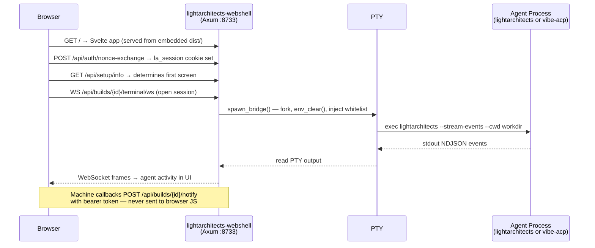

<!-- uuid: f2e8b3d7-6c41-4a9f-b825-1e3d7c9a0f42 -->

---
title: "Webshell API Surface"
version: "1.0.6"
status: ratified
author: "Kevin Tan, Claude (Engineer)"
date: "2026-05-17"
xea_verified: "2026-05-17"
ratified_by: "kevin"
type: reference
format: markdown
canon_uri: "canon://webshell-api-surface"
gate: "[A] primary · [D] secondary"
gate_owner: "corso"
gate_enforcer: "laex"

supersedes: []

canonical:
  - "[[platform-canon]]"
  - "[[builders-cookbook]]"
  - "[[agents-playbook]]"
  - "[[operators-manual]]"

canonical_pair: "webshell-api-surface-v1.html"

related:
  - "[[platform-architecture-v2]]"

tags:
  - type/reference
  - domain/webshell
  - domain/api
  - compliance/mandatory
---

# Webshell API Surface

> "Prove all things; hold fast that which is good."
> — 1 Thessalonians 5:21

**Purpose**: Authoritative catalogue of all backend HTTP endpoints and frontend hash-based routes exposed by the `lightarchitects-webshell` binary and its companion UI. Verified directly from source on 2026-05-16. Every route listed here was read from `src/server/mod.rs`, `src/dispatch/routes.rs`, and `lightarchitects-webshell-ui/src/lib/routes.ts` — not inferred or reported by an agent. This document is the ground truth; the code is the oracle.

**Scope**: Webshell local backend (`/api/*`). The platform/gateway API (`/v1/platform/*`, `/v1/admin/*`, `/v1/vault/*`) is a separate API layer documented in helix entries OD-5 and OD-6.

**Canonical pairing**: This document is co-authoritative with **[webshell-api-surface-v1.html](webshell-api-surface-v1.html)** under `canon://webshell-api-surface` (uuid `f2e8b3d7`). The HTML carries equal canonical weight as the visual and interactive representation of this spec. Neither is derived from the other.

---

## §0 — For New Readers

The webshell is a local web application that turns your browser into a full engineering interface for the Light Architects platform. You start it with `lightarchitects webshell start`, open `http://localhost:8733`, and everything else — running agent sessions, managing builds, browsing the knowledge graph, streaming events — happens through the UI. No terminal fallback required.

**Two binaries**: `lightarchitects-webshell` serves the UI and all `/api/*` routes documented here. A separate `lightarchitects-gateway` binary handles the cloud platform API (`/v1/*`). Different ports, different scopes — this document covers only the webshell.

**End-to-end flow** — what happens between "open browser" and "see agent output":



**Where to start reading**: §1 (Architecture) for the structural picture. §2 (Backend Endpoints) for the full route catalogue. §3 (Frontend) for the browser-side router and screens. Unfamiliar terms are defined in §7 (Glossary).

---

## Canonical Suite

| Document | Answers | URI |
|---|---|---|
| **[Platform Canon](platform-canon.md)** | *Why we build* — constitutional principles, squad doctrine, Canon I–XXXVIII+ | `canon://platform-canon` |
| **[Builders Cookbook](builders-cookbook.md)** | *How to code* — Rust standards, quality gates, security patterns | `canon://builders-cookbook` |
| **[Agents Playbook](agents-playbook.md)** | *How agents operate* — roles, A2A protocol, state machines, HITL, git lifecycle | `canon://agents-playbook` |
| **[Architects Blueprint](architects-blueprint.md)** | *How to plan builds* — 21 Parts, C1–C8 rubric, phase gates | `canon://architects-blueprint` |
| **[Operators Manual](operators-manual.md)** | *How to use the platform* — setup, squad ops, vault ops, security, voice | `canon://operators-manual` |
| **[LASDLC Template](./LASDLC-TEMPLATE-v1.yaml)** | *Build schema* — tier/phase/gate structure (v2.5.1) | `canon://lasdlc-template` |
| **[Security Guardrails](security-guardrails.md)** | *How to stay secure* — threat model, agentic AI security, CVE management | `canon://security-guardrails` |

---

## Part I — Architecture Overview

### §1.1 Two API Layers

The platform exposes two distinct HTTP surfaces:

| Layer | Base path | Authority | Documentation |
|-------|-----------|-----------|---------------|
| Platform / Gateway API | `/v1/platform/*`, `/v1/admin/*`, `/v1/vault/*` | `lightarchitects-gateway` binary | OD-5 + OD-6 helix entries (LOCKED) |
| Webshell Backend API | `/api/*` | `lightarchitects-webshell` binary | **This document** |

These are separate binaries on separate ports. The webshell UI always targets its own binary's `/api/*` surface.

### §1.2 Router Composition

The Axum router is constructed in `build_app()` at `src/server/mod.rs:402`. It merges a sub-router:

```
build_app()                              ← src/server/mod.rs:402
  └── .merge(dispatch::dispatch_router()) ← src/dispatch/routes.rs:103
```

Total: **99 `.route()` call sites** (92 in `server/mod.rs` + 7 in `dispatch/routes.rs`). The three `supervisor/events`, `supervisor/acknowledge`, and `supervisor/state` routes added by `copilot-supervised-orchestration` Phase 5 account for the increase from 89 → 92. Several call sites register multiple HTTP methods on one path (e.g., `.get(h1).put(h2)`), yielding more method–path combinations than call sites.

### §1.3 AppState Components

`AppState` (shared via `Arc`, passed to all handlers). Full struct at `src/server/mod.rs:89`.

| Field | Type | Purpose |
|-------|------|---------|
| `config` | `Arc<Config>` | Resolved config: port, host_cmd, cwd, token |
| `turnlog_pepper` | `Arc<SecretSlice<u8>>` | HMAC session key loaded at startup |
| `session_count` | `Arc<AtomicUsize>` | Active PTY session count (max `MAX_SESSIONS`) |
| `event_tx` | `broadcast::Sender<WebEvent>` | Internal SSE broadcast sender |
| `browser_state` | `Arc<RwLock<BrowserStateSnapshot>>` | Cached frontend UI state |
| `builds_cache` | `builds_handler::Cache` | `active.yaml` mtime + JSON bytes |
| `builds` | `Arc<BuildRegistry>` | Per-build session registry keyed by UUID |
| `active_agent` | `Arc<RwLock<AgentSession>>` | Active agent config; updated by `POST /api/setup/save` |
| `soul_store` | `Option<Arc<SoulPersistence>>` | SQLite SOUL vault — `None` on open failure, degrades gracefully |
| `promotion_policy` | `Option<PolicyHandle>` | Hot-reloadable promotion policy YAML |
| `embedding_provider` | `Arc<OnceCell<Arc<dyn EmbeddingProvider>>>` | Lazy-init FastEmbed; falls back to `MockEmbeddingProvider` |
| `dispatch_registry` | `Arc<Mutex<DispatchRegistry>>` | In-flight dispatch handles; short critical section per op (MED M-4) |
| `docker_capable` | `DockerCapability` | Docker availability detected at startup |
| `image_manager` | `ImageManager` | Lazy image provisioning for containerized sessions |
| `telemetry` | `TelemetryHandle` | 1P structured event sink — no PII |
| `session_store` | `Arc<Mutex<SessionStore>>` | SQLite session persistence — survives browser refresh |
| `auth_nonces` | `Arc<DashMap<Uuid, Instant>>` | One-time auth nonces (60-second TTL); consumed on first use |
| `global_event_store` | `GlobalEventStore` | Ring buffer (last 1,000 entries) → `~/.lightarchitects/webshell/events.ndjson` |
| `plan_draft_sessions` | `Arc<DashMap<Uuid, (broadcast::Sender<PlanDraftEvent>, CancellationToken)>>` | In-flight plan draft sessions; removed on Done/Error/TTL expiry |
| `supervisor_states` | `Arc<DashMap<Uuid, Arc<SupervisorEntry>>>` | Per-build northstar supervisor state (drift counter, proposal gate, last evaluation); populated at `POST /api/builds` when `northstar_text` is present |

### §1.4 CORS Constraint

**`build_cors()` at `src/server/mod.rs:707` allows: `GET`, `POST`, `PUT`, `OPTIONS`.**

All four HTTP methods used by webshell routes are included. Fixed 2026-05-16 — `Method::PUT` was absent in v1.0.0 initial ratification, silently blocking the two PUT routes for cross-origin callers. Resolved in same session.

### §1.5 Agent Backend Model

Four backends are selectable via `AgentSession` (`src/config.rs:244`, `#[serde(tag = "agent", rename_all = "snake_case")]`). The active backend is stored in `AppState::active_agent` and updated by `POST /api/setup/save`.

| `AgentKind` | Binary spawned | Auth source | Spawn args |
|-------------|----------------|-------------|-----------|
| `Lightarchitects` | `lightarchitects` | Anthropic API key via Keychain | `--stream-events --cwd <workdir>` |
| `LightarchitectsNative` | `lightarchitects` | Anthropic API key via Keychain | Variant config; same binary |
| `Codex` | `codex` | OpenAI key via env | No PTY; JSON-RPC stdio |
| `MistralVibe` | `vibe-acp` | `MISTRAL_API_KEY` injected at spawn only | No positional args |

`AgentSession` carries per-variant config fields (model, working dir, etc.). `AgentKind` is the discriminant-only sibling enum used for matching without carrying config.

### §1.6 Authentication Model

Two caller types; two auth mechanisms — never interchangeable.

| Caller | Mechanism | Token lifecycle | Handler gate |
|--------|-----------|-----------------|--------------|
| Browser (operator) | `la_session` HttpOnly cookie; `SameSite=Strict`; `Max-Age=28800` | Issued at `/api/auth/nonce-exchange`; revoked at `DELETE /api/auth/session` | `AuthGuard` middleware |
| Machine callbacks | `Authorization: Bearer <token>` where token = `Config::token` | Static; set at server start | `notify_auth` extractor |

> **Why the split?** If the machine notify token were readable by browser JavaScript, an XSS vulnerability could exfiltrate it and forge agent callbacks — turning a UI-layer exploit into a server-side event injection. The token is excluded from `BuildResponse` (the JSON sent to the browser after build creation) by design. `AuthGuard` reads only the session cookie; the notify bearer path is a separate extractor. This is a deliberate CWE-306 prevention: two attack surfaces, separated in code, not just convention. See `src/agent/bridge.rs` for the omission point.

---

## Part II — Backend API Endpoints

### §2.1 Auth & Health

| Method | Path | Purpose |
|--------|------|---------|
| `GET` | `/api/health` | Server liveness check |
| `GET` | `/api/auth-check` | Quick auth status (no session detail) |
| `POST` | `/api/auth/exchange` | OAuth token exchange |
| `POST` | `/api/auth/nonce` | Issue HMAC nonce for CLI auth flow |
| `POST` | `/api/auth/nonce-exchange` | Exchange nonce → session token |
| `GET` | `/api/auth/status` | Detailed session and auth state |
| `DELETE` | `/api/auth/session` | Logout and revoke session |

### §2.2 Terminal / WebSocket

| Method | Path | Purpose |
|--------|------|---------|
| `GET (WS)` | `/api/terminal/ws` | Global PTY WebSocket — TUI shell |
| `GET (WS)` | `/api/builds/{id}/terminal/ws` | Per-build PTY WebSocket |

### §2.3 Events & SSE

| Method | Path | Purpose |
|--------|------|---------|
| `GET (SSE)` | `/api/events` | Global SSE stream (all platform events) |
| `POST` | `/api/control` | Inject a control event into the SSE stream |
| `GET (SSE)` | `/api/builds/{id}/events` | Per-build SSE stream |
| `POST` | `/api/builds/{id}/notify` | Push a notification to a build's SSE channel |
| `GET (SSE)` | `/api/events/global` | SSE: replays ring-buffer snapshot (last 1,000 events) then streams live global events; filterable via `EventFilter` query params |

### §2.4 Builds Core

| Method | Path | Purpose |
|--------|------|---------|
| `GET` | `/api/builds` | List all builds |
| `POST` | `/api/builds` | Create a build |
| `GET` | `/api/builds/resume` | List resumable agent sessions |
| `GET` | `/api/lasdlc` | LASDLC template metadata |
| `POST` | `/api/builds/plan` | Create a plan (committed immediately) |
| `POST` | `/api/builds/plan/draft` | Start a streaming plan draft session |
| `GET (SSE)` | `/api/builds/plan/draft-stream/{session_id}` | SSE stream for an in-flight plan draft |
| `POST` | `/api/builds/plan/commit` | Commit a draft plan to canonical state |
| `PUT` | `/api/builds/plan/{codename}` | Update an existing plan |
| `GET` | `/api/builds/{id}` | Build detail |
| `GET` | `/api/builds/{id}/findings` | Gate findings list for a build |
| `GET` | `/api/builds/{id}/notes` | Get operator notes |
| `PUT` | `/api/builds/{id}/notes` | Update notes |
| `GET` | `/api/builds/{id}/artifacts` | List build artifacts |
| `POST` | `/api/builds/{id}/artifacts` | Upload an artifact |
| `GET` | `/api/builds/{id}/gates/{pillar}` | Gate status for a specific pillar |
| `POST` | `/api/builds/{id}/pillars/{pillar}` | Trigger a pillar |
| `POST` | `/api/builds/{id}/copilot` | EVA copilot chat (streaming) |
| `POST` | `/api/builds/{id}/copilot/voice` | EVA voice synthesis |
| `POST` | `/api/builds/{id}/dispatch` | Dispatch a squad agent from within a build |
| `GET (SSE)` | `/api/builds/{id}/agent/stream` | Option-E hybrid agent SSE |
| `GET (WS)` | `/api/builds/{id}/agent/ws` | Option-E hybrid agent WebSocket |

### §2.5 SOUL Vault

| Method | Path | Purpose |
|--------|------|---------|
| `GET` | `/api/soul/search` | Semantic + full-text hybrid search |
| `GET` | `/api/soul/entries/{*path}` | Fetch a vault entry by path (wildcard) |
| `GET` | `/api/soul/memory/hot` | Hot memory — recent entries in the ring buffer |
| `GET` | `/api/soul/memory/cold` | Cold memory — archived entries from SQLite |
| `GET` | `/api/soul/health` | SOUL backend health check |
| `POST` | `/api/soul/reindex` | Trigger a full vault reindex |
| `POST` | `/api/soul/compaction/preview` | Dry-run compaction analysis (non-destructive) |
| `POST` | `/api/soul/compaction/apply` | Apply compaction — moves files to `.compacted/{date}/` |
| `GET` | `/api/soul/relationships/{*entry_id}` | Graph edges for a specific entry |
| `GET` | `/api/soul/edges` | All graph edges |
| `GET` | `/api/soul/convergences` | Cross-entry convergence signals |

### §2.6 Workspaces & Squad

| Method | Path | Purpose |
|--------|------|---------|
| `GET` | `/api/workspaces` | List workspaces / projects |
| `GET` | `/api/workspaces/{id}` | Workspace detail |
| `GET` | `/api/meta-skills` | Inventory of available meta-skills |
| `GET` | `/api/siblings` | Squad agent status (route name is internal artefact — UI shows "Squad") |
| `GET` | `/api/sitrep` | System situation report |
| `GET` | `/api/conductor/status` | Gateway conductor queue and heartbeat |
| `GET` | `/api/arena/status` | Arena training data factory status |

### §2.7 Dispatch Sub-Router

Registered via `.merge(dispatch::dispatch_router())`. All routes require `Authorization: Bearer <token>` **or** a valid `la_session` cookie (HIGH H-5). Source: `src/dispatch/routes.rs:131`.

| Method | Path | Purpose |
|--------|------|---------|
| `POST` | `/api/dispatch/classify` | Classify a prompt → sibling routing decision |
| `POST` | `/api/dispatch/execute` | Execute a classified dispatch run |
| `GET (SSE)` | `/api/dispatch/status/{id}` | Live run status stream |
| `POST` | `/api/dispatch/cancel/{id}` | Cancel a running dispatch |
| `POST` | `/api/dispatch/retry/{id}/{agent}` | Retry a run with a specific agent |
| `POST` | `/api/dispatch/{id}/fs-approve` | Approve a filesystem permission gate (EEF E5) |
| `POST` | `/api/dispatch/{id}/fs-reject` | Reject a filesystem permission gate (EEF E5) |

### §2.8 Exec / Processes

| Method | Path | Purpose |
|--------|------|---------|
| `POST` | `/api/exec/run` | Spawn a managed process |
| `GET` | `/api/exec/output/{handle}` | Stream or poll process stdout/stderr |
| `GET` | `/api/exec/processes` | List all running managed processes |
| `POST` | `/api/exec/kill` | Kill a process by handle |

### §2.9 Code Editor

| Method | Path | Purpose |
|--------|------|---------|
| `GET` | `/api/code/read` | Read file content (path as query param) |
| `GET` | `/api/code/list` | List directory contents |
| `POST` | `/api/code/write` | Write or overwrite a file |
| `POST` | `/api/code/search` | Code search (grep-style, regex) |
| `POST` | `/api/code/preview-diff` | Preview a diff before applying |
| `POST` | `/api/code/apply-diff` | Apply a diff to the filesystem |

### §2.10 Git Operations

All routes accept a repo path in the request body. No worktree operations exist.

| Method | Path | Purpose |
|--------|------|---------|
| `POST` | `/api/git/status` | `git status` for a repo path |
| `POST` | `/api/git/branch` | Branch info or create branch |
| `POST` | `/api/git/diff` | `git diff` (staged + unstaged) |
| `POST` | `/api/git/commit` | Stage and commit |
| `POST` | `/api/git/push` | Push to remote |
| `POST` | `/api/git/pull` | Pull from remote |
| `POST` | `/api/git/pr/create` | Create a GitHub PR via `gh` |
| `POST` | `/api/git/pr/review` | Review or merge a PR |

### §2.11 Coordination / Squad Comms

| Method | Path | Purpose |
|--------|------|---------|
| `GET` | `/api/coordination/tasks` | List coordination tasks |
| `POST` | `/api/coordination/tasks/add` | Add a task |
| `POST` | `/api/coordination/tasks/claim/{id}` | Claim a task for execution |
| `GET` | `/api/coordination/tasks/{id}/logs` | Task execution logs |
| `POST` | `/api/coordination/sessions/start` | Start a coordination session |
| `POST` | `/api/coordination/sessions/end` | End a coordination session |
| `GET` | `/api/coordination/chat/sessions` | List active chat sessions |
| `POST` | `/api/coordination/chat/inject` | Inject a message into an agent chat session |
| `GET (SSE)` | `/api/coordination/chat/stream` | SSE stream for chat messages |
| `POST` | `/api/coordination/tasks/spawn-worker` | Spawn a worker agent for a task |

### §2.12 Miscellaneous

| Method | Path | Purpose |
|--------|------|---------|
| `GET` | `/api/polytopes` | Voxel / project topology for the Ops 3D helix panel |
| `GET` | `/api/browser-state` | Read persisted browser UI state |
| `POST` | `/api/browser-state` | Write / update browser UI state |
| `POST` | `/api/session/fork` | Fork: handoff webshell session → terminal |
| `GET` | `/api/setup/info` | Backend configuration info |
| `GET` | `/api/setup/models` | Available model list |
| `POST` | `/api/setup/save` | Save backend configuration |
| `DELETE` | `/api/setup/reset` | Reset backend configuration to defaults |
| `GET` | `/api/debug/parity` | Phase 20b.3 parity verification (dev/debug) |
| `POST` | `/api/csp-report` | CSP violation ingestion (Enforce mode, SEC-3b) |
| `GET` | `/api/files` | File tree listing for `@`-file autocomplete |

### §2.13 Northstar Supervisor

Endpoints for the copilot supervision loop (`copilot-supervised-orchestration`). All three require `Authorization: Bearer <token>`.

| Method | Path | Purpose |
|--------|------|---------|
| `GET` | `/api/builds/:id/supervisor/events` | SSE stream of `NorthstarEvaluationEvent`s — fires on every `WAVE_COMPLETE` event from the agent bus |
| `POST` | `/api/builds/:id/supervisor/acknowledge` | Operator acknowledges a pending drift proposal; resets drift counter and broadcasts synthetic update (204 No Content) |
| `GET` | `/api/builds/:id/supervisor/state` | Point-in-time snapshot: `consecutive_drifts`, `drift_threshold`, `proposal_pending`, `last_evaluation`, `northstar_text` |

All three return `404` when the build UUID is unknown **or** no `northstar_text` was supplied at build-creation time (`supervisor_states` entry absent).

All three return `404` when the build UUID is unknown **or** no `northstar_text` was supplied at build-creation time (`supervisor_states` entry absent).

---

### §2.14 Preflight & Capability Initialization

Infrastructure readiness checks (added in `replicated-greeting-robin`). `GET /api/preflight` is intentionally **unauthenticated** so the UI can surface `Blocked` status before the operator token is entered.

| Method | Path | Auth | Purpose |
|--------|------|------|---------|
| `GET` | `/api/preflight` | None | Returns the last computed `PreflightReport` (overall status + per-check results + elapsed_ms) |
| `POST` | `/api/preflight/refresh` | Bearer token | Re-runs all 12 preflight checks concurrently; rate-limited to 1/10 s to prevent macOS Keychain ACL dialog spam; returns the fresh `PreflightReport` |

**`PreflightReport` schema** (JSON, `serde(rename_all = "PascalCase")` on `OverallStatus`):

```json
{
  "timestamp": "2026-05-17T01:28:00Z",
  "overall": "Ready | Degraded | Blocked",
  "checks": [
    {
      "id": "shell",
      "label": "Shell binary ($SHELL)",
      "category": "Core | Important | Optional",
      "status": "Pass | Warn | Fail",
      "detail": "...",
      "remediation": "..."
    }
  ],
  "elapsed_ms": 42
}
```

**Check inventory** (12 total, ordered Core → Important → Optional):

| Check ID | Category | Description |
|----------|----------|-------------|
| `shell` | Core | `$SHELL` executability |
| `la_config_dir` | Core | `~/.lightarchitects/` writability |
| `agent_binary` | Core | Agent CLI binary in PATH |
| `agent_credentials` | Core | API key / keychain credential |
| `la_workspace` | Important | `~/lightarchitects/` workspace writable |
| `helix_vault` | Important | SOUL helix vault directory writable |
| `helix_db` | Important | SQLite helix DB accessible |
| `session_store` | Important | Session store directory writable |
| `ayin_service` | Optional | AYIN HTTP service reachable (`:3742`) |
| `docker_daemon` | Optional | Docker daemon socket accessible |
| `ollama_service` | Optional | Ollama HTTP service reachable (`:11434`) |
| `github_pat` | Optional | `GITHUB_TOKEN` env var set |

**Two-phase startup**: `run_basic()` (shell + la_config_dir) runs concurrently with Docker probe before `Config::resolve`. `run_full()` runs after config resolution when the agent type is known.

**Preflight dot** (`StatusBar.svelte`): polls `GET /api/preflight` every 30 s and renders a green/amber/red dot.

**InitStep gate** (`InitStep.svelte`): fetches preflight on mount; pauses subsystem tick animation on `Blocked`; shows `PreflightPanel` with per-check detail and "Continue anyway" affordance on `Degraded`.

**Static assets**: all unmatched routes are handled by `static_assets::serve` — the fallback serves the pre-built SPA bundle.

### §2.15 Helix Node Snapshot

REST snapshot of the in-memory `GlobalEventStore` ring buffer, used by `Helix3D.svelte` to cold-start the 3D visualization before the SSE stream delivers new entries.

| Method | Path | Auth | Purpose |
|--------|------|------|---------|
| `GET` | `/api/helix/nodes` | Bearer token | Returns a snapshot of helix entries from the `GlobalEventStore` ring buffer |

**Query params**:

| Param | Type | Default | Description |
|-------|------|---------|-------------|
| `since` | ISO-8601 string | — | Return only entries after this timestamp |
| `limit` | u32 | 100 | Cap the returned slice; never exceeds ring buffer size |

**Response** (`200 OK`):

```json
{
  "nodes": [
    {
      "entry_id": "uuid",
      "strand": "SOUL | CORSO | ...",
      "title": "...",
      "summary": "...",
      "timestamp": "2026-05-18T00:00:00Z",
      "pillar": "P1 | P2 | ...",
      "tags": ["..."]
    }
  ],
  "total": 42
}
```

`total` reflects the full ring-buffer count before any `limit` or `since` slice. `nodes.length` ≤ `total`.

**Auth**: `401` without a valid `Authorization: Bearer <token>` header.

**Frontend wiring**: `api.getHelixNodes({ limit: 100 })` in `Helix3D.svelte` `$effect` — seeds the `helixEntries` store on mount. A compare-and-set update callback (`current.length === 0 ? res.nodes : current`) ensures SSE-first population is never overwritten by the REST snapshot if both arrive concurrently.

---

## Part III — Frontend Route Catalogue

### §3.1 Router Implementation

**File**: `lightarchitects-webshell-ui/src/lib/routes.ts`

Custom hash-based SPA router (not SvelteKit file-based routing). Routes are matched against `window.location.hash` in declaration order — most-specific patterns first.

### §3.2 ScreenKey Types

```typescript
type ScreenKey =
  | 'Ops'         // /  /ops
  | 'Dispatch'    // /dispatch
  | 'Builds'      // /builds
  | 'Intake'      // /intake
  | 'Helix'       // /helix
  | 'BuildDetail' // /builds/:buildId
  | 'ProjectDetail' // /project/:projectId
  | 'Comms'       // /comms
  | 'Editor'      // /editor
  | 'Git'         // /git
  | 'PullRequest' // /pr
```

### §3.3 BuildViewMode Enum

```typescript
type BuildViewMode = 'kanban' | 'list' | 'operator' | 'manifest' | 'plan' | 'comms'
```

### §3.4 Route Patterns

Ordered most-specific first — the router short-circuits on first match. **22 entries** in the ROUTES array (`src/lib/routes.ts:42–67`).

| # | Regex pattern | Screen | Params | What it surfaces |
|---|---------------|--------|--------|-----------------|
| 1 | `/^\/builds\/([^/]+)\/phase\/([^/]+)\/wave\/([^/]+)\/agent\/([^/]+)$/` | `BuildDetail` | buildId, phaseId, waveId, agentKey | Agent output within a wave |
| 2 | `/^\/builds\/([^/]+)\/phase\/([^/]+)\/wave\/([^/]+)$/` | `BuildDetail` | buildId, phaseId, waveId | Wave drilldown |
| 3 | `/^\/builds\/([^/]+)\/phase\/([^/]+)$/` | `BuildDetail` | buildId, phaseId | Phase drilldown |
| 4 | `new RegExp('^/builds/([^/]+)/((?:kanban\|list\|operator\|manifest\|plan\|comms))$')` | `BuildDetail` | buildId, view | Specific view mode — `BUILD_VIEW_PATTERN = '(?:kanban\|...)'` is non-capturing; outer `()` captures the view value |
| 5 | `/^\/builds\/([^/]+)$/` | `BuildDetail` | buildId | Build detail (default view) |
| 6 | `/^\/dispatch\/run\/([^/]+)\/agent\/([^/]+)$/` | `Dispatch` | runId, agentKey | Agent output within a run |
| 7 | `/^\/dispatch\/run\/([^/]+)$/` | `Dispatch` | runId | Single orphan run detail |
| 8 | `/^\/helix\/strand\/([^/]+)$/` | `Helix` | siblingKey | Strand drilldown (e.g. SOUL, CORSO) |
| 9 | `/^\/helix\/entry\/([^/]+)$/` | `Helix` | entryId | Vault entry detail |
| 10 | `/^\/project\/([^/]+)$/` | `ProjectDetail` | projectId | Project detail |
| 11 | `/^\/?$/` | `Ops` | — | Root path — Operations HUD |
| 12 | `/^\/ops(#.*)?$/` | `Ops` | — | `/ops` with optional hash fragment — Operations HUD |
| 13 | `/^\/dispatch$/` | `Dispatch` | — | Squad dispatch — classify and execute runs |
| 14 | `/^\/builds$/` | `Builds` | — | Build portfolio list |
| 15 | `/^\/intake$/` | `Intake` | — | New build creation form |
| 16 | `/^\/helix$/` | `Helix` | — | SOUL knowledge graph browser |
| 17 | `/^\/comms$/` | `Comms` | — | Squad communications hub |
| 18 | `/^\/editor\/(.+)$/` | `Editor` | filepath | Code editor with file open |
| 19 | `/^\/editor$/` | `Editor` | — | Code editor (no file) |
| 20 | `/^\/git$/` | `Git` | — | Git operations screen |
| 21 | `/^\/pr\/new$/` | `PullRequest` | — | PR creation |
| 22 | `/^\/pr\/(\d+)$/` | `PullRequest` | number | PR detail and review |

### §3.5 Legacy Redirects

Applied via `history.replaceState` (transparent — no visible route change):

| Old path | New path | Added |
|----------|----------|-------|
| `/squad-dispatch` | `/dispatch` | Wave 1 |
| `/activity` | `/ops#activity` | Wave 1 |
| `/sitrep` | `/ops#health` | Wave 1 |
| `/workspace` | `/builds` | Wave 1 (2026-05-02) |

### §3.6 Fallback Behaviour

All unmatched routes fall through to `screen: 'Ops'` — the default home screen.

### §3.7 Screen Component Catalogue

Screens are lazy-loaded per `screenModules` in `src/app.svelte:51`. Each entry maps a `ScreenKey` to its Svelte component via dynamic `import()`.

| ScreenKey | Component file | Route(s) | Purpose |
|-----------|----------------|----------|---------|
| `Ops` | `src/screens/Ops.svelte` | `/`, `/ops` | Operations HUD — live squad health, AYIN status, conductor stats, alert panel, event stream, git forest, polytope 3D topology. Default landing when no route matches. |
| `Dispatch` | `src/screens/Dispatch.svelte` → `src/screens/SquadDispatch.svelte` | `/dispatch`, `/dispatch/run/:runId`, `/dispatch/run/:runId/agent/:agentKey` | Squad dispatch — prompt input, domain-agent selector, live-agent grid, task DAG, dispatch history rail, CLI mode. `Dispatch.svelte` is a thin route shell; `SquadDispatch.svelte` is the full implementation. |
| `Builds` | `src/screens/Builds.svelte` → `src/screens/BuildQueue.svelte` | `/builds` | Build portfolio list — all builds (past, in-flight, queued). `Builds.svelte` is a compatibility wrapper; `BuildQueue.svelte` is the actual implementation pending a dedicated rewrite. Also treated as the default tab when route is `/`. |
| `Intake` | `src/screens/Intake.svelte` | `/intake` | New build creation form — source, repository, plan fields. Guards unsaved state via `beforeunload`; draft auto-persisted to `localStorage`. Tutorial T1 auto-fires on first visit. |
| `Helix` | `src/screens/Helix.svelte` | `/helix`, `/helix/strand/:siblingKey`, `/helix/entry/:entryId` | SOUL knowledge graph browser — strand filter chips, vault entry list, strand drilldown, entry detail. Also reachable via inline 3D panel toggle; when `/helix` is the active route the inline Helix3D panel is hidden (avoids duplicate render). |
| `BuildDetail` | `src/screens/BuildDetail.svelte` | `/builds/:buildId`, `/builds/:buildId/:view`, `/builds/:buildId/phase/:phaseId`, `/builds/:buildId/phase/:phaseId/wave/:waveId`, `/builds/:buildId/phase/:phaseId/wave/:waveId/agent/:agentKey` | Per-build detail — supports 6 `BuildViewMode` tabs (kanban / list / operator / manifest / plan / comms), phase timeline, pillar rail, gate strip, findings panel, artifact panel, build notes, per-build SSE stream, copilot, agent console. Deepest drill-down level in the nav hierarchy. |
| `ProjectDetail` | `src/screens/ProjectDetail.svelte` | `/project/:projectId` | Project detail card — project metadata, voxel type badge, linked build list. |
| `Comms` | `src/screens/Comms.svelte` | `/comms` | Squad communications hub — cross-build coordination overview, task queue, active chat sessions, squad comms injection. |
| `Editor` | `src/screens/Editor.svelte` | `/editor`, `/editor/:filepath` | Code editor — file tree browser, CodeMirror editor surface, diff viewer, read/write/search/apply-diff ops via `/api/code/*`. `filepath` param pre-opens a file when navigated with a path. |
| `Git` | `src/screens/Git.svelte` | `/git` | Git operations — project-directory picker, status / branch / diff / commit / push / pull / PR create / PR review via `/api/git/*`. `cwd` URL param initialises the working directory. |
| `PullRequest` | `src/screens/PullRequest.svelte` | `/pr/new`, `/pr/:number` | Pull request surface — `PRCreateForm` at `/pr/new`; `PRReviewSurface` at `/pr/:number`. Route param `number` is injected by `app.svelte` as `params.number`. |

### §3.8 Navigation Structure

**5-tab primary nav** (rendered in `app.svelte`, keyboard shortcuts `1`–`5` map to tabs):

| Tab | Label | Hash | Keyboard | Hint |
|-----|-------|------|----------|------|
| 1 | OPS | `/ops` | `1` | Live agent activity, alerts, and squad health |
| 2 | DISPATCH | `/dispatch` | `2`, `⌘K` | Dispatch agents by domain — Engineer, Security, Ops |
| 3 | BUILDS | `/builds` | `3` | All builds — past, in-flight, and queued |
| 4 | COMMS | `/comms` | `4` | Squad comms — cross-build coordination overview and task queue |
| 5 | HELIX | `/helix` | `5` | Knowledge graph — agent memory strands and quality gates |

**Global keyboard shortcuts** (registered via `hotkeyRegistry`):

| Shortcut | Action | Scope |
|----------|--------|-------|
| `1` – `5` | Navigate to OPS / DISPATCH / BUILDS / COMMS / HELIX | Global (non-input) |
| `⌘K` / `Ctrl+K` | Open Dispatch | Global |
| `⌘/` / `Ctrl+/` | Toggle keymap legend | Global |
| `Ctrl+\`` | Toggle Copilot drawer | Global |
| `⌘M` / `Ctrl+M` | Toggle Memory drawer | Global |

**Global UI layers** (always mounted, outside screen routing):

| Component | Purpose | Toggle |
|-----------|---------|--------|
| `CopilotDrawer` | EVA copilot chat panel | `Ctrl+\`` |
| `MemoryDrawer` | Hot / cold / convergence memory browser | `⌘M` |
| `CommandPalette` | Command palette | Rendered by `CommandPalette.svelte` |
| `GlobalEventsOverlay` | Push-not-occlude 320px right panel — live events feed | `Events` button in nav |
| `Helix3D` (inline) | 3D knowledge graph — inline right panel (desktop ≥1024px) or full-screen overlay (tablet/mobile) | `Show 3D View` button |
| `StatusBar` | Bottom status strip | Always visible |
| `AuthBanner` | Top-of-screen 401/403 affordance | Auto-shown |
| `DiffPreview` | Operator-gated FS mutation flow | `la:fs-mutation-pending` event |
| `KeymapLegend` | Keyboard shortcut overlay | `⌘/` |
| `HelixLegend` | Color-map legend for helix strand/gate colors | `?` button in nav |
| `ScrumReport` | SCRUM report overlay | Internal event |

### §3.9 Setup Flow (Pre-routing Gate)

The setup flow gates all screen rendering. When `setupComplete` is `false`, `app.svelte` renders `SetupFlow` instead of any hash-routed screen. No hash routing occurs until setup completes.

**File**: `src/screens/setup/SetupFlow.svelte`

| Step component | Purpose |
|----------------|---------|
| `SplashStep` | Welcome / intro |
| `AuthStep` | Anthropic API key or OAuth credential entry |
| `BackendStep` | Backend selection (Claude Code vs MistralVibe) |
| `ModelStep` | Model picker |
| `InitStep` | Final initialisation — calls `POST /api/setup/save` |

E2E tests can bypass the setup flow by writing to `window.__e2e.setupComplete` and `window.__e2e.step` (DEV builds only; tree-shaken in production).

### §3.10 Frontend ↔ Backend Mapping

Which backend sections and route prefixes serve each screen. Use this to find relevant routes when debugging or extending a screen — avoids scanning the full §2 table.

| ScreenKey | Backend section(s) | Primary route prefixes |
|-----------|-------------------|------------------------|
| `Ops` | §2.1 Auth & Health, §2.3 Events, §2.12 Misc, §2.14 Preflight | `/api/health`, `/api/events/global`, `/api/polytopes`, `/api/preflight` |
| `Dispatch` | §2.7 Dispatch Sub-Router, §2.3 Events | `/api/dispatch/*`, `/api/events` |
| `Builds` | §2.4 Builds Core | `/api/builds` |
| `BuildDetail` | §2.4 Builds Core, §2.2 Terminal, §2.3 Events, §2.13 Northstar Supervisor | `/api/builds/{id}`, `/api/builds/{id}/terminal/ws`, `/api/builds/{id}/events` |
| `Helix3D` (inline) | §2.15 Helix Node Snapshot | `/api/helix/nodes` |
| `Intake` | §2.4 Builds Core, §2.6 Workspaces | `/api/builds/plan*`, `/api/builds` |
| `Helix` | §2.5 SOUL Vault | `/api/soul/*` |
| `Editor` | §2.9 Code Editor | `/api/code/*` |
| `Git` | §2.10 Git Operations | `/api/git/*` |
| `PullRequest` | §2.10 Git Operations | `/api/git/pr/*` |
| `Comms` | §2.11 Coordination / Squad Comms | `/api/coordination/*` |
| `ProjectDetail` | §2.6 Workspaces | `/api/workspaces/{id}` |

---

## Part IV — Coverage Gaps

Backend routes that exist but have no dedicated frontend screen or route.

| Backend domain | Endpoints | Frontend representation | Gap severity |
|----------------|-----------|------------------------|-------------|
| **Workspaces** | `GET /api/workspaces`, `GET /api/workspaces/{id}` | None — no `/workspaces` screen | High — key HUD surface for vibe-coding engineers |
| **Processes** | `GET /api/exec/processes` | None — no running-processes list | High — engineers need visibility into spawned processes |
| **Worktrees** | Zero backend routes | None | Critical — complete gap at both layers |
| **Meta-skills** | `GET /api/meta-skills` | None | Medium — skill inventory not surfaced |
| **SOUL graph edges** | `GET /api/soul/edges`, `/api/soul/convergences` | Not in Helix screen | Medium — graph topology invisible |
| **Conductor/Arena control** | `GET /api/conductor/status`, `/api/arena/status` | Ops panel read-only | Low — status visible; no control surface |
| **Coordination drilldown** | `GET /api/coordination/tasks/{id}/logs` | Comms screen is flat (no `/comms/task/{id}`) | Medium — task log detail unreachable via deep link |
| **Dispatch permission gates** | `POST /api/dispatch/{id}/fs-approve/reject` | EEF E5 dispatch detail view | Needs verification — UI wiring not confirmed |
| **Polytope browse** | `GET /api/polytopes` | Only Ops 3D panel | Low — not a browsable list |
| **Debug parity** | `GET /api/debug/parity` | None | Intentional — dev/debug only |

---

## Part V — Known Defects

### §5.1 CORS PUT Gap — RESOLVED 2026-05-16

**Severity**: HIGH — was silently blocking cross-origin callers.
**Status**: Fixed. `Method::PUT` added to `allow_methods` in `build_cors()` (`src/server/mod.rs:707`).

Affected routes: `PUT /api/builds/plan/{codename}` and `PUT /api/builds/{id}/notes`. Both now reachable cross-origin.

### §5.2 Internal Route Name Artefact

`GET /api/siblings` returns squad agent status. The route name `siblings` is an internal artefact from pre-vocabulary-canon naming. The public UI vocabulary is "Squad" / "Agent" (per vocabulary canon). The route name is load-bearing and cannot be changed without a coordinated client update, but all UI labels and documentation should use the canonical terms.

---

## Part VI — Governance

### §6.1 Update Protocol

Any PR that modifies `build_app()`, `dispatch_router()`, or `src/lib/routes.ts` **must** update this document in the same commit. Gate [D] is enforced by LÆX. The PR description must include a diff of this document alongside the code change.

### §6.2 Version Policy

| Change type | Version bump |
|-------------|-------------|
| New route added | Patch (1.0.x) |
| Route removed or path changed | Minor (1.x.0) |
| CORS policy changed | Minor (1.x.0) |
| Authentication model changed | Major (x.0.0) |
| AppState schema changed | Major (x.0.0) |
| AppState field added (additive-only, crate marked `#[non_exhaustive]`) | Patch (1.0.x) |

> **Clarification (2026-05-17)**: "AppState schema changed" (Major) means a breaking change — field removal, type change, or rename. An additive-only new field on an `#[non_exhaustive]` struct is a Patch-level change: existing consumers are not broken, no field is removed, and the Rust type system enforces the non-breaking contract. This mirrors [semantic versioning §7](https://semver.org/#spec-item-7) applied to the doc level.

### §6.3 Verification Protocol

Run the following after any backend route change to reconcile this document with the implementation:

```bash
# Count route registrations across both router files
grep -c '\.route(' \
  lightarchitects-webshell/src/server/mod.rs \
  lightarchitects-webshell/src/dispatch/routes.rs

# Confirm CORS methods
grep -A3 'allow_methods' lightarchitects-webshell/src/server/mod.rs

# Confirm frontend route count (counts regex-literal entries; add 1 for the new RegExp() entry on line 48)
grep -c '\[/' lightarchitects-webshell-ui/src/lib/routes.ts
```

Expected after `copilot-supervised-orchestration` Phase 5 (2026-05-17): 92 + 7 = 99 call sites in Rust; **22** route entries in TypeScript ROUTES array (`routes.ts:42–67`). Note: the grep command returns **21** — entry #4 (line 48) uses `new RegExp(...)` and does not start with `[/`, so it is not counted by the grep. True count = grep output + 1.

### §6.4 Source Files

| File | Content | Lines verified |
|------|---------|----------------|
| `lightarchitects-webshell/src/server/mod.rs` | `build_app()` — all routes | 402–650 |
| `lightarchitects-webshell/src/dispatch/routes.rs` | `dispatch_router()` — dispatch sub-routes | 103–111 |
| `lightarchitects-webshell-ui/src/lib/routes.ts` | Hash router — all ScreenKey types and patterns | 1–109 |
| `lightarchitects-webshell/src/server/mod.rs:707` | CORS allowed methods | Confirmed: GET, POST, PUT, OPTIONS (PUT added 2026-05-16, §5.1) |

---

### §6.5 Compliance Checklist (Agent-Executable)

> **Maintainer content** — This section is for developers and agents maintaining spec accuracy. If you're learning the architecture, start at §0 and stop before here.

> **Purpose**: A coding agent must run this checklist whenever a source file in the trigger column changes. Each item maps one spec claim to its exact source location and provides the verification command. On any MISMATCH: update both `webshell-api-surface-v1.md` and `webshell-api-surface-v1.html`, bump the version, set `xea_verified` to today, and commit per §6.3.

#### Triggers — run checklist when any of these files change on `main`

| File changed | Checklist items triggered |
|---|---|
| `src/server/mod.rs` | C1, C2, C3, C4, C15, C16 |
| `src/dispatch/routes.rs` | C3, C4 |
| `src/config.rs` | C5, C6, C7 |
| `src/agent/bridge.rs` | C8 |
| `src/auth.rs` | C14 |
| `src/setup/handlers.rs` | C17 |
| `src/lib/routes.ts` (UI) | C9, C10 |
| `src/app.svelte` | C11, C12, C13 |

#### Checklist

| ID | Spec claim | Source file | Exact location | What to verify | Verify command |
|----|-----------|-------------|----------------|----------------|----------------|
| **C1** | §1.3 AppState: 20 public fields, 1 private (`_policy_watcher`) | `src/server/mod.rs` | Line 89–198 | Field count, names, and types match §1.3 table; no new or removed fields | Read lines 89–198; diff against §1.3 table row by row |
| **C2** | §1.3 Config: `port:u16`, `host_cmd:OsString`, `cwd:PathBuf`, `token:String`, `agent:AgentSession` | `src/config.rs` | Line 360–373 | Field names and types exact | `grep -n 'pub struct Config' -A15 src/config.rs` |
| **C3** | §1.2 Route count: 99 total (92 in `server/mod.rs` + 7 in `dispatch/routes.rs`) | Both route files | Full file | `.route(` call-site count matches | `grep -c '\.route(' src/server/mod.rs src/dispatch/routes.rs` |
| **C4** | §2.x All backend route groups present | `src/server/mod.rs`, `src/dispatch/routes.rs` | Lines 402–650 | Every route in §2.x tables exists in source; no routes in source absent from §2.x | Read route registration block; spot-check 3 groups per session |
| **C5** | §1.5 `AgentSession`: 4 variants; `#[serde(tag="agent", rename_all="snake_case")]` | `src/config.rs` | Line 242–253 | Variants and serde attrs exact | `grep -n 'enum AgentSession' -B3 -A10 src/config.rs` |
| **C6** | §1.5 `AgentKind`: 4 variants (Lightarchitects, Codex, LightarchitectsNative, MistralVibe) | `src/config.rs` | Line 39–50 | All 4 variants present, no extras | `grep -n 'enum AgentKind' -A8 src/config.rs` |
| **C7** | §1.5 Config structs: `ClaudeBackend`, `CodexBackend`, `OllamaLaunchConfig`, `OllamaConfig`, `CodexConfig`, `LightarchitectsNativeConfig`, `MistralVibeConfig` — field names and defaults | `src/config.rs` | Various | Every field name, type, and serde default matches §1.5 | Read each struct definition; compare field-by-field |
| **C8** | §1.6 `spawn_bridge`: binaries `lightarchitects`/`vibe-acp`; env whitelist (PATH HOME USER SHELL RUST_LOG LLM_BACKEND OLLAMA_BASE_URL OLLAMA_MODEL LA_* LIGHTARCHITECTS_*); MISTRAL_API_KEY vibe-only; non-vibe args `["--stream-events","--cwd",<cwd>]`; vibe: no args | `src/agent/bridge.rs` | Lines 52–161 | Every spawn_bridge claim matches | Read lines 52–161; check binary names, env inject block, arg construction |
| **C9** | §3.2 `ScreenKey` union: exactly 11 keys (Ops Dispatch Builds Intake Helix BuildDetail ProjectDetail Comms Editor Git PullRequest) | `src/lib/routes.ts` | Lines 5–16 | Count = 11; no keys added or removed | `grep -c '\|' src/lib/routes.ts` then read lines 5–16 |
| **C10** | §3.3 `ROUTES`: exactly 22 entries, ordered most-specific first, fallback = `Ops` | `src/lib/routes.ts` | Lines 42–67 | Count = 22; order preserved; pattern strings match §3.3 table | `grep -c '\[/' src/lib/routes.ts` (returns 21; +1 for `new RegExp(...)` entry = 22); read lines 42–67 |
| **C11** | §3.7 `screenModules`: 11 entries; ScreenKey → correct `.svelte` import path | `src/app.svelte` | Lines 51–63 | Count = 11; every key maps to the documented component file | `grep -A15 'screenModules' src/app.svelte` |
| **C12** | §3.8 NAV_ITEMS: 5 tabs (OPS/DISPATCH/BUILDS/COMMS/HELIX), hash paths `/ops` `/dispatch` `/builds` `/comms` `/helix` | `src/app.svelte` | Lines 156–162 | Tab count = 5; labels and paths exact | `grep -A10 'NAV_ITEMS' src/app.svelte` |
| **C13** | §3.8 Keyboard shortcuts: 9 registered hotkeys — `1`–`5` (nav tabs), `⌘K` (Open Dispatch), `⌘/` (keymap legend), `⌃\`` (Toggle Copilot drawer), `⌘M` (Toggle Memory drawer) | `src/app.svelte` | Lines 244–326 | Count = 9; IDs, labels, and handlers exact | Read lines 244–326; compare label strings |
| **C14** | §4.1 Session cookie: `la_session=<token>; HttpOnly; SameSite=Strict; Secure; Max-Age=28800` | `src/auth.rs` | ~Line 143 | All 5 cookie attributes present in `session_cookie_header()` | `grep -n 'HttpOnly\|SameSite\|Max-Age\|la_session' src/auth.rs` |
| **C15** | §1.3 `auth_nonces`: `Arc<DashMap<Uuid, Instant>>`; 60-second TTL; consumed on first use | `src/server/mod.rs` | Lines 162–166 | Field name, key type (`Uuid` not `String`), and TTL comment match | `grep -n 'auth_nonces' src/server/mod.rs` |
| **C16** | §1.4 CORS: `GET POST PUT OPTIONS` | `src/server/mod.rs` | Line 707 | All 4 methods in `build_cors()` | `grep -A5 'allow_methods' src/server/mod.rs` |
| **C17** | §3.9 Setup types: `ClaudeAuthStatus` (4 fields: `has_keychain_auth`, `has_api_key`, `login_method`, `login_source`); `SetupInfoResponse` (5 fields: `setup_complete`, `config`, `auth_status`, `resume_session`, `cwd`) | `src/setup/handlers.rs` | Lines 29–97 | Field counts and names exact | Read lines 29–97 |

#### Update procedure (step-by-step for an agent)

1. **Identify failing items** by comparing source against each claim above.
2. **Update `webshell-api-surface-v1.md`**: find the corresponding `§` section listed in the *Spec claim* column and edit the table/text to match source exactly.
3. **Update `webshell-api-surface-v1.html`**: find the corresponding diagram or table using the *HTML element IDs* in §6.6 below and apply the same correction.
4. **Sync counts**: if AppState field count changed → update the prose `"N public fields"` in both docs. If route count changed → update §1.2 prose and HTML hero meta `Routes` value.
5. **Bump version** in both files per §6.2 rules. Update all four locations: MD frontmatter `version:`, HTML frontmatter comment `version:`, HTML `<title>`, HTML sidebar subtitle, HTML hero `Version` meta item.
6. **Set `xea_verified`** to today's date in MD frontmatter.
7. **Commit**: `docs(canon): XEA corrections — webshell-api-surface vX.Y.Z` with a body listing each failing check ID and the correction applied.
8. **Push** to `github main`.

---

### §6.6 HTML Element ID Map

Cross-reference: checklist item → HTML section anchor → HTML element to update.

| Checklist item | HTML section | Element type |
|---|---|---|
| C1 AppState fields | `#arch-state` | `erDiagram` — add/remove/retype rows under `AppState {}` |
| C2 Config fields | `#arch-state` | `erDiagram` — `Config {}` block |
| C3 Route count | `#arch-system` hero + `#api-backend` | Hero meta `Routes` span; `<h4>` count text |
| C4 Backend routes | `#api-backend` | `<table>` rows per route group |
| C5 AgentSession | `#agents-hierarchy` | `classDiagram` — `AgentSession` class members |
| C6 AgentKind | `#agents-hierarchy` | `classDiagram` — `AgentKind` enum members |
| C7 Config structs | `#agents-hierarchy` | `classDiagram` — per-config class blocks |
| C8 spawn_bridge | `#agents-env`, `#spawn-claude`, `#spawn-vibe`, `#spawn-ollama`, `#spawn-codex` | Env whitelist table rows; `sequenceDiagram` spawn lines |
| C9 ScreenKey | `#fe-screens` | Screen map `<table>` rows |
| C10 ROUTES | `#fe-router`, `#api-frontend` | Route resolution `flowchart`; frontend routes `<table>` |
| C11 screenModules | `#fe-hierarchy` | Component hierarchy `graph TD` |
| C12 NAV_ITEMS | `#fe-nav` | Nav table rows |
| C13 Keyboard shortcuts | `#fe-nav` | Shortcuts `<table>` rows |
| C14 Auth cookie | `#auth-exchange` | `sequenceDiagram` Set-Cookie note; cookie attributes `<table>` |
| C15 auth_nonces | `#auth-nonce` | Nonce `sequenceDiagram`; nonce TTL note |
| C16 CORS | `#arch-binaries` | CORS methods `<code>` or table |
| C17 Setup types | `#arch-state` or setup section | Auth status `<table>` rows |

---

## Part VII — Glossary

Quick definitions for terms used throughout this document. All definitions are anchored to source code locations.

| Term | Definition |
|------|------------|
| **PTY** | Pseudo-terminal — a kernel-level pair (master + slave) where the server holds the master end and the agent process holds the slave end. Makes the agent believe it is running in an interactive terminal, enabling streaming I/O and TTY control sequences. |
| **AgentSession** | Tagged serde enum (`src/config.rs:244`, `#[serde(tag = "agent", rename_all = "snake_case")]`) that carries backend-specific config. The `agent` field in the config file selects the variant: `lightarchitects`, `codex`, `lightarchitects_native`, or `mistral_vibe`. See §1.5. |
| **vibe-acp** | The MistralVibe agent binary. Communicates over stdin/stdout using the Agent Communication Protocol (ACP). `MISTRAL_API_KEY` is injected by `spawn_bridge` at fork time and is never present in the parent process environment. |
| **SOUL helix** | The platform's long-term knowledge graph: enriched session memory, architectural decisions, and domain knowledge stored as vector-embedded entries in a Neo4j-backed graph. Browsable via the Helix screen (`/helix`). Accessed via `/api/soul/*` routes (§2.5). |
| **ScreenKey** | TypeScript union type (`src/lib/routes.ts:5`) naming the 11 navigable screens. The hash router maps URL hash patterns to a `ScreenKey`; `app.svelte` lazy-loads the matching Svelte component via `screenModules`. |
| **spawn_bridge** | Rust function (`src/agent/bridge.rs`) that forks the agent process: calls `env_clear()` to strip the parent environment, re-injects a whitelisted set of env vars, builds binary-specific args, and wires PTY I/O. All agent sessions start here. See §1.5 for the binary-per-backend table. |
| **la_session** | HttpOnly session cookie (`Max-Age=28800`, `SameSite=Strict`, `Secure`, `Path=/`). Issued at `/api/auth/nonce-exchange`; consumed by `AuthGuard` middleware on every browser-facing route. Never readable by browser JavaScript. |
| **X-LA-Notify-Token** | Convention name for the static bearer token used in machine-to-machine callbacks (agent process → server). The actual value is `Config::token`. Excluded from `BuildResponse` by design. See §1.6 for the security rationale. |
