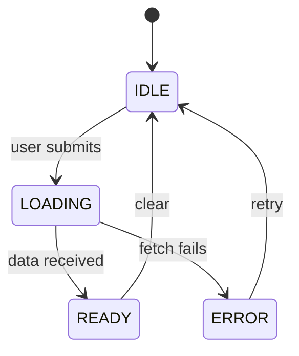

# Architecture Diagram Industry Baselines

**Folder**: `industry-baselines/architecture/diagrams/`  
**Added**: 2026-05-20 (LASDLC v2.6.0, Blueprint Parts XXVI + XXVII)  
**Updated**: 2026-05-20 — expanded with full enterprise standards from Firecrawl scrapes  
**Owner gate**: [A] Architecture (CORSO primary, LÆX secondary)

---

## Standard Hierarchy

Enterprise architecture diagrams sit within a layered standard hierarchy. Understand this before choosing a notation:

```
ISO/IEC/IEEE 42010:2011       ← Meta-standard: defines what an architecture description IS
└── TOGAF ADM                 ← Process: when to create which diagram (10 ADM phases)
    └── ArchiMate 3.2         ← Notation: EA modeling language for TOGAF viewpoints
        └── C4 Model          ← Zoom-level abstraction hierarchy (L0→L3)
            └── UML 2.5.1     ← Detailed structural + behavioral notation
4+1 View Model                ← Stakeholder-concern → view mapping (orthogonal layer)
BPMN 2.0                      ← Business process notation (complements ArchiMate)
Mermaid v11.15.0              ← Platform standard for diagram-as-code output
```

---

## 1. ISO/IEC/IEEE 42010:2011 — Meta-Standard

**Reference**: [iso-architecture.org/ieee-1471](http://www.iso-architecture.org/ieee-1471/) | Supersedes IEEE 1471  
**Confidence**: HIGH — foundational international standard, legally referenced by TOGAF + ArchiMate

This is the **foundation standard** for all architecture description. It defines the vocabulary and requirements that every other standard in this list references.

| Concept | Definition |
|---------|-----------|
| **Architecture description (AD)** | Work product used to express an architecture of a system |
| **Viewpoint** | A specification of the conventions for constructing and using a view to address a set of stakeholder concerns |
| **View** | A work product expressing the architecture of a system from the perspective of specific concerns |
| **Architecture framework** | Conventions, principles, and practices for the description of architectures within a domain |
| **ADL** | Architecture Description Language — any form of expression for use in ADs (UML, SysML, BPMN, ArchiMate are all ADLs) |

**Platform application**: Every diagram the platform generates is an "architecture view" per ISO 42010. `stack_classification` determines which viewpoints are required.

---

## 2. C4 Model (Simon Brown)

**Reference**: [c4model.com](https://c4model.com) | Brown, S. *The C4 Model* (O'Reilly, 2024) | CC BY 4.0  
**Confidence**: HIGH — widely adopted, CNCF-endorsed, tooling-independent, notation-independent

The C4 model is a hierarchical set of abstractions and four standard diagram types. It is notation-independent (no prescribed shapes or colors) and tooling-independent.

### Core Abstractions

| Abstraction | Definition | Platform mapping |
|-------------|------------|-----------------|
| **Software System** | Highest-level bounded domain | `lightarchitects-gateway` binary |
| **Container** | Independently deployable/runnable unit | Rust binary or MCP server |
| **Component** | Logical grouping within a container | Crate or module |
| **Code** | Lowest-level implementation | Struct, function |

### Core Diagram Types (L0-L3)

| Level | C4 Name | Audience | Required in platform |
|-------|---------|----------|---------------------|
| C1 (L0) | **System Context** | Non-technical + architects | MEDIUM+ (Blueprint Part XXVII) |
| C2 (L1) | **Container** | Architects + engineers | MEDIUM+ |
| C3 (L2) | **Component** | Engineers | ALL tiers minimum |
| C4 (L3) | **Code** | Implementation team | LARGE+ selectively |

### Supporting Diagram Types

| Diagram | Purpose | When to use |
|---------|---------|------------|
| **System Landscape** | Multiple software systems + their relationships | Multi-system overview; not scoped to one system |
| **Dynamic** | How elements collaborate for a use case at runtime | Any async flow across ≥2 components |
| **Deployment** | How containers map to infrastructure | MEDIUM+; always for multi-binary |

**Tooling**: Structurizr DSL (canonical C4 tooling, Apache 2.0), Mermaid `C4Context`/`C4Container`/`C4Component` keywords (platform standard). `arch generate` outputs L0-L6 Mermaid files mapped to C4 levels.

---

## 3. Arc42 (Gernot Starke / Peter Hruschka)

**Reference**: [arc42.org](https://arc42.org) | ISO/IEC/IEEE 42010:2011 alignment | CC BY-SA 4.0  
**Confidence**: HIGH — ISO-aligned, widely used in European enterprise software; iSAQB CPSA-Foundation basis  
**Source**: Firecrawl scrape 2026-05-20

Arc42 is a **documentation template** (12 sections), not a diagram notation. It answers: *What* to document and *How* to document architecture.

### All 12 Arc42 Sections

| § | Section | Content | Diagram types typically used |
|---|---------|---------|------------------------------|
| 1 | **Introduction & Goals** | Requirements, quality goals (top 5), stakeholders | None (text) |
| 2 | **Constraints** | Technical + organizational constraints | None (text/table) |
| 3 | **Context & Scope** | System boundary, external interfaces | C1 System Context |
| 4 | **Solution Strategy** | Core architecture decisions, technology choices | None (text) |
| 5 | **Building Block View** | Static decomposition (white/black boxes, hierarchical) | C2 Container, C3 Component |
| 6 | **Runtime View** | Behavior as scenarios, interactions, error handling | Sequence, Dynamic |
| 7 | **Deployment View** | Hardware, infrastructure, topology | Deployment, Network |
| 8 | **Crosscutting Concepts** | Architecture patterns, security, domain models | Varies |
| 9 | **Architectural Decisions** | Key decisions (ADRs) | None (text) |
| 10 | **Quality Requirements** | Quality tree, quality scenarios | None (text) |
| 11 | **Risks & Technical Debt** | Known problems, risks | None (text) |
| 12 | **Glossary** | Domain and technical terms | None (text) |

**Platform application**: Arc42 §3 = L0 (C1 system context). §5 = L1+L2 (C2+C3). §6 = L3 (sequence/dynamic). §7 = L6 (deployment/security boundary). Plans that claim LARGE tier should cover §3, §5, §6, §7, §8 in the planning artifacts.

---

## 4. UML 2.5.1 — Unified Modeling Language

**Reference**: [OMG UML 2.5.1 spec](https://www.omg.org/spec/UML/2.5.1/About-UML/) | [draw.io UML overview](https://www.drawio.com/blog/uml-overview) | OMG standard  
**Confidence**: HIGH — ISO/IEC 19505, industry standard since 1997; 14 defined diagram types  
**Source**: Firecrawl scrape 2026-05-20

UML 2.5.1 (2017) defines **14 diagram types** in two groups. Widely used in large organizations; steep learning curve.

### Group A: Structure Diagrams (static — how system parts relate)

| Diagram | Shows | Used by | Platform use |
|---------|-------|---------|-------------|
| **Class** | Classes, attributes, methods, relationships (inheritance, association, dependency) | Architects, developers | Domain model, entity design |
| **Object** | Named instances with actual values at a specific moment | QA, developers | Testing snapshots |
| **Package** | Dependencies between packages/modules | Architects | Large codebase module organization |
| **Composite Structure** | Internal structure of a classifier showing collaboration | Architects | Complex component internals |
| **Component** | System split into components + inter-dependencies | Architects, engineers | Maps directly to C3 component level |
| **Deployment** | Software components → physical infrastructure mapping | DevOps, architects | Maps to L6 deployment topology |
| **Profile** | Customizations/extensions to UML metamodel | Framework authors | Rarely needed |

### Group B: Behaviour Diagrams (dynamic — how system runs)

| Diagram | Shows | Used by | Platform use |
|---------|-------|---------|-------------|
| **Use Case** | Actors + system functions + interactions | BAs, product | Northstar requirement capture |
| **Activity** | Business + operational workflow of components | BAs, architects | Process flows, pipeline stages |
| **State Machine** | States a system can be in + transitions | Developers, architects | Svelte store state; maps to L3 data flow |
| **Sequence** | Ordered messages between elements for a use case | Developers, architects | Async flows crossing ≥2 crate boundaries |
| **Communication** | Collaboration between objects (less ordered than sequence) | Developers | Integration point documentation |
| **Timing** | State changes over time with timing constraints | Embedded, real-time | Rarely used for web/backend builds |
| **Interaction Overview** | High-level composition of interactions | Architects | Complex flow orchestration |

**Platform practice**: Mermaid supports: class (`classDiagram`), state (`stateDiagram-v2`), sequence (`sequenceDiagram`), ER (`erDiagram`). For the remaining UML types, use PlantUML or draw.io XML when needed.

---

## 5. ArchiMate 3.2 — Enterprise Architecture Notation

**Reference**: [opengroup.org/archimate-forum](https://www.opengroup.org/archimate-forum/archimate-overview) | [ArchiMate 3.2 Spec](https://pubs.opengroup.org/architecture/archimate3-doc/) | Open Group standard  
**Confidence**: HIGH — The Open Group standard; TOGAF's companion notation; dominant in European enterprise  
**Source**: Firecrawl scrape 2026-05-20 (Visual Paradigm viewpoints guide)

ArchiMate 3.2 is an **enterprise architecture modeling language** with 3 layers and 23 official example viewpoints. It complements TOGAF and BPMN.

### Notation Layers

| Layer | Color | Content |
|-------|-------|---------|
| **Business** | Yellow | Business actors, processes, services, events |
| **Application** | Blue/Turquoise | Application components, services, data objects |
| **Technology** | Green | Infrastructure, nodes, networks, artifacts |
| **Motivation** | Purple | Goals, principles, requirements, constraints |
| **Strategy** | Tan | Capabilities, courses of action, resources |
| **Physical** | — | Physical equipment, materials, facilities |

### Notation Cues

- Square corners = structure elements
- Round corners = behavior elements  
- Diagonal corners = motivation elements

### 23 Official Example Viewpoints

**Basic Viewpoints** (Business, Application, Technology layers):

*Composition:*
| Viewpoint | Stakeholders | Purpose |
|-----------|-------------|---------|
| Organization | Architects, managers | Org structure: roles, departments, competencies |
| Information Structure | Architects, BAs | Data structure and dependencies |
| Technology | Architects, infrastructure | Stability, security, deps, costs of infrastructure |
| Layered | Architects, executives | Full architecture overview, impact of change |
| Physical | Architects, facilities | Physical environment ↔ IT infrastructure |

*Support:*
| Viewpoint | Stakeholders | Purpose |
|-----------|-------------|---------|
| Product | Product managers, architects | Product value composition, services offered |
| Application Usage | Architects, BAs | Applications ↔ business processes mapping |
| Technology Usage | Architects, DevOps | How technology is used by applications |

*Cooperation:*
| Viewpoint | Stakeholders | Purpose |
|-----------|-------------|---------|
| Business Process Cooperation | Process architects, ops managers | Business process flow, dependencies |
| Application Cooperation | Enterprise architects | Application landscape, service orchestration |

*Realization:*
| Viewpoint | Stakeholders | Purpose |
|-----------|-------------|---------|
| Service Realization | Process architects | How services are realized by behavior |
| Implementation and Deployment | Architects, DevOps | Applications → technology infrastructure mapping |

**Motivation Viewpoints** (modeling motivational aspects):

| Viewpoint | Purpose |
|-----------|---------|
| Stakeholder | Document stakeholder concerns and interests |
| Goal Realization | Goals → principles → requirements chain |
| Requirements Realization | Requirements → behavior elements |
| Motivation | High-level motivation: drivers, assessments, goals |

**Strategy Viewpoints** (strategic direction):

| Viewpoint | Purpose |
|-----------|---------|
| Strategy | Strategic capabilities and resources |
| Capability Map | Capability hierarchy of the enterprise |
| Outcome Realization | Strategic outcomes → capabilities |
| Resource Map | Resource deployment across capabilities |

**Implementation & Migration Viewpoints** (architecture change management):

| Viewpoint | Purpose |
|-----------|---------|
| Project | Programs, projects, and their relationships |
| Migration | Plateau and gap analysis (baseline → target) |
| Implementation and Migration | Integrated view of implementation + migration planning |

**Platform application**: ArchiMate is primarily for enterprise-scale TOGAF contexts. For platform-level builds (MEDIUM/LARGE), the Application Cooperation and Implementation and Deployment viewpoints map directly to L1 (container) and L6 (deployment) diagrams. Use as reference — not required for SMALL builds.

---

## 6. TOGAF ADM — The Open Group Architecture Framework

**Reference**: [opengroup.org/togaf](https://www.opengroup.org/togaf/) | TOGAF 10 (2022) | Open Group standard  
**Confidence**: HIGH — globally dominant enterprise architecture process framework; used by 80% of Fortune 500

TOGAF provides the **process** for developing architecture (the ADM — Architecture Development Method). It defines WHEN to create which diagrams across 10 phases.

### 4 Architecture Domains

| Domain | Scope | Key diagram types |
|--------|-------|------------------|
| **Business** | Business strategy, governance, processes, stakeholders | Organization, Business Process, Value Chain |
| **Application** | Application portfolio, interactions, data | Application Landscape, Integration |
| **Data** | Data entities, relationships, lifecycle | ERD, Data Flow |
| **Technology** | Infrastructure, platforms, networks, hardware | Network, Deployment, Environment + Locations |

### ADM Phases → Diagram Artifacts

| Phase | Name | Diagram deliverables |
|-------|------|---------------------|
| **Preliminary** | Preparation | Architecture principles catalog |
| **A** | Architecture Vision | Stakeholder map, Value chain, Concept diagram |
| **B** | Business Architecture | Business process cooperation, Organization viewpoint |
| **C** | Application Architecture | Application cooperation, Application usage, Data flow |
| **D** | Technology Architecture | Network + Communications, Environments + Locations, Platform decomposition |
| **E** | Opportunities & Solutions | Solution architecture overview |
| **F** | Migration Planning | Plateau + gap analysis (ArchiMate migration viewpoint) |
| **G** | Implementation Governance | Architecture compliance diagram |
| **H** | Architecture Change Management | Change impact diagram |
| **Requirements Management** | (continuous) | Traceability matrix |

**Platform application**: Platform-scale builds (XL, multi-binary) should reference TOGAF Phase D diagrams (Technology Architecture) for the deployment topology and Phase C for the application cooperation diagram. These map to L0 (system context) + L6 (technology) in the L0-L6 extraction framework.

---

## 7. 4+1 View Model (Kruchten, 1995)

**Reference**: Kruchten, P. "Architectural Blueprints — The '4+1' View Model of Software Architecture" (1995), IEEE Software  
**Confidence**: HIGH — seminal model, widely taught; bridges stakeholder concerns to diagram types

The 4+1 View Model maps **stakeholder concerns → architecture views**. No enforced notation; any ADL (UML, ArchiMate, C4) can be used.

| View | Concerns | Diagram type | Stakeholder |
|------|---------|-------------|------------|
| **Logical** | Functional requirements, object decomposition | UML Class + Interaction | End users, architects |
| **Process** | Concurrency, distribution, performance, fault tolerance | UML Activity, Sequence | Process architects, integrators |
| **Development** | Software module organization, layering | UML Package, Component | Developers, software managers |
| **Physical** | System topology, software → hardware mapping | UML Deployment | System engineers, DevOps |
| **Scenarios (+1)** | Illustrate + validate the other 4 views | UML Use Case | All stakeholders |

**Platform application**: The 5 views map cleanly: Logical = L2 (component); Process = L3 (data flow + sequence); Development = L5 (dependency graph); Physical = L6 (security boundary + deployment); Scenarios = use case / E2E test narrative. For LARGE-tier plans, the 4+1 mapping is a useful cross-reference to verify all views are covered by the L0-L6 diagram set.

---

## 8. BPMN 2.0 — Business Process Model and Notation

**Reference**: [OMG BPMN 2.0](https://www.omg.org/spec/BPMN/2.0/) | OMG standard, 2011  
**Confidence**: HIGH — ISO/IEC 19510; widely used for business process documentation alongside ArchiMate

BPMN is a **graphical notation for processes**: activities, events, gateways, sequence flows, message flows, swimlanes.

| Element | Notation | Purpose |
|---------|---------|---------|
| **Task/Activity** | Rounded rectangle | A unit of work |
| **Event** | Circle | Start, intermediate, or end of a process |
| **Gateway** | Diamond | Decision/branching (exclusive XOR, inclusive OR, parallel AND) |
| **Sequence flow** | Arrow | Control flow between elements |
| **Message flow** | Dashed arrow | Communication between pools |
| **Pool/Swimlane** | Labeled band | Participant / organizational boundary |

**When to use in platform**: For `/PLAN` phases that involve multi-party orchestration (e.g., the ironclaw-spine build pipeline with Conductor → Workers → MergeAgent), a BPMN diagram clarifies process flow better than a sequence diagram when ≥3 participants + conditional routing are involved.

**Mermaid equivalent**: Use `graph TD` with decision diamonds to approximate BPMN; no native BPMN keyword in Mermaid. Draw.io supports full BPMN 2.0 shapes.

---

## 9. Light Architects L0–L6 Extraction Levels (arch-generate canonical)

**Source**: architecture-intelligence-substrate (shipped 2026-05-19, commit 5d829eb)  
**Tool**: `arch generate --output <path>`  
**Output format**: Mermaid `.mmd` files

| Level | Extraction scope | Diagram type | C4 / 4+1 mapping | Example |
|-------|-----------------|-------------|-------------------|---------|
| L0 | System context — binary + external systems | C1 context | C1 / Physical | lightarchitects-sdk ↔ Claude API ↔ MCP servers |
| L1 | Container map — crates + binaries | C2 container | C2 / Development | gateway / webshell / lightarchitects crates |
| L2 | Module structure within crate | C3 component | C3 / Logical | routes / handlers / stores |
| L3 | Key data flows — async message paths | Sequence / flow | Process / Scenarios | WebEvent broadcast pipeline |
| L4 | Public API surface | API contract | Logical | HTTP routes, MCP tool signatures |
| L5 | Dependency graph | DAG | Development | Cargo.toml dependencies |
| L6 | Security boundary map | Security context | Physical | trust zones, external integrations |

**Usage in build plans:**
```bash
# Run from project root during /PLAN Phase 0 or /BUILD Phase 1
arch generate --output $HELIX/corso/builds/<codename>/diagrams/

# Output: L0-system-context.mmd, L1-container.mmd, ... L6-security-boundary.mmd
# Reference in LASDLC template architecture_artifacts.generated_diagrams[]
```

**Minimum required per tier** (Blueprint Part XXVII §27.2):

| Tier | Required levels | Waiver |
|------|----------------|--------|
| SMALL | L2 (C3 component) | `diagram_waiver: true` operator override |
| MEDIUM | L1 + L2 | None |
| LARGE | L0 + L1 + L2 + L3 + L6 | None |
| XL | L0–L6 + deployment topology | None |

---

## 10. Stack-Specific Diagram Types (Blueprint Part XXVI §26.4)

### Frontend-only / full-stack builds — UI-flow additions

| Diagram type | Content | When required |
|---|---|---|
| **Screen-flow diagram** | User navigation paths between Svelte screens/routes | Full-stack or frontend-only builds touching ≥2 screens |
| **State-machine diagram** | Svelte store state transitions + event triggers | Builds with ≥4 store states |
| **Component hierarchy** | Parent→child Svelte component tree | Full-stack MEDIUM+ |

**Mermaid state machine example:**


### Backend-only builds — Data flow additions

| Diagram type | When required |
|---|---|
| ERD (entity relationship) | Any build touching Neo4j schema or SQLite tables |
| Sequence diagram | Async flows crossing ≥2 binary/crate boundaries |
| Deployment topology | Multi-binary builds (LARGE+) |

### CLI-tooling builds

| Diagram type | When required |
|---|---|
| Component (C3 / L2) | Always — even SMALL tier (Blueprint §26.4) |
| Data flow | When CLI reads from multiple sources or pipes |

---

## 11. Mermaid v11.15.0 — Platform Standard

**Reference**: [mermaid.js.org](https://mermaid.js.org) | [Syntax reference](https://mermaid.js.org/intro/syntax-reference.html) | Apache-2.0  
**Version scraped**: 11.15.0 (2026-05-20)  
**Confidence**: HIGH — embedded in GitHub, GitLab, Notion, Obsidian; our `arch generate` output format

### Complete Diagram Type → Keyword Map

| Category | Diagram type | Mermaid keyword | Platform use |
|----------|-------------|----------------|-------------|
| **Structural** | Flowchart / C1-C3 context/container/component | `graph TD` / `graph LR` | L0–L2, screen-flow |
| **Structural** | C4 native syntax | `C4Context`, `C4Container`, `C4Component`, `C4Dynamic`, `C4Deployment` | L0–L2 with C4 shapes |
| **Behavioral** | Sequence | `sequenceDiagram` | L3, async flows |
| **Behavioral** | State machine | `stateDiagram-v2` | Svelte store states |
| **Data** | Entity Relationship | `erDiagram` | Neo4j/SQLite schema |
| **Process** | Activity/flow | `flowchart` | Pipeline stages |
| **Dependency** | DAG / dependency graph | `graph LR` | L5 dependency |
| **Deployment** | Deployment topology | `graph TB` with subgraph zones | L6, multi-binary |
| **Architecture** | Architecture diagram (native) 🔥 | `architecture-beta` | Modern infra diagrams |
| **Code** | Class diagram | `classDiagram` | Domain model |
| **Planning** | Gantt | `gantt` | Phase timeline |
| **Planning** | Kanban 🔥 | `kanban` | Sprint board |
| **Git** | GitGraph | `gitGraph` | Branch topology |
| **Analytics** | Pie chart | `pie` | Test coverage |
| **Analytics** | XY Chart 🔥 | `xychart-beta` | Performance metrics |
| **Analytics** | Quadrant 🔥 | `quadrantChart` | Risk/effort matrix |
| **Analytics** | Radar 🔥 | `radar` | STRAND Mosaic coverage |
| **User** | User Journey | `journey` | UX flow documentation |
| **Process** | Sankey 🔥 | `sankey-beta` | Data flow volumes |
| **Events** | Event Modeling 🔥 | `eventmodel` | Event-sourced systems |
| **Requirements** | Requirement diagram | `requirementDiagram` | Feature traceability |
| **Mind** | Mindmap | `mindmap` | Architecture brainstorm |
| **Tree** | Treemap 🔥 | `treemap` | Crate size analysis |
| **Interaction** | ZenUML (sequence alt) | `zenuml` | Code-level interactions |

🔥 = new in recent Mermaid releases (v10+); use with caution in tools that haven't upgraded

### Platform Conventions

- All diagram files use `.mmd` extension
- File naming: `L{N}-{diagram-type}.mmd` for L0-L6 levels (e.g. `L1-container.mmd`)
- Custom diagrams: `{slug}-{type}.mmd` (e.g. `copilot-state-machine.mmd`)
- Stored in: `$HELIX/corso/builds/<codename>/diagrams/`
- Rendered in: webshell ARCH tab (architecture-intelligence-substrate, commit 5d829eb)

---

## 12. Tool Comparison — Diagram-as-Code Ecosystem

**Sources**: [infrasketch.net/blog/top-7-architecture-diagram-tools](https://infrasketch.net/blog/top-7-architecture-diagram-tools) (Firecrawl 2026-05-20) | icepanel.io modelling languages survey

| Tool | License | Best for | Diagram types | LLM familiarity |
|------|---------|---------|--------------|----------------|
| **Mermaid** | MIT | PR-reviewable diagrams; platform standard | 20+ (flowchart, sequence, state, ER, C4, class, gitGraph, kanban, …) | Highest — native GitHub/GitLab support |
| **Structurizr DSL** | Apache 2.0 (CLI) | Enterprise C4 model teams; multi-diagram from single model | C1–C4 + landscape + dynamic + deployment | High — C4 canonical tooling |
| **D2** | MPL 2.0 | Beautiful auto-layout; infrastructure diagrams | General + sequence + SQL + classes | Medium — growing rapidly |
| **PlantUML** | GPL 3.0 | Maximum UML coverage; legacy enterprise | All 14 UML types + C4 + ArchiMate + BPMN | High — most feature-rich; verbose syntax |
| **Diagrams (Python)** | MIT | Cloud infrastructure (AWS/Azure/GCP/K8s icons built-in) | Infrastructure topology | Medium — Python-specific |
| **Draw.io (Diagrams.net)** | Apache 2.0 | Visual editing + collaboration; BPMN + ArchiMate + SysML shapes | All types including BPMN 2.0, ArchiMate, UML, C4 | Low (GUI-first) |
| **Eraser.io** | Commercial/Freemium | AI-assisted with manual control | General + cloud architecture | Medium (AI-integrated) |

**Platform rule**: `arch generate` outputs **Mermaid** as the default format. For BPMN or full ArchiMate notation, use draw.io XML or PlantUML and reference the file in `generated_diagrams[]` with `generator_id: "manual-mermaid"` or a registered tool entry.

### Developer Selection Guide

| Question | Answer → Tool |
|----------|--------------|
| "Can I review this in a PR?" | Mermaid, D2, PlantUML (text-based) > draw.io XML > GUI tools |
| "Does it need to be C4-exact?" | Structurizr DSL (canonical), then Mermaid C4Context |
| "Does it need BPMN shapes?" | Draw.io (full BPMN 2.0), PlantUML (BPMN limited) |
| "Does it need ArchiMate notation?" | Draw.io (certified shapes), Visual Paradigm (certified tooling) |
| "Does it need cloud provider icons?" | Diagrams (Python), Draw.io shape libraries |
| "Auto-layout with beautiful output?" | D2 with TALA engine |
| "Fastest to write for LLMs?" | Mermaid (highest training data density) |

---

## 13. Confidence Deductions (XEA §C1f)

Per XEA Layer 1 sibling domain config for CORSO [A] gate:

| Condition | Deduction |
|-----------|-----------|
| Diagrams present but no `source_anchor` on relations | −10% C1f |
| L0 missing for MEDIUM+ | −15% C1f (BLOCKING) |
| `arch generate` not run, diagrams hand-drawn only | −5% (acceptable, not blocking) |
| Diagram-code drift detected at [A] gate | −20% (BLOCKING until corrected) |
| `diagram_waiver: true` present (SMALL only) | 0 deduction; flag for LÆX retrospective |
| Missing stack-class required diagram (e.g., screen-flow for frontend-only) | −10% C1f per missing |
| Required viewpoints undocumented for LARGE+ (no L3 data flow or L6 security boundary) | −15% C1f (BLOCKING) |

---

## 14. Diagram Library HTML

A living interactive reference page is maintained alongside this document:

**`diagram-library.html`** — `$HELIX/user/standards/industry-baselines/architecture/diagrams/diagram-library.html`

Features:
- 15 rendered SVG examples (C4 Context/Container/Component, UML Sequence/Class/State, Mermaid Flowchart/ER/GitGraph/Gantt/Mindmap/Timeline/Architecture-Beta, D2, PlantUML)
- Filter by diagram standard, stack class (full-stack / backend-only / frontend-only / cli-tooling), and tier (SMALL / MEDIUM / LARGE / XL)
- Copy-to-clipboard DSL source for each diagram
- Live rendering via Kroki unified API (internet required)

Open with any browser: `open ~/lightarchitects/soul/helix/user/standards/industry-baselines/architecture/diagrams/diagram-library.html`

---

## 15. Additional Kroki-Supported Diagram Types

Beyond the primary types in §9 (Tool Comparison), Kroki supports these additional formats useful for specialized diagrams. All renderable via `https://kroki.io/{type}/svg/{encoded}`.

| Type | Kroki name | Best for | Platform use |
|------|-----------|----------|--------------|
| BlockDiag | `blockdiag` | Simple block relationships | L0 alternatives |
| SeqDiag | `seqdiag` | Sequence (BlockDiag family) | L3 alternative to Mermaid |
| ActDiag | `actdiag` | Activity diagrams | L2 process flows |
| NwDiag | `nwdiag` | Network topology | L3 infrastructure |
| RackDiag | `rackdiag` | Server rack layouts | L3 hardware deployment |
| GraphViz | `graphviz` | Complex graph structures, dep trees | L4-L5 dependency |
| SvgBob | `svgbob` | ASCII-art style diagrams | Documentation inline |
| Erd | `erd` | Entity-relationship (alternative syntax) | L1 data model |
| Nomnoml | `nomnoml` | UML-like lightweight notation | L2 class alternative |
| Excalidraw | `excalidraw` | Hand-drawn style mockups | Whiteboard/sketch |
| Structurizr | `structurizr` | C4 formal DSL (Structurizr DSL) | L0-L3 C4 formal |
| WaveDrom | `wavedrom` | Digital timing waveforms | Hardware/protocol |
| Vega / Vega-Lite | `vega` / `vegalite` | Data visualization charts | Metrics/dashboards |
| Pikchr | `pikchr` | Commit graphs, syntax diagrams | CLI/git tooling |
| WireViz | `wireviz` | Cable/wiring diagrams | Hardware projects |
| BPMN | `bpmn` | Business process flows (XML) | Process documentation |
| DBML | `dbml` | Database markup language | L1 schema (simpler than ER) |

**Structurizr DSL note**: Structurizr is the formal C4 DSL — more expressive than Mermaid C4 syntax for large systems. Kroki renders it natively. No local Java or CLI required. Example:
```
workspace {
  model {
    user = person "Operator"
    softwareSystem = softwareSystem "Light Architects" {
      webapp = container "Webshell UI" { technology "SvelteKit" }
      gateway = container "Gateway" { technology "Rust/Axum" }
    }
    user -> softwareSystem "Uses"
  }
  views {
    systemContext softwareSystem { include * autoLayout }
    container softwareSystem { include * autoLayout }
  }
}
```

---

## 16. MCP Server Recommendations for Diagram Tooling

Research conducted 2026-05-20 via plugin ecosystem audit:

| Tool | MCP available? | Recommendation |
|------|---------------|----------------|
| **draw.io** | Yes — `@drawio/mcp` (official, v1.2.7, May 2026) | **Install** — accepts Mermaid input, opens interactive editor |
| Kroki | Partial — `@tkoba1974/mcp-kroki` (Mermaid-only) | Build native gateway wrapper instead (50-line `reqwest::post` to `kroki.io`) |
| PlantUML | Yes — `plantuml-mcp-server` (v0.2.4, Jan 2026) | Low priority — requires Java runtime; Mermaid covers most use cases |
| Mermaid | Yes — several community servers | Redundant — Claude generates Mermaid natively; `@drawio/mcp` is better |
| Structurizr | No | Use Kroki's `structurizr` format instead |
| D2 | No | Already in sdk `arch-substrate` emitter — expose via gateway arch routes |
| Figma (installed) | Yes (installed) | Design-file only; not suitable for architecture diagram DSL authoring |

**Recommended action**: Install `@drawio/mcp` via the plugin marketplace. For multi-format Kroki rendering, add a `render_diagram(type, source) -> svg` tool to `lightarchitects-gateway` (single `reqwest::post` to `https://kroki.io/{type}/svg`, returns inline SVG).

---

## 17. Sources & References

All content sourced via Firecrawl scrapes 2026-05-20. Diagram library HTML rendered via Kroki — confirmed 25+ supported types (2026-05-20 kroki.io/examples.html). MCP ecosystem audited 2026-05-20.

- **C4 Model**: [c4model.com](https://c4model.com) — Simon Brown, CC BY 4.0
- **Arc42**: [arc42.org/overview](https://arc42.org/overview) — Starke & Hruschka, CC BY-SA 4.0
- **ArchiMate 3.2 viewpoints**: [visual-paradigm.com/guide/archimate/full-archimate-viewpoints-guide](https://www.visual-paradigm.com/guide/archimate/full-archimate-viewpoints-guide/) — Visual Paradigm guide to ArchiMate 3.2 Spec (Open Group)
- **ArchiMate spec**: [pubs.opengroup.org/architecture/archimate3-doc](https://pubs.opengroup.org/architecture/archimate3-doc/) — The Open Group (requires login)
- **UML 2.5.1**: [drawio.com/blog/uml-overview](https://www.drawio.com/blog/uml-overview) — draw.io, 2025-01-30
- **Mermaid syntax**: [mermaid.js.org/intro/syntax-reference.html](https://mermaid.js.org/intro/syntax-reference.html) — v11.15.0
- **Tool comparison**: [infrasketch.net/blog/top-7-architecture-diagram-tools](https://infrasketch.net/blog/top-7-architecture-diagram-tools) — 2026
- **Modelling languages survey**: [icepanel.io/blog/2025-09-01-modelling-languages-for-software-architecture](https://icepanel.io/blog/2025-09-01-modelling-languages-for-software-architecture)
- **ISO/IEC/IEEE 42010**: [iso-architecture.org/ieee-1471](http://www.iso-architecture.org/ieee-1471/)
- **TOGAF**: The Open Group — TOGAF 10 (2022)
- **4+1 View Model**: Kruchten, P. (1995), IEEE Software 12(6):42-50
- **BPMN 2.0**: [omg.org/spec/BPMN/2.0](https://www.omg.org/spec/BPMN/2.0/)

---

*Added: 2026-05-20 | Version: 2.0.0 | Owner: CORSO [A] gate + LÆX [C] | Expanded with Firecrawl research: 7 standards, 20+ Mermaid diagram types, 23 ArchiMate viewpoints, 12 Arc42 sections, 14 UML diagram types, TOGAF ADM phases*
